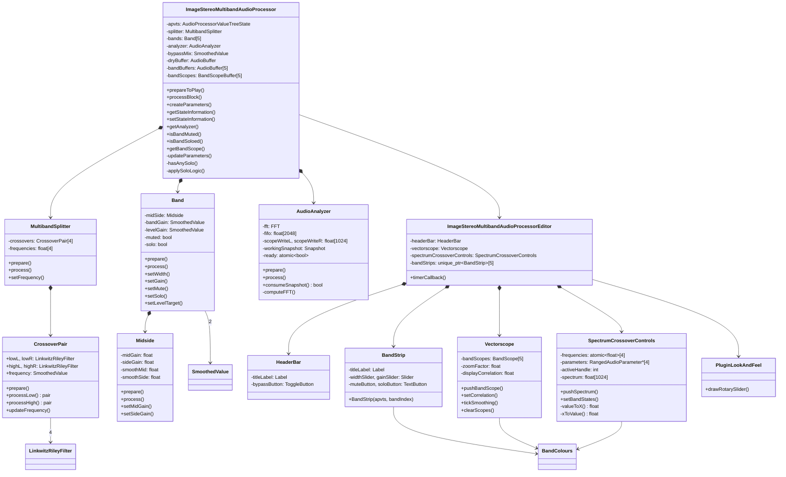

# ImageStereoMultiband — Documentación técnica

> **Autor:** Pedro Cuomo Ghio  
> **Versión:** 1.0.0  
> **Framework:** JUCE 8.0.12 | **Plataforma:** Windows x64 (VS2026)  
> **Formato:** VST3

---

## Índice

1. [Arquitectura general](#1-arquitectura-general)
2. [Estructura del proyecto](#2-estructura-del-proyecto)
3. [Pipeline de audio (ciclo de vida)](#3-pipeline-de-audio-ciclo-de-vida)
   - [3.1 Inicialización](#31-inicialización)
   - [3.2 Preparación](#32-preparación)
   - [3.3 Procesamiento bloque a bloque](#33-procesamiento-bloque-a-bloque)
   - [3.4 Actualización de la GUI](#34-actualización-de-la-gui)
   - [3.5 Persistencia de estado](#35-persistencia-de-estado)
4. [Descripción detallada de componentes](#4-descripción-detallada-de-componentes)
   - [4.1 MultibandSplitter — División en 5 bandas](#41-multibandsplitter--división-en-5-bandas)
   - [4.2 Crossover — Filtros Linkwitz-Riley LR4](#42-crossover--filtros-linkwitz-riley-lr4)
   - [4.3 Midside — Procesamiento Mid/Side](#43-midside--procesamiento-midside)
   - [4.4 Band — Banda individual](#44-band--banda-individual)
   - [4.5 AudioAnalyzer — FFT y osciloscopio](#45-audioanalyzer--fft-y-osciloscopio)
   - [4.6 Bypass suave](#46-bypass-suave)
   - [4.7 Lógica de Solo](#47-lógica-de-solo)
5. [Interfaz gráfica — GUI](#5-interfaz-gráfica--gui)
   - [5.1 Layout general](#51-layout-general)
   - [5.2 HeaderBar](#52-headerbar)
   - [5.3 BandStrip — Tutorial de uso](#53-bandstrip--tutorial-de-uso)
   - [5.4 SpectrumCrossoverControls](#54-spectrumcrossovercontrols)
   - [5.5 Vectorscope](#55-vectorscope)
   - [5.6 PluginLookAndFeel](#56-pluginlookandfeel)
   - [5.7 BandColours](#57-bandcolours)
6. [Diagrama de clases UML](#6-diagrama-de-clases-uml)
7. [Sistema de parámetros](#7-sistema-de-parámetros)
8. [Hilo de audio vs. hilo de GUI](#8-hilo-de-audio-vs-hilo-de-gui)
9. [Instalador Inno Setup](#9-instalador-inno-setup)
10. [Guía para desarrolladores](#10-guía-para-desarrolladores)
    - [10.1 Añadir una nueva banda](#101-añadir-una-nueva-banda)
    - [10.2 Añadir un nuevo parámetro](#102-añadir-un-nuevo-parámetro)
    - [10.3 Compilar en Release](#103-compilar-en-release)
    - [10.4 Stubs pendientes](#104-stubs-pendientes)

---

## 1. Arquitectura general

ImageStereoMultiband es un plugin VST3 que procesa audio estéreo dividiéndolo en **5 bandas de frecuencia** mediante 4 filtros Linkwitz-Riley de 4to orden (LR4) en cascada. Cada banda procesa su contenido de forma independiente con control de ancho estéreo (Mid/Side) y ganancia, y luego las bandas se suman para producir la salida final.

```
                    ┌──────────────────────────────────────┐
                    │            AudioProcessor            │
                    │      (hilo de audio del DAW)          │
                    └──────────────────────────────────────┘
                                      │
                    ┌─────────────────▼──────────────────┐
                    │         updateParameters()          │
                    │   Lee APVTS y sincroniza todo       │
                    └─────────────────┬──────────────────┘
                                      │
              ┌───────────────────────┬───────────────────────┐
              ▼                       ▼                       ▼
    ┌──────────────────┐   ┌──────────────────┐   ┌──────────────────┐
    │  MultibandSplitter │   │   Band[0..4]     │   │   AudioAnalyzer  │
    │  (LR4 cascada)    │   │  MidSide + Gain  │   │   FFT + Scope    │
    │  input → 5 bands  │──▶│  Mute/Solo logic │──▶│   snapshot→GUI   │
    └──────────────────┘   └──────────────────┘   └──────────────────┘
                                      │
                                      ▼
                              ┌──────────────────┐
                              │   Bypass mix     │
                              │  (crossfade 50ms)│
                              └──────────────────┘
                                      │
                                      ▼
                              ┌──────────────────┐
                              │   Output buffer   │
                              └──────────────────┘
```

La GUI se ejecuta en el **hilo de mensajes de JUCE** y se actualiza mediante un **timer a 30 fps** que consulta atómicamente los snapshots producidos por el analizador.

---

## 2. Estructura del proyecto

```
ImageStereoMultiband/
│
├── ImageStereoMultiband.jucer           ← Proyecto JUCE (PROJUCER)
├── README.md                            ← Guía para usuarios y desarrolladores
├── DOCUMENTATION.md                     ← Esta documentación
├── installer.iss                        ← Script Inno Setup
├── ImageStereoMultiband_Installer.exe   ← Instalador compilado
│
├── Source/                              ← CÓDIGO FUENTE
│   │
│   ├── PluginProcessor.h                → Clase AudioProcessor
│   ├── PluginProcessor.cpp              → Pipeline de audio + parámetros
│   ├── PluginEditor.h                   → Clase AudioProcessorEditor
│   ├── PluginEditor.cpp                 → Layout + timer 30 fps
│   │
│   ├── Parameters/                      → [stubs] Sin implementar
│   │   ├── ParameterIDs.h
│   │   ├── ParameterLayout.h
│   │   └── ParameterLayout.cpp
│   │
│   ├── DSP/                             → Procesamiento digital de audio
│   │   ├── MultibandSplitter/           → División espectral 5 bandas
│   │   │   ├── MultibandSplitter.h
│   │   │   └── MultibandSplitter.cpp
│   │   ├── Crossover/                   → Filtros LR4 (un punto de cruce)
│   │   │   ├── Crossover.h
│   │   │   └── Crossover.cpp
│   │   ├── Band/                        → Banda: MidSide + ganancia
│   │   │   ├── Band.h
│   │   │   └── Band.cpp
│   │   ├── Midside/                     → Codificación Mid/Side
│   │   │   ├── MidSide.h
│   │   │   └── MidSide.cpp
│   │   ├── Analyzer/                    → FFT + osciloscopio
│   │   │   ├── AudioAnalyzer.h
│   │   │   └── AudioAnalyzer.cpp
│   │   ├── Gain/                        → [stub]
│   │   │   ├── Gain.h
│   │   │   └── Gain.cpp
│   │   └── DryWet/                      → [stub]
│   │       ├── DryWet.h
│   │       └── DryWet.cpp
│   │
│   └── GUI/                             → Interfaz gráfica
│       ├── LookAndFeel/                 → Tema visual personalizado
│       │   ├── PluginLookAndFeel.h
│       │   └── PluginLookAndFeel.cpp
│       ├── Components/
│       │   ├── HeaderBar/               → Título + bypass
│       │   │   ├── HeaderBar.h
│       │   │   └── HeaderBar.cpp
│       │   ├── BandStrip/              → Controles por banda
│       │   │   ├── BandStrip.h
│       │   │   └── BandStrip.cpp
│       │   ├── SpectrumCrossoverControls/ → Espectro + cruces
│       │   │   ├── SpectrumCrossoverControls.h
│       │   │   └── SpectrumCrossoverControls.cpp
│       │   └── Vectorscope/            → Mid/Side scope
│       │       ├── Vectorscope.h
│       │       └── Vectorscope.cpp
│       └── BandColours.h               → Paleta de 5 colores
│
├── Builds/
│   └── VisualStudio2026/                → Solución VS2026
│       ├── ImageStereoMultiband.sln
│       ├── ImageStereoMultiband_StandalonePlugin.vcxproj
│       ├── ImageStereoMultiband_VST3.vcxproj
│       ├── ImageStereoMultiband_SharedCode.vcxproj
│       ├── x64/Debug/Standalone Plugin/ → .exe debug
│       └── x64/Debug/VST3/              → .vst3 debug
│
└── JuceLibraryCode/                     → Generado por JUCE
```

---

## 3. Pipeline de audio (ciclo de vida)

### 3.1 Inicialización

```cpp
ImageStereoMultibandAudioProcessor()
  ├── AudioProcessor(buses: stereo in/out)
  ├── apvts(*this, &undoManager, "Parameters", createParameters())
  └── undoManager
```

`createParameters()` genera **25 parámetros**:

- 5 bandas × 4 parámetros: Width, Gain, Mute, Solo
- 4 frecuencias de crossover
- 1 bypass

### 3.2 Preparación

El DAW llama a `prepareToPlay(sampleRate, samplesPerBlock)`:

```
prepareToPlay(44100, 512)
  │
  ├── spec = { 44100, 512, 2 }
  ├── splitter.prepare(spec)
  │     └── 4 crossovers × 4 filtros LR4 = 16 filtros preparados
  ├── bands[i].prepare(spec)
  │     └── MidSide.prepare() + SmoothedValue::reset(44100, 0.02)
  ├── bandBuffers[i].setSize(2, 512)
  ├── analyzer.prepare(44100, 512) → reset(), fftHop = 512
  ├── bypassMix.reset(44100, 0.05) → rampa de 50 ms
  └── dryBuffer.setSize(2, 512)
```

### 3.3 Procesamiento bloque a bloque

```
processBlock(buffer, midiMessages)
  │
  ├── updateParameters()
  │     ├── Leer APVTS: Width, Gain, Mute, Solo x 5 bandas
  │     ├── Leer crossover1..4, aplicar límites con gap ≥ 100 Hz
  │     ├── splitter.setFrequency(i, f)
  │     └── setBypassed(estado)
  │
  ├── dryBuffer.makeCopyOf(buffer)        ← respaldo para bypass
  │
  ├── splitter.process(buffer, bandBuffers)
  │     └── Entrada → 5 buffers: band[0..4]
  │
  ├── for (auto& band : bands)
  │     band.process(bandBuffers[i])
  │       ├── midSide.process() → width
  │       └── ganancia = bandGain × levelGain (sample a sample)
  │
  ├── applySoloLogic()
  │     └── setLevelTarget(1.0 o 0.0) en cada banda
  │
  ├── buffer.clear()
  │     buffer.addFrom(bandBuffers[i])  ← suma todas las bandas
  │
  ├── analyzer.process(buffer)           ← FFT sobre el resultado
  │
  └── Bypass crossfade (sample a sample)
        out = wet × mix + dry × (1 - mix)
```

### 3.4 Actualización de la GUI

El editor tiene un **timer a 30 Hz** (~33 ms). Cada tick:

```
timerCallback()
  │
  ├── analyzer.consumeSnapshot(snap)
  │     ├── Éxito: hay nuevo FFT
  │     │   ├── vectorscope.pushBandScope(0..4) → datos por banda
  │     │   ├── Calcular correlación Σ(L×R)/√(ΣL²×ΣR²)
  │     │   ├── spectrumCrossoverControls.pushSpectrum()
  │     │   └── repaint()
  │     └── Fracaso: no hay datos nuevos
  │         └── vectorscope.clearScopes()
  │
  └── vectorscope.tickSmoothing()
        └── Suavizado IIR: displayCorrelation += (target - display) × 0.12
```

### 3.5 Persistencia de estado

```
getStateInformation()
  └── apvts.copyState() → XML → MemoryBlock

setStateInformation()
  └── MemoryBlock → XML → apvts.replaceState()
```

El DAW llama estos métodos al guardar/cargar proyectos, asegurando que todos los parámetros (cruces, gains, solos, bypass) se preserven.

---

## 4. Descripción detallada de componentes

### 4.1 MultibandSplitter — División en 5 bandas

Divide la señal estéreo en 5 bandas usando **4 crossovers Linkwitz-Riley de 4to orden** en configuración en cascada:

```


Entrada estéreo
      │
      ▼
┌──────────────┐
│ Crossover[0] │ 120 Hz
│  LR4 lowpass │───→ Band[0]
│  LR4 highpass│───→ ─┐
└──────────────┘      │
                      ▼
              ┌──────────────┐
              │ Crossover[1] │ 500 Hz
              │  LR4 lowpass │───→ Band[1]
              │  LR4 highpass│───→ ─┐
              └──────────────┘      │
                                    ▼
                            ┌──────────────┐
                            │ Crossover[2] │ 2 kHz
                            │  LR4 lowpass │───→ Band[2]
                            │  LR4 highpass│───→ ─┐
                            └──────────────┘      │
                                                  ▼
                                          ┌──────────────┐
                                          │ Crossover[3] │ 8 kHz
                                          │  LR4 lowpass │───→ Band[3]
                                          │  LR4 highpass│───→ Band[4]
                                          └──────────────┘
```

**CrossoverPair** (estructura anidada en `MultibandSplitter.h`):
- 4 filtros `LinkwitzRileyFilter<float>`: lowL, lowR, highL, highR
- `SmoothedValue<float> frequency` con 50 ms de rampa
- `processLow(l, r)` y `processHigh(l, r)` devuelven `pair<float,float>` procesado sample a sample

**Frecuencias por defecto:** 120, 500, 2000, 8000 Hz.

El procesamiento es **sample a sample** para permitir automatización suave de frecuencias. Cada crossover llama a `updateFrequency()` al inicio de cada sample para actualizar la frecuencia de corte con suavizado.

### 4.2 Crossover — Filtros Linkwitz-Riley LR4

**Linkwitz-Riley de 4to orden** = dos Butterworth de 2do orden en cascada. Pendiente de **24 dB/octava**. La suma del lowpass y highpass produce una respuesta plana en magnitud.

```cpp
struct CrossoverPair {
    LinkwitzRileyFilter<float> lowL, lowR;   // lowpass
    LinkwitzRileyFilter<float> highL, highR; // highpass
    SmoothedValue<float> frequency;          // 50 ms rampa

    void updateFrequency() {
        auto f = frequency.getNextValue();
        lowL.setCutoffFrequency(f);
        lowR.setCutoffFrequency(f);
        highL.setCutoffFrequency(f);
        highR.setCutoffFrequency(f);
    }
};
```

La clase `Crossover` individual (`Crossover.h/.cpp`) es independiente pero actualmente **no se usa directamente** — el `MultibandSplitter` usa `CrossoverPair` que tiene la misma estructura internamente.

### 4.3 Midside — Procesamiento Mid/Side

Convierte la señal estéreo (L,R) a componentes Mid (mono) y Side (estéreo), aplica ganancias independientes, y reconvierte a L,R.

**Ecuaciones:**

```
Mid  = (L + R) / √2
Side = (L - R) / √2

L' = (Mid × gainMid + Side × gainSide) / √2
R' = (Mid × gainMid - Side × gainSide) / √2
```

El factor `√2` asegura conservación de potencia.

**Suavizado IIR de primer orden:**

```cpp
smoothMid  += 0.002 × (midGain  - smoothMid)
smoothSide += 0.002 × (sideGain - smoothSide)
```

Donde `0.002` es la constante de suavizado. Con `sampleRate = 44100`, la constante de tiempo es aproximadamente `τ ≈ 1 / (0.002 × 44100) ≈ 11 ms`.

**Control de Width:** Se expone `setSideGain()` mediante `Band::setWidth()`:
- `sideGain = 0` → Mono (solo Mid)
- `sideGain = 1` → Ancho estéreo original
- `sideGain = 2` → Estéreo ensanchado (el doble de componente Side)

`midGain` siempre es `1.0` — no se expone como parámetro en la versión actual.

### 4.4 Band — Banda individual

Cada banda encapsula:

```
Band
├── Midside midSide        → Procesamiento de ancho estéreo
├── SmoothedValue bandGain → Ganancia general (20 ms)
└── SmoothedValue levelGain → Ganancia de mute/solo (20 ms)
```

**Método `process()`:**

```cpp
void Band::process(juce::AudioBuffer<float>& buffer) {
    midSide.process(buffer);          // Aplica width

    for (int sample = 0; sample < buffer.getNumSamples(); ++sample) {
        auto totalGain = bandGain.getNextValue() * levelGain.getNextValue();
        left[sample]  *= totalGain;
        right[sample] *= totalGain;
    }
}
```

**Control desde el procesador:**
- `setWidth(float)` → `midSide.setSideGain(width)`
- `setGain(float dB)` → `bandGain.setTargetValue(Decibels::decibelsToGain(dB))`
- `setMute(bool)` / `setSolo(bool)` → flags usados por `applySoloLogic()`
- `setLevelTarget(float)` → usado por `applySoloLogic()` para silenciar/activar

### 4.5 AudioAnalyzer — FFT y osciloscopio

Analizador espectral en tiempo real con los siguientes parámetros:

| Parámetro | Valor |
|-----------|-------|
| Orden FFT | 11 |
| Tamaño FFT | 2048 samples |
| Hop size | 512 samples (75% overlap) |
| Ventana | Hann |
| Bins espectrales | 1024 |
| Piso dB | -120 dB |
| Scope size | 1024 samples L/R |
| Sincronización | `std::atomic<bool> ready` |

**Pipeline:**

```
FIFO circular (2048)
  │ write: (L+R)/2 en fifo[fifoIndex++ % 2048]
  │
  └── Cada 512 samples:
        ├── Aplicar ventana Hann
        │     w[n] = 0.5 × (1 - cos(2πn/(N-1)))
        │     fftData[n] = fifo[n] × w[n]
        │
        ├── FFT forward (2048 puntos)
        │
        ├── Magnitud → dB para cada bin:
        │     Bin 0 (DC):     |fftData[0]| / N
        │     Bins 1..1022:   √(real² + imag²) / N
        │     Bin 1023 (Nyq): |fftData[1]| / N
        │     → Decibels::gainToDecibels(mag, -120dB)
        │
        ├── Copiar scope L/R desde ring buffer
        │     scope[0..1023] desde oldestIdx
        │
        └── ready.store(true)
```

**Consumo desde la GUI:**

```cpp
bool consumeSnapshot(Snapshot& output) {
    if (!ready.exchange(false))
        return false;      // No hay datos nuevos
    // Copia segura a output
    memcpy(output.spectrum, workingSnapshot.spectrum, ...);
    memcpy(output.scopeLeft, workingSnapshot.scopeLeft, ...);
    return true;
}
```

### 4.6 Bypass suave

El bypass no corta abruptamente sino que realiza un **crossfade lineal** de 50 ms:

```
bypass activado:   mix: 1.0 → 0.0 (wet se desvanece, dry aparece)
bypass desactivado: mix: 0.0 → 1.0 (dry se desvanece, wet aparece)
```

```cpp
// En processBlock, sample a sample:
for (int sample = 0; sample < buffer.getNumSamples(); ++sample) {
    auto mix = bypassMix.getNextValue();  // SmoothedValue, 50 ms
    for (int ch = 0; ch < numChannels; ++ch) {
        auto wet = buffer.getSample(ch, sample);
        auto dry = dryBuffer.getSample(ch, sample);
        buffer.setSample(ch, sample, wet * mix + dry * (1.0f - mix));
    }
}
```

La `dryBuffer` se captura inmediatamente después de `updateParameters()` y antes de cualquier procesamiento.

### 4.7 Lógica de Solo

La lógica de solo/mute se implementa mediante `setLevelTarget()` con suavizado de 20 ms:

```cpp
void ImageStereoMultibandAudioProcessor::applySoloLogic() {
    const bool anySolo = hasAnySolo();
    for (auto& band : bands) {
        float target = 1.0f;
        if (anySolo)
            target = band.isSolo() ? 1.0f : 0.0f;
        else
            target = band.isMuted() ? 0.0f : 1.0f;
        band.setLevelTarget(target);
    }
}
```

| Situación | Band.Solo | Band.Muted | levelTarget |
|-----------|-----------|------------|-------------|
| Sin solos activos | false | false | 1.0 |
| Sin solos activos | false | true | 0.0 |
| Al menos un solo | true | — | 1.0 |
| Al menos un solo | false | — | 0.0 |

---

## 5. Interfaz gráfica — GUI

### 5.1 Layout general

La ventana del plugin mide **980 × 720 px** con esta disposición:

```
┌──────────────────────────────────────────────────────────────────┐
│  ImageStereoMultiband                        [Bypass]            │  50px
├──────────────────────────────────────────────────────────────────┤
│                                                                  │
│  ┌────────────────────────────────────────────────────────────┐  │
│  │  Frequency — Espectro FFT + handles de crossover           │  │
│  │  (arrastrables) + band fills coloreados                    │  │  200px
│  │                                                            │  │
│  └────────────────────────────────────────────────────────────┘  │
│                                                                  │
├────────┬────────┬────────┬────────┬────────┬───────────────────┤ │
│Band 1  │Band 2  │Band 3  │Band 4  │Band 5  │  Vectorscope      │ │
│        │        │        │        │        │  Mid/Side +       │ │
│ Width  │ Width  │ Width  │ Width  │ Width  │  correlación      │ │
│ ───○── │ ───○── │ ───○── │ ───○── │ ───○── │                   │ │
│        │        │        │        │        │  x6.5  [W][C]     │ │
│ Gain   │ Gain   │ Gain   │ Gain   │ Gain   │                   │ │
│  │     │  │     │  │     │  │     │  │     │  ╭──╮             │ │
│  ○     │  ○     │  ○     │  ○     │  ○     │  ╰──╯ ●           │ │
│  │     │  │     │  │     │  │     │  │     │                   │ │
│ [M][S] │ [M][S] │ [M][S] │ [M][S] │ [M][S] │   correlación     │ │
│        │        │        │        │        │   ││││││││││││    │ │
│        │        │        │        │        │      0.85          │ │
└────────┴────────┴────────┴────────┴────────┴───────────────────┘ │
└──────────────────────────────────────────────────────────────────┘
```

### 5.2 HeaderBar

Archivos: `Source/GUI/Components/HeaderBar.h/.cpp`

Componente superior que contiene:
- **Título:** `Label` con texto "ImageStereoMultiband", fuente blanca negrita 22px, alineado a la izquierda
- **Bypass:** `ToggleButton` conectado al parámetro `"bypass"` mediante `ButtonAttachment`

Estilo visual: fondo `#15171a` con línea divisoria inferior `#343941`.

### 5.3 BandStrip — Tutorial de uso

Archivos: `Source/GUI/Components/BandStrip.h/.cpp`

Cada banda tiene un panel con estos controles, en orden vertical:

```
┌──────────────────┐
│    Band N        │  ← Título
│                  │
│  ──── ○ ────     │  ← Width (slider horizontal)
│    Width         │
│                  │
│       │          │
│       ○          │  ← Gain (slider vertical)
│       │          │     Rango: -24 a +24 dB
│                  │
│   [ M ] [ S ]    │  ← Botones Mute (M) y Solo (S)
└──────────────────┘
```

**Cómo usar:**

1. **Width:** Desliza horizontalmente para ajustar el ancho estéreo de la banda. A `0` la banda se vuelve mono; a `1` es el ancho original; más allá de `1` se ensancha artificialmente.

2. **Gain:** Desliza verticalmente para subir o bajar el volumen de la banda. El valor en dB se muestra debajo del slider.

3. **M (Mute):** Click para silenciar la banda. El botón se ilumina con el color de la banda.

4. **S (Solo):** Click para aislar la banda. Si activas Solo en cualquier banda, las demás se silencian automáticamente. Puedes activar múltiples solos simultáneamente.

**Colores por banda:**

| Banda | Color |
|-------|-------|
| 1 | Rojo/Rosa |
| 2 | Azul |
| 3 | Verde |
| 4 | Amarillo |
| 5 | Púrpura |

### 5.4 SpectrumCrossoverControls

Archivos: `Source/GUI/Components/SpectrumCrossoverControls.h/.cpp`

Componente compuesto que integra tres funcionalidades:

#### a) Visualización del espectro FFT

Dibuja la curva espectral en escala **logarítmica** de 20 Hz a 20 kHz. Los niveles se muestran de -96 dB a 0 dB. La curva se renderiza como un path de JUCE con trazo curvo.

**Transformación de coordenadas:**

```cpp
// Frecuencia → posición X (logarítmica)
float valueToX(float frequency) {
    auto proportion = (log10(f) - log10(20)) / (log10(20000) - log10(20));
    return graphX + graphWidth * proportion;
}

// Posición X → frecuencia
float xToValue(float x) {
    auto proportion = (x - graphX) / graphWidth;
    return pow(10, log10(20) + proportion * (log10(20000) - log10(20)));
}
```

#### b) Handles de crossover

Cuatro líneas verticales arrastrables que controlan las frecuencias de cruce. Al hacer drag:

1. `mouseDown()` → detecta el handle más cercano (`findNearestHandle`), inicia gesture
2. `mouseDrag()` → actualiza frecuencia mediante `setCrossoverFrequency(i, xToValue(x))`
3. `mouseUp()` → finaliza gesture

**Restricciones:** `getConstrainedFrequency()` asegura un **gap mínimo de 100 Hz** entre cruces adyacentes.

#### c) Band fills

Áreas coloreadas entre los cruces que se sombrean según el color de cada banda. La opacidad refleja el estado:

| Estado | Opacidad del fill |
|--------|-------------------|
| Normal | 20% |
| Solos activos, banda con solo | 40% |
| Solos activos, banda sin solo | 5% |
| Muted | 5% |

#### Marcas y etiquetas

- **Líneas de rejilla horizontales:** -80, -60, -40, -20 dB
- **Marcas de frecuencia verticales:** 30, 60, 100, 300, 1k, 5k, 15k Hz
- **Etiquetas de cruce:** formato "120", "2.0k", "10.0k" según magnitud
- **Etiqueta "Hz"** en la esquina inferior derecha del gráfico

### 5.5 Vectorscope

Archivos: `Source/GUI/Components/Vectorscope.h/.cpp`

Visualizador Mid/Side que muestra la imagen estéreo en tiempo real. Es el componente más complejo de la GUI.

#### Principio de funcionamiento

Cada sample estéreo se convierte a coordenadas Mid/Side:

```
mid  = (L + R) / 2      → eje Y (pantalla invertida: arriba es positivo)
side = (L - R) / 2      → eje X
```

#### Elementos visuales

- **Crosshair:** Líneas vertical y horizontal en el centro
- **Círculos de referencia:** Anillos concéntricos a 50% y 100% del tamaño máximo
- **Línea de referencia mono:** Línea vertical en el centro (side = 0)
- **Puntos:** Cada sample se dibuja como un círculo de 1.8 px. La opacidad aumenta de 8% a 85% a lo largo del buffer (los samples más recientes son más brillantes)
- **Zoom:** 0.5× a 8.0×, controlado por botones +/- o rueda del ratón
- **Modo color:** Botón W/C alterna entre blanco (todos los puntos en cian `#58c7d9`) y colores por banda

#### Medidor de correlación

```
correlación = Σ(L×R) / √(ΣL² × ΣR²)

  +1.0 → Perfectamente mono (L = R)
   0.0 → No correlacionado
  -1.0 → Inversión de fase (L = -R)
```

El medidor es una barra horizontal con colores:
- **Verde** (> 0.7): Bien correlacionado
- **Amarillo** (0.3 – 0.7): Parcialmente correlacionado
- **Naranja** (-0.3 – 0.3): No correlacionado
- **Rojo** (< -0.3): Fuera de fase

El valor numérico se muestra centrado y se suaviza con `tickSmoothing()` usando un filtro IIR (coeficiente 0.12).

#### Botones de control

| Botón | Acción |
|-------|--------|
| **+** | Aumenta zoom (máx 8.0×) |
| **-** | Disminuye zoom (mín 0.5×) |
| **W/C** | Alterna entre blanco y colores por banda |

### 5.6 PluginLookAndFeel

Archivos: `Source/GUI/LookAndFeel/PluginLookAndFeel.h/.cpp`

Tema visual personalizado que hereda de `LookAndFeel_V4`:

**Colores base:**

| Propiedad | Color |
|-----------|-------|
| Fondo de ventana | `#15171a` |
| Thumb de slider | `#ffb84d` |
| Relleno de slider rotatorio | `#58c7d9` |
| Contorno de slider rotatorio | `#343941` |
| Botón normal | `#252a31` |
| Botón activado | `#58c7d9` |

**`drawRotarySlider()`:** Renderizado a medida con:
1. **Arco de fondo:** Trazo del contorno circular completo
2. **Arco de valor:** Trazo desde inicio hasta posición actual
3. **Indicador:** Círculo (8×8 px) en la posición actual sobre el arco

### 5.7 BandColours

Archivos: `Source/GUI/BandColours.h`

Paleta de colores definida como `constexpr` en namespace:

```cpp
namespace BandColours {
    inline constexpr int numBands = 5;

    inline juce::Colour getBandColour(int index) {
        static const std::array<juce::Colour, 5> colours {
            juce::Colour(0xffee6677),  // Rojo/Rosa
            juce::Colour(0xff4477aa),  // Azul
            juce::Colour(0xff228833),  // Verde
            juce::Colour(0xffccbb44),  // Amarillo
            juce::Colour(0xffaa3377)   // Púrpura
        };
        return colours[jlimit(0, 4, index)];
    }

    inline juce::Colour getBandFillColour(int index) {
        return getBandColour(index).withAlpha(0.20f);
    }
}
```

---

## 6. Diagrama de clases UML



---

## 7. Sistema de parámetros

Todos los parámetros se definen en `PluginProcessor::createParameters()` y se gestionan mediante `AudioProcessorValueTreeState`.

| Parámetro | ID | Tipo | Rango | Default |
|-----------|----|------|-------|---------|
| Width banda N | `band{N}Width` | Float | 0.0 – 2.0 | 1.0 |
| Gain banda N | `band{N}Gain` | Float | -24 – 24 dB | 0.0 |
| Mute banda N | `band{N}Mute` | Bool | off/on | false |
| Solo banda N | `band{N}Solo` | Bool | off/on | false |
| Crossover 1 | `crossover1` | Float | 20 – 20000 Hz | 120 |
| Crossover 2 | `crossover2` | Float | 20 – 20000 Hz | 500 |
| Crossover 3 | `crossover3` | Float | 20 – 20000 Hz | 2000 |
| Crossover 4 | `crossover4` | Float | 20 – 20000 Hz | 8000 |
| Bypass | `bypass` | Bool | off/on | false |

Total: **25 parámetros** (5 bandas × 4 + 4 cruces + 1 bypass).

### Conexión con la GUI

La conexión entre parámetros y controles visuales se realiza mediante `Attachments`:

```cpp
// En BandStrip constructor:
widthAttachment = make_unique<SliderAttachment>(apvts, "band1Width", widthSlider);
gainAttachment  = make_unique<SliderAttachment>(apvts, "band1Gain", gainSlider);
muteAttachment  = make_unique<ButtonAttachment>(apvts, "band1Mute", muteButton);
soloAttachment  = make_unique<ButtonAttachment>(apvts, "band1Solo", soloButton);
```

### Restricciones en tiempo real

`updateParameters()` aplica límites a las frecuencias de crossover para garantizar un gap mínimo de 100 Hz entre bandas:

```cpp
f1 = jlimit(20.0f, 19600.0f, f1);
f2 = jlimit(f1 + 100, 19700.0f, f2);
f3 = jlimit(f2 + 100, 19800.0f, f3);
f4 = jlimit(f3 + 100, 19900.0f, f4);
```

---

## 8. Hilo de audio vs. hilo de GUI

La comunicación entre el hilo de audio (tiempo real) y el hilo de la GUI se realiza mediante **datos compartidos atómicos**:

### AudioAnalyzer

```cpp
// Hilo de audio (processBlock):
void computeFFT() {
    // ... procesamiento ...
    ready.store(true);   // Señal: hay datos nuevos
}

// Hilo de GUI (timer 30 Hz):
bool consumeSnapshot(Snapshot& output) {
    if (!ready.exchange(false))  // Toma el flag y lo resetea
        return false;             // No hay datos nuevos
    // Copia segura de workingSnapshot a output
    return true;
}
```

### SpectrumCrossoverControls

Las frecuencias de crossover se comparten mediante `std::atomic<float>[4]`:

```cpp
// Actualizado desde hilo de audio o desde cambio de parámetro:
frequencies[i].store(constrainedFrequency);

// Leído desde hilo de pintado:
auto f = frequencies[i].load();
```

### Vectorscope

Los datos de los scopes por banda se escriben desde `processBlock` y se leen desde `timerCallback`. No hay sincronización explícita porque el timer usa `consumeSnapshot` atómico y los buffers de scope se sobrescriben cada bloque — la pérdida ocasional de un frame es aceptable en visualización.

---

## 9. Instalador Inno Setup

El archivo `installer.iss` genera un instalador que copia el plugin VST3 a:

```
C:\Program Files\Common Files\VST3\ImageStereoMultiband.vst3\
```

Esta es la ubicación estándar donde los DAWs buscan plugins VST3 de 64 bits en Windows.

**Requisitos del instalador:**
- Privilegios de administrador (necesarios para escribir en `Program Files`)
- Arquitectura x64 (compatible con sistemas de 64 bits)

**Para regenerar el instalador:**

```bash
# 1. Compilar el proyecto en Release (x64) desde VS2026
# 2. Actualizar rutas en installer.iss si es necesario
# 3. Ejecutar:
& "C:\Program Files (x86)\Inno Setup 6\ISCC.exe" installer.iss
```

---

## 10. Guía para desarrolladores

### 10.1 Añadir una nueva banda

Si quisieras expandir el plugin a **6 bandas** (5 cruces):

1. **`PluginProcessor.h`:** Cambiar `numBands = 6`, `bandBuffers[6]`, `bandScopes[6]`
2. **`MultibandSplitter.h`:** Cambiar `frequencies[5]`, `crossovers[5]`, outputs `array<AudioBuffer, 6>`
3. **`MultibandSplitter.cpp`:** Añadir un crossover más en la cascada, actualizar outputs
4. **`PluginProcessor.cpp`:** Cambiar loops `for (int i = 0; i < 5; ++i)` a `i < 6`
5. **`BandColours.h`:** Añadir un sexto color a la paleta
6. **`PluginEditor.cpp`:** Actualizar `bandStrips` de 5 a 6, recalcular layout
7. **`createParameters()`:** Añadir Width, Gain, Mute, Solo para banda 6 + crossover 5

### 10.2 Añadir un nuevo parámetro

Ejemplo: añadir un control **Mid Gain** a cada banda:

1. **`PluginProcessor::createParameters()`:** Añadir `AudioParameterFloat("band{N}Mid", ...)`
2. **`Midside.h`:** Asegurar que `setMidGain()` existe
3. **`Band.h`:** Añadir `setMidGain(float)`
4. **`PluginProcessor::updateParameters()`:** Leer nuevo parámetro y llamar `bands[i].setMidGain()`
5. **`BandStrip.h/.cpp`:** Añadir slider + attachment
6. **`installer.iss`:** Actualizar versión si es necesario

### 10.3 Compilar en Release

```bash
# Desde la línea de comandos de VS2026 (Developer Command Prompt):
msbuild Builds/VisualStudio2026/ImageStereoMultiband.sln /p:Configuration=Release /p:Platform=x64
```

O desde el IDE: Configuración → Release, Plataforma → x64, Compilar.

Los binarios Release se generan en:
- `Builds/VisualStudio2026/x64/Release/VST3/ImageStereoMultiband.vst3/`
- `Builds/VisualStudio2026/x64/Release/Standalone Plugin/ImageStereoMultiband.exe`

### 10.4 Stubs pendientes

Estos archivos están vacíos y podrían implementarse en el futuro:

| Archivo | Posible propósito |
|---------|-------------------|
| `Parameters/ParameterIDs.h` | Centralizar IDs de parámetros como constantes |
| `Parameters/ParameterLayout.h/.cpp` | Separar la creación del layout de parámetros del `PluginProcessor` |
| `DSP/Gain.h/.cpp` | Módulo de ganancia reutilizable (actualmente la ganancia está en `Band`) |
| `DSP/DryWet.h/.cpp` | Control de mezcla wet/dry independiente (actualmente es parte del bypass) |

---

## Referencias

- [JUCE Framework](https://juce.com/)
- [Linkwitz-Riley filter design](https://en.wikipedia.org/wiki/Linkwitz%E2%80%93Riley_filter)
- [Mid/Side stereo processing](https://en.wikipedia.org/wiki/M/S_stereo)
- [Inno Setup](https://www.innosetup.com/)
