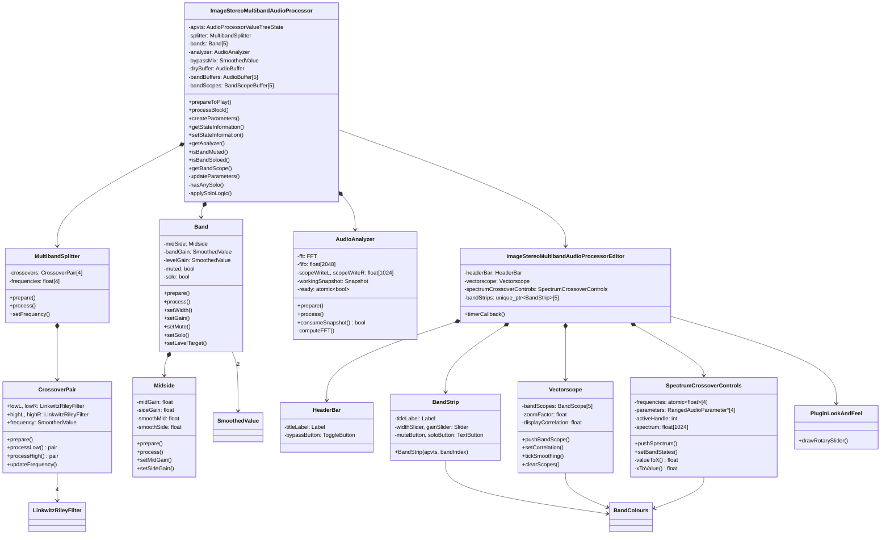

# ImageStereoMultiband — Technical Documentation

> **Author:** Pedro Cuomo Ghio  
> **Version:** 1.0.0  
> **Framework:** JUCE 8.0.12 | **Platform:** Windows x64 (VS2026)  
> **Format:** VST3

---

## Table of Contents

1. [General Architecture](#1-general-architecture)
2. [Project Structure](#2-project-structure)
3. [Audio Pipeline (Lifecycle)](#3-audio-pipeline-lifecycle)
   - [3.1 Initialization](#31-initialization)
   - [3.2 Preparation](#32-preparation)
   - [3.3 Block-by-block Processing](#33-block-by-block-processing)
   - [3.4 GUI Update](#34-gui-update)
   - [3.5 State Persistence](#35-state-persistence)
4. [Detailed Component Description](#4-detailed-component-description)
   - [4.1 MultibandSplitter — 5-band Splitting](#41-multibandsplitter--5-band-splitting)
   - [4.2 Crossover — Linkwitz-Riley LR4 Filters](#42-crossover--linkwitz-riley-lr4-filters)
   - [4.3 Midside — Mid/Side Processing](#43-midside--midside-processing)
   - [4.4 Band — Individual Band](#44-band--individual-band)
   - [4.5 AudioAnalyzer — FFT and Oscilloscope](#45-audioanalyzer--fft-and-oscilloscope)
   - [4.6 Smooth Bypass](#46-smooth-bypass)
   - [4.7 Solo Logic](#47-solo-logic)
5. [Graphical Interface — GUI](#5-graphical-interface--gui)
   - [5.1 General Layout](#51-general-layout)
   - [5.2 HeaderBar](#52-headerbar)
   - [5.3 BandStrip — Usage Guide](#53-bandstrip--usage-guide)
   - [5.4 SpectrumCrossoverControls](#54-spectrumcrossovercontrols)
   - [5.5 Vectorscope](#55-vectorscope)
   - [5.6 PluginLookAndFeel](#56-pluginlookandfeel)
   - [5.7 BandColours](#57-bandcolours)
6. [UML Class Diagram](#6-uml-class-diagram)
7. [Parameter System](#7-parameter-system)
8. [Audio Thread vs. GUI Thread](#8-audio-thread-vs-gui-thread)
9. [Inno Setup Installer](#9-inno-setup-installer)
10. [Developer Guide](#10-developer-guide)
    - [10.1 Adding a New Band](#101-adding-a-new-band)
    - [10.2 Adding a New Parameter](#102-adding-a-new-parameter)
    - [10.3 Building in Release](#103-building-in-release)
    - [10.4 Pending Stubs](#104-pending-stubs)
11. [Production Use Cases](#11-production-use-cases)
12. [In-Depth Code Explanation — Classes and Methods](#12-in-depth-code-explanation--classes-and-methods)
    - [12.1 PluginProcessor.h — JUCE Lifecycle Roles](#121-pluginprocessorh--juce-lifecycle-roles)
    - [12.2 PluginProcessor.cpp — The processBlock in Detail](#122-pluginprocessorcpp--the-processblock-in-detail)
    - [12.3 MultibandSplitter — Crossover Cascade](#123-multibandsplitter--crossover-cascade)
    - [12.4 CrossoverPair — LR4 Filters Per Channel](#124-crossoverpair--lr4-filters-per-channel)
    - [12.5 Band — Individual Band Processing](#125-band--individual-band-processing)
    - [12.6 Midside — Mid/Side Encoding/Decoding](#126-midside--midside-encodingdecoding)
    - [12.7 AudioAnalyzer — Real-time FFT](#127-audioanalyzer--real-time-fft)
    - [12.8 PluginEditor — Timer and Visual Update](#128-plugineditor--timer-and-visual-update)
    - [12.9 Vectorscope — Mid/Side Visualization](#129-vectorscope--midside-visualization)
    - [12.10 SpectrumCrossoverControls — Spectrum and Drag Handles](#1210-spectrumcrossovercontrols--spectrum-and-drag-handles)
    - [12.11 BandStrip — Per-band Controls](#1211-bandstrip--per-band-controls)
    - [12.12 HeaderBar — Top Bar](#1212-headerbar--top-bar)
    - [12.13 PluginLookAndFeel — Custom Theme](#1213-pluginlookandfeel--custom-theme)
    - [12.14 BandColours — Color Palette](#1214-bandcolours--color-palette)
13. [Class Dependency Diagram](#13-class-dependency-diagram)
14. [Known Limitations and Roadmap](#14-known-limitations-and-roadmap)

---

## 1. General Architecture

ImageStereoMultiband is a VST3 plugin that processes stereo audio by splitting it into **5 frequency bands** using 4 cascaded 4th-order Linkwitz-Riley (LR4) filters. Each band independently processes its content with stereo width control (Mid/Side) and gain, then the bands are summed to produce the final output.

```
                    ┌──────────────────────────────────────┐
                    │            AudioProcessor            │
                    │         (DAW audio thread)            │
                    └──────────────────────────────────────┘
                                      │
                    ┌─────────────────▼──────────────────┐
                    │         updateParameters()          │
                    │   Reads APVTS and syncs everything  │
                    └─────────────────┬──────────────────┘
                                      │
              ┌───────────────────────┬───────────────────────┐
              ▼                       ▼                       ▼
    ┌──────────────────┐   ┌──────────────────┐   ┌──────────────────┐
    │  MultibandSplitter│   │   Band[0..4]     │   │   AudioAnalyzer  │
    │  (LR4 cascade)   │   │  MidSide + Gain  │   │   FFT + Scope    │
    │  input → 5 bands │──▶│  Mute/Solo logic │──▶│   snapshot→GUI   │
    └──────────────────┘   └──────────────────┘   └──────────────────┘
                                      │
                                      ▼
                              ┌──────────────────┐
                              │   Bypass mix     │
                              │  (50ms crossfade)│
                              └──────────────────┘
                                      │
                                      ▼
                              ┌──────────────────┐
                              │   Output buffer   │
                              └──────────────────┘
```

The GUI runs on the **JUCE message thread** and is updated via a **30 fps timer** that atomically polls snapshots produced by the analyzer.

---

## 2. Project Structure

```
ImageStereoMultiband/
│
├── ImageStereoMultiband.jucer           ← JUCE project (PROJUCER)
├── README.md                            ← User and developer guide
├── DOCUMENTATION.md                     ← Spanish technical docs
├── DOCUMENTATION_EN.md                  ← English technical docs (this file)
├── installer.iss                        ← Inno Setup script
├── ImageStereoMultiband_Installer.exe   ← Compiled installer
│
├── Source/                              ← SOURCE CODE
│   │
│   ├── PluginProcessor.h                → AudioProcessor class
│   ├── PluginProcessor.cpp              → Audio pipeline + parameters
│   ├── PluginEditor.h                   → AudioProcessorEditor class
│   ├── PluginEditor.cpp                 → Layout + 30 fps timer
│   │
│   ├── Parameters/                      → [stubs] Not yet implemented
│   │   ├── ParameterIDs.h
│   │   ├── ParameterLayout.h
│   │   └── ParameterLayout.cpp
│   │
│   ├── DSP/                             → Digital audio processing
│   │   ├── MultibandSplitter/           → Spectral 5-band splitting
│   │   │   ├── MultibandSplitter.h
│   │   │   └── MultibandSplitter.cpp
│   │   ├── Crossover/                   → LR4 filters (one crossover point)
│   │   │   ├── Crossover.h
│   │   │   └── Crossover.cpp
│   │   ├── Band/                        → Band: MidSide + gain
│   │   │   ├── Band.h
│   │   │   └── Band.cpp
│   │   ├── Midside/                     → Mid/Side encoding
│   │   │   ├── MidSide.h
│   │   │   └── MidSide.cpp
│   │   ├── Analyzer/                    → FFT + oscilloscope
│   │   │   ├── AudioAnalyzer.h
│   │   │   └── AudioAnalyzer.cpp
│   │   ├── Gain/                        → [stub]
│   │   │   ├── Gain.h
│   │   │   └── Gain.cpp
│   │   └── DryWet/                      → [stub]
│   │       ├── DryWet.h
│   │       └── DryWet.cpp
│   │
│   └── GUI/                             → Graphical interface
│       ├── LookAndFeel/                 → Custom visual theme
│       │   ├── PluginLookAndFeel.h
│       │   └── PluginLookAndFeel.cpp
│       ├── Components/
│       │   ├── HeaderBar/               → Title + bypass
│       │   │   ├── HeaderBar.h
│       │   │   └── HeaderBar.cpp
│       │   ├── BandStrip/              → Per-band controls
│       │   │   ├── BandStrip.h
│       │   │   └── BandStrip.cpp
│       │   ├── SpectrumCrossoverControls/ → Spectrum + crossover handles
│       │   │   ├── SpectrumCrossoverControls.h
│       │   │   └── SpectrumCrossoverControls.cpp
│       │   └── Vectorscope/            → Mid/Side scope
│       │       ├── Vectorscope.h
│       │       └── Vectorscope.cpp
│       └── BandColours.h               → 5-color palette
│
├── Builds/
│   └── VisualStudio2026/                → VS2026 solution
│       ├── ImageStereoMultiband.sln
│       ├── ImageStereoMultiband_StandalonePlugin.vcxproj
│       ├── ImageStereoMultiband_VST3.vcxproj
│       ├── ImageStereoMultiband_SharedCode.vcxproj
│       ├── x64/Debug/Standalone Plugin/ → .exe debug
│       └── x64/Debug/VST3/              → .vst3 debug
│
└── JuceLibraryCode/                     → Generated by JUCE
```

---

## 3. Audio Pipeline (Lifecycle)

### 3.1 Initialization

```cpp
ImageStereoMultibandAudioProcessor()
  ├── AudioProcessor(buses: stereo in/out)
  ├── apvts(*this, &undoManager, "Parameters", createParameters())
  └── undoManager
```

`createParameters()` generates **25 parameters**:

- 5 bands × 4 parameters: Width, Gain, Mute, Solo
- 4 crossover frequencies
- 1 bypass

### 3.2 Preparation

The DAW calls `prepareToPlay(sampleRate, samplesPerBlock)`:

```
prepareToPlay(44100, 512)
  │
  ├── spec = { 44100, 512, 2 }
  ├── splitter.prepare(spec)
  │     └── 4 crossovers × 4 LR4 filters = 16 filters prepared
  ├── bands[i].prepare(spec)
  │     └── MidSide.prepare() + SmoothedValue::reset(44100, 0.02)
  ├── bandBuffers[i].setSize(2, 512)
  ├── analyzer.prepare(44100, 512) → reset(), fftHop = 512
  ├── bypassMix.reset(44100, 0.05) → 50 ms ramp
  └── dryBuffer.setSize(2, 512)
```

### 3.3 Block-by-block Processing

```
processBlock(buffer, midiMessages)
  │
  ├── updateParameters()
  │     ├── Read APVTS: Width, Gain, Mute, Solo × 5 bands
  │     ├── Read crossover1..4, apply limits with gap ≥ 100 Hz
  │     ├── splitter.setFrequency(i, f)
  │     └── setBypassed(state)
  │
  ├── dryBuffer.makeCopyOf(buffer)              ← backup for bypass
  │
  ├── splitter.process(buffer, bandBuffers)
  │     └── Input → 5 buffers: band[0..4]
  │
  ├── for (auto& band : bands)
  │     band.process(bandBuffers[i])
  │       ├── midSide.process() → width
  │       └── gain = bandGain × levelGain (sample-by-sample)
  │
  ├── applySoloLogic()
  │     └── setLevelTarget(1.0 or 0.0) on each band
  │
  ├── buffer.clear()
  │     buffer.addFrom(bandBuffers[i])  ← sum all bands
  │
  ├── analyzer.process(buffer)           ← FFT on the result
  │
  └── Bypass crossfade (sample-by-sample)
        out = wet × mix + dry × (1 - mix)
```

### 3.4 GUI Update

The editor has a **30 Hz timer** (~33 ms). Each tick:

```
timerCallback()
  │
  ├── analyzer.consumeSnapshot(snap)
  │     ├── Success: new FFT available
  │     │   ├── vectorscope.pushBandScope(0..4) → per-band data
  │     │   ├── Compute correlation Σ(L×R)/√(ΣL²×ΣR²)
  │     │   ├── spectrumCrossoverControls.pushSpectrum()
  │     │   └── repaint()
  │     └── Failure: no new data
  │         └── vectorscope.clearScopes()
  │
  └── vectorscope.tickSmoothing()
        └── IIR smoothing: displayCorrelation += (target - current) × 0.12
```

### 3.5 State Persistence

```
getStateInformation()
  └── apvts.copyState() → XML → MemoryBlock

setStateInformation()
  └── MemoryBlock → XML → apvts.replaceState()
```

The DAW calls these methods when saving/loading projects, ensuring all parameters (crossovers, gains, solos, bypass) are preserved.

---

## 4. Detailed Component Description

### 4.1 MultibandSplitter — 5-band Splitting

Splits the stereo signal into 5 bands using **4 cascaded 4th-order Linkwitz-Riley crossovers**:

```

Stereo input
      │
      ▼
┌──────────────┐
│ Crossover[0] │ 120 Hz
│  LR4 lowpass │───→ Band[0]
│  LR4 highpass│───→ ─┐
└──────────────┘      │
                      ▼
              ┌──────────────┐
              │ Crossover[1] │ 500 Hz
              │  LR4 lowpass │───→ Band[1]
              │  LR4 highpass│───→ ─┐
              └──────────────┘      │
                                    ▼
                            ┌──────────────┐
                            │ Crossover[2] │ 2 kHz
                            │  LR4 lowpass │───→ Band[2]
                            │  LR4 highpass│───→ ─┐
                            └──────────────┘      │
                                                  ▼
                                          ┌──────────────┐
                                          │ Crossover[3] │ 8 kHz
                                          │  LR4 lowpass │───→ Band[3]
                                          │  LR4 highpass│───→ Band[4]
                                          └──────────────┘
```

**CrossoverPair** (nested struct in `MultibandSplitter.h`):
- 4 `LinkwitzRileyFilter<float>` filters: lowL, lowR, highL, highR
- `SmoothedValue<float> frequency` with 50 ms ramp
- `processLow(l, r)` and `processHigh(l, r)` return `pair<float,float>` sample-by-sample

**Default frequencies:** 120, 500, 2000, 8000 Hz.

Processing is **sample-by-sample** to allow smooth frequency automation. Each crossover calls `updateFrequency()` at the start of each sample to update the cutoff frequency with smoothing.

### 4.2 Crossover — Linkwitz-Riley LR4 Filters

**4th-order Linkwitz-Riley** = two cascaded 2nd-order Butterworth filters. Slope of **24 dB/octave**. The sum of lowpass and highpass yields a flat magnitude response.

```cpp
struct CrossoverPair {
    LinkwitzRileyFilter<float> lowL, lowR;   // lowpass
    LinkwitzRileyFilter<float> highL, highR; // highpass
    SmoothedValue<float> frequency;          // 50 ms ramp

    void updateFrequency() {
        auto f = frequency.getNextValue();
        lowL.setCutoffFrequency(f);
        lowR.setCutoffFrequency(f);
        highL.setCutoffFrequency(f);
        highR.setCutoffFrequency(f);
    }
};
```

The standalone `Crossover` class (`Crossover.h/.cpp`) is independent but currently **not used directly** — `MultibandSplitter` uses `CrossoverPair` which has the same structure internally.

### 4.3 Midside — Mid/Side Processing

Converts the stereo signal (L,R) to Mid (mono) and Side (stereo) components, applies independent gains, and converts back to L,R.

**Equations:**

```
Mid  = (L + R) / √2
Side = (L - R) / √2

L' = (Mid × gainMid + Side × gainSide) / √2
R' = (Mid × gainMid - Side × gainSide) / √2
```

The `√2` factor ensures power conservation.

**First-order IIR smoothing:**

```cpp
smoothMid  += 0.002 × (midGain  - smoothMid)
smoothSide += 0.002 × (sideGain - smoothSide)
```

Where `0.002` is the smoothing constant. At `sampleRate = 44100`, the time constant is approximately `τ ≈ 1 / (0.002 × 44100) ≈ 11 ms`.

**Width control:** Exposed through `Band::setWidth()`:
- `sideGain = 0` → Mono (Mid only)
- `sideGain = 1` → Original stereo width
- `sideGain = 2` → Widened stereo (double Side component)

`midGain` is always `1.0` — not exposed as a parameter in the current version.

### 4.4 Band — Individual Band

Each band encapsulates:

```
Band
├── Midside midSide        → Stereo width processing
├── SmoothedValue bandGain → General gain (20 ms)
└── SmoothedValue levelGain → Mute/solo gain (20 ms)
```

**`process()` method:**

```cpp
void Band::process(juce::AudioBuffer<float>& buffer) {
    midSide.process(buffer);          // Apply width

    for (int sample = 0; sample < buffer.getNumSamples(); ++sample) {
        auto totalGain = bandGain.getNextValue() * levelGain.getNextValue();
        left[sample]  *= totalGain;
        right[sample] *= totalGain;
    }
}
```

**Control from the processor:**
- `setWidth(float)` → `midSide.setSideGain(width)`
- `setGain(float dB)` → `bandGain.setTargetValue(Decibels::decibelsToGain(dB))`
- `setMute(bool)` / `setSolo(bool)` → flags used by `applySoloLogic()`
- `setLevelTarget(float)` → used by `applySoloLogic()` for muting/unmuting

### 4.5 AudioAnalyzer — FFT and Oscilloscope

Real-time spectrum analyzer with the following parameters:

| Parameter | Value |
|-----------|-------|
| FFT Order | 11 |
| FFT Size | 2048 samples |
| Hop size | 512 samples (75% overlap) |
| Window | Hann |
| Spectral bins | 1024 |
| dB floor | -120 dB |
| Scope size | 1024 samples L/R |
| Synchronization | `std::atomic<bool> ready` |

**Pipeline:**

```
Circular FIFO (2048)
  │ write: (L+R)/2 at fifo[fifoIndex++ % 2048]
  │
  └── Every 512 samples:
        ├── Apply Hann window
        │     w[n] = 0.5 × (1 - cos(2πn/(N-1)))
        │     fftData[n] = fifo[n] × w[n]
        │
        ├── Forward FFT (2048 points)
        │
        ├── Magnitude → dB per bin:
        │     Bin 0 (DC):     |fftData[0]| / N
        │     Bins 1..1022:   √(real² + imag²) / N
        │     Bin 1023 (Nyq): |fftData[1]| / N
        │     → Decibels::gainToDecibels(mag, -120dB)
        │
        ├── Copy scope L/R from ring buffer
        │     scope[0..1023] from oldestIdx
        │
        └── ready.store(true)
```

**Consumption from GUI:**

```cpp
bool consumeSnapshot(Snapshot& output) {
    if (!ready.exchange(false))
        return false;      // No new data
    // Safe copy to output
    memcpy(output.spectrum, workingSnapshot.spectrum, ...);
    memcpy(output.scopeLeft, workingSnapshot.scopeLeft, ...);
    return true;
}
```

### 4.6 Smooth Bypass

The bypass does not cut abruptly but performs a **linear crossfade** over 50 ms:

```
bypass engaged:   mix: 1.0 → 0.0 (wet fades out, dry fades in)
bypass disengaged: mix: 0.0 → 1.0 (dry fades out, wet fades in)
```

```cpp
// In processBlock, sample-by-sample:
for (int sample = 0; sample < buffer.getNumSamples(); ++sample) {
    auto mix = bypassMix.getNextValue();  // SmoothedValue, 50 ms
    for (int ch = 0; ch < numChannels; ++ch) {
        auto wet = buffer.getSample(ch, sample);
        auto dry = dryBuffer.getSample(ch, sample);
        buffer.setSample(ch, sample, wet * mix + dry * (1.0f - mix));
    }
}
```

The `dryBuffer` is captured immediately after `updateParameters()` and before any processing.

### 4.7 Solo Logic

The solo/mute logic is implemented through `setLevelTarget()` with 20 ms smoothing:

```cpp
void ImageStereoMultibandAudioProcessor::applySoloLogic() {
    const bool anySolo = hasAnySolo();
    for (auto& band : bands) {
        float target = 1.0f;
        if (anySolo)
            target = band.isSolo() ? 1.0f : 0.0f;
        else
            target = band.isMuted() ? 0.0f : 1.0f;
        band.setLevelTarget(target);
    }
}
```

| Situation | Band.Solo | Band.Muted | levelTarget |
|-----------|-----------|------------|-------------|
| No solos active | false | false | 1.0 |
| No solos active | false | true | 0.0 |
| At least one solo | true | — | 1.0 |
| At least one solo | false | — | 0.0 |

---

## 5. Graphical Interface — GUI

### 5.1 General Layout

The plugin window is **980 × 720 px** with this layout:

```
┌──────────────────────────────────────────────────────────────────┐
│  ImageStereoMultiband                        [Bypass]            │  50px
├──────────────────────────────────────────────────────────────────┤
│                                                                  │
│  ┌────────────────────────────────────────────────────────────┐  │
│  │  Frequency — FFT spectrum + crossover handles              │  │
│  │  (draggable) + colored band fills                          │  │  200px
│  │                                                            │  │
│  └────────────────────────────────────────────────────────────┘  │
│                                                                  │
├────────┬────────┬────────┬────────┬────────┬───────────────────┤ │
│Band 1  │Band 2  │Band 3  │Band 4  │Band 5  │  Vectorscope      │ │
│        │        │        │        │        │  Mid/Side +       │ │
│ Width  │ Width  │ Width  │ Width  │ Width  │  correlation      │ │
│ ───○── │ ───○── │ ───○── │ ───○── │ ───○── │                   │ │
│        │        │        │        │        │  x6.5  [W][C]     │ │
│ Gain   │ Gain   │ Gain   │ Gain   │ Gain   │                   │ │
│  │     │  │     │  │     │  │     │  │     │  ╭──╮             │ │
│  ○     │  ○     │  ○     │  ○     │  ○     │  ╰──╯ ●           │ │
│  │     │  │     │  │     │  │     │  │     │                   │ │
│ [M][S] │ [M][S] │ [M][S] │ [M][S] │ [M][S] │   correlation     │ │
│        │        │        │        │        │   ││││││││││││    │ │
│        │        │        │        │        │      0.85          │ │
└────────┴────────┴────────┴────────┴────────┴───────────────────┘ │
└──────────────────────────────────────────────────────────────────┘
```

### 5.2 HeaderBar

Files: `Source/GUI/Components/HeaderBar.h/.cpp`

Top component containing:
- **Title:** `Label` with "ImageStereoMultiband" white bold 22px font, left-aligned
- **Bypass:** `ToggleButton` connected to the `"bypass"` parameter via `ButtonAttachment`

Visual style: background `#15171a` with bottom divider line `#343941`.

### 5.3 BandStrip — Usage Guide

Files: `Source/GUI/Components/BandStrip.h/.cpp`

Each band has a panel with these controls, vertically arranged:

```
┌──────────────────┐
│    Band N        │  ← Title
│                  │
│  ──── ○ ────     │  ← Width (horizontal slider)
│    Width         │
│                  │
│       │          │
│       ○          │  ← Gain (vertical slider)
│       │          │     Range: -24 to +24 dB
│                  │
│   [ M ] [ S ]    │  ← Mute (M) and Solo (S) buttons
└──────────────────┘
```

**How to use:**

1. **Width:** Drag horizontally to adjust the stereo width of the band. At `0` the band becomes mono; at `1` it's the original width; beyond `1` it is artificially widened.

2. **Gain:** Drag vertically to increase or decrease the band's volume. The dB value is displayed below the slider.

3. **M (Mute):** Click to mute the band. The button lights up with the band's color.

4. **S (Solo):** Click to isolate the band. If you activate Solo on any band, all others are automatically muted. You can activate multiple solos simultaneously.

**Per-band colors:**

| Band | Color |
|------|-------|
| 1 | Red/Pink |
| 2 | Blue |
| 3 | Green |
| 4 | Yellow |
| 5 | Purple |

### 5.4 SpectrumCrossoverControls

Files: `Source/GUI/Components/SpectrumCrossoverControls.h/.cpp`

Composite component that integrates three features:

#### a) FFT Spectrum Display

Draws the spectral curve on a **logarithmic** scale from 20 Hz to 20 kHz. Levels are shown from -96 dB to 0 dB. The curve is rendered as a JUCE path with curved stroke.

**Coordinate transformation:**

```cpp
// Frequency → X position (logarithmic)
float valueToX(float frequency) {
    auto proportion = (log10(f) - log10(20)) / (log10(20000) - log10(20));
    return graphX + graphWidth * proportion;
}

// X position → frequency
float xToValue(float x) {
    auto proportion = (x - graphX) / graphWidth;
    return pow(10, log10(20) + proportion * (log10(20000) - log10(20)));
}
```

#### b) Crossover Handles

Four draggable vertical lines that control the crossover frequencies. On drag:

1. `mouseDown()` → detects the nearest handle (`findNearestHandle`), starts gesture
2. `mouseDrag()` → updates frequency via `setCrossoverFrequency(i, xToValue(x))`
3. `mouseUp()` → ends gesture

**Constraints:** `getConstrainedFrequency()` ensures a **minimum gap of 100 Hz** between adjacent crossovers.

#### c) Band Fills

Colored areas between crossovers shaded according to each band's color. Opacity reflects the state:

| State | Fill opacity |
|-------|-------------|
| Normal | 20% |
| Solos active, band with solo | 40% |
| Solos active, band without solo | 5% |
| Muted | 5% |

#### Labels and Marks

- **Horizontal grid lines:** -80, -60, -40, -20 dB
- **Vertical frequency marks:** 30, 60, 100, 300, 1k, 5k, 15k Hz
- **Crossover labels:** format "120", "2.0k", "10.0k" depending on magnitude
- **"Hz" label** at the bottom-right corner of the graph

### 5.5 Vectorscope

Files: `Source/GUI/Components/Vectorscope.h/.cpp`

Mid/Side visualizer that shows the stereo image in real time. It is the most complex GUI component.

#### Operating Principle

Each stereo sample is converted to Mid/Side coordinates:

```
mid  = (L + R) / 2      → Y axis (screen inverted: up is positive)
side = (L - R) / 2      → X axis
```

#### Visual Elements

- **Crosshair:** Vertical and horizontal lines at the center
- **Reference circles:** Concentric rings at 50% and 100% of maximum size
- **Mono reference line:** Vertical line at center (side = 0)
- **Dots:** Each sample is drawn as a 1.8 px circle. Opacity increases from 8% to 85% across the buffer (newer samples are brighter)
- **Zoom:** 0.5× to 8.0×, controlled by +/- buttons or mouse wheel
- **Color mode:** W/C button toggles between white (all dots cyan `#58c7d9`) and per-band colors

#### Correlation Meter

```
correlation = Σ(L×R) / √(ΣL² × ΣR²)

  +1.0 → Perfectly mono (L = R)
   0.0 → Uncorrelated
  -1.0 → Phase inversion (L = -R)
```

The meter is a horizontal bar with colors:
- **Green** (> 0.7): Well correlated
- **Yellow** (0.3 – 0.7): Partially correlated
- **Orange** (-0.3 – 0.3): Uncorrelated / wide
- **Red** (< -0.3): Out of phase

The numeric value is displayed centered and smoothed with `tickSmoothing()` using an IIR filter (coefficient 0.12).

#### Control Buttons

| Button | Action |
|--------|--------|
| **+** | Increase zoom (max 8.0×) |
| **-** | Decrease zoom (min 0.5×) |
| **W/C** | Toggle between white and per-band colors |

### 5.6 PluginLookAndFeel

Files: `Source/GUI/LookAndFeel/PluginLookAndFeel.h/.cpp`

Custom visual theme inheriting from `LookAndFeel_V4`:

**Base colors:**

| Property | Color |
|----------|-------|
| Window background | `#15171a` |
| Slider thumb | `#ffb84d` |
| Rotary slider fill | `#58c7d9` |
| Rotary slider outline | `#343941` |
| Normal button | `#252a31` |
| Activated button | `#58c7d9` |

**`drawRotarySlider()`:** Custom rendering with:
1. **Background arc:** Full circle outline stroke
2. **Value arc:** Stroke from start to current position
3. **Indicator:** Circle (8×8 px) at the current position on the arc

### 5.7 BandColours

Files: `Source/GUI/BandColours.h`

Color palette defined as `constexpr` in a namespace:

```cpp
namespace BandColours {
    inline constexpr int numBands = 5;

    inline juce::Colour getBandColour(int index) {
        static const std::array<juce::Colour, 5> colours {
            juce::Colour(0xffee6677),  // Red/Pink
            juce::Colour(0xff4477aa),  // Blue
            juce::Colour(0xff228833),  // Green
            juce::Colour(0xffccbb44),  // Yellow
            juce::Colour(0xffaa3377)   // Purple
        };
        return colours[jlimit(0, 4, index)];
    }

    inline juce::Colour getBandFillColour(int index) {
        return getBandColour(index).withAlpha(0.20f);
    }
}
```

---

## 6. UML Class Diagram



---

## 7. Parameter System

All parameters are defined in `PluginProcessor::createParameters()` and managed through `AudioProcessorValueTreeState`.

| Parameter | ID | Type | Range | Default |
|-----------|----|------|-------|---------|
| Width band N | `band{N}Width` | Float | 0.0 – 2.0 | 1.0 |
| Gain band N | `band{N}Gain` | Float | -24 – 24 dB | 0.0 |
| Mute band N | `band{N}Mute` | Bool | off/on | false |
| Solo band N | `band{N}Solo` | Bool | off/on | false |
| Crossover 1 | `crossover1` | Float | 20 – 20000 Hz | 120 |
| Crossover 2 | `crossover2` | Float | 20 – 20000 Hz | 500 |
| Crossover 3 | `crossover3` | Float | 20 – 20000 Hz | 2000 |
| Crossover 4 | `crossover4` | Float | 20 – 20000 Hz | 8000 |
| Bypass | `bypass` | Bool | off/on | false |

Total: **25 parameters** (5 bands × 4 + 4 crossovers + 1 bypass).

### Connection with the GUI

The connection between parameters and visual controls is made via `Attachments`:

```cpp
// In BandStrip constructor:
widthAttachment = make_unique<SliderAttachment>(apvts, "band1Width", widthSlider);
gainAttachment  = make_unique<SliderAttachment>(apvts, "band1Gain", gainSlider);
muteAttachment  = make_unique<ButtonAttachment>(apvts, "band1Mute", muteButton);
soloAttachment  = make_unique<ButtonAttachment>(apvts, "band1Solo", soloButton);
```

### Real-time Constraints

`updateParameters()` applies limits to crossover frequencies to ensure a minimum gap of 100 Hz between bands:

```cpp
f1 = jlimit(20.0f, 19600.0f, f1);
f2 = jlimit(f1 + 100, 19700.0f, f2);
f3 = jlimit(f2 + 100, 19800.0f, f3);
f4 = jlimit(f3 + 100, 19900.0f, f4);
```

---

## 8. Audio Thread vs. GUI Thread

Communication between the audio thread (real-time) and the GUI thread is done through **shared atomic data**:

### AudioAnalyzer

```cpp
// Audio thread (processBlock):
void computeFFT() {
    // ... processing ...
    ready.store(true);   // Signal: new data available
}

// GUI thread (30 Hz timer):
bool consumeSnapshot(Snapshot& output) {
    if (!ready.exchange(false))  // Take the flag and reset it
        return false;             // No new data
    // Safe copy from workingSnapshot to output
    return true;
}
```

### SpectrumCrossoverControls

Crossover frequencies are shared via `std::atomic<float>[4]`:

```cpp
// Updated from audio thread or parameter change:
frequencies[i].store(constrainedFrequency);

// Read from paint thread:
auto f = frequencies[i].load();
```

### Vectorscope

Band scope data is written from `processBlock` and read from `timerCallback`. There is no explicit synchronization because the timer uses `consumeSnapshot` atomically and scope buffers are overwritten each block — occasional frame loss is acceptable for visualization.

---

## 9. Inno Setup Installer

The `installer.iss` file generates an installer that copies the VST3 plugin to:

```
C:\Program Files\Common Files\VST3\ImageStereoMultiband.vst3\
```

This is the standard location where DAWs look for 64-bit VST3 plugins on Windows.

**Installer requirements:**
- Administrator privileges (needed to write to `Program Files`)
- x64 architecture (compatible with 64-bit systems)

**To regenerate the installer:**

```bash
# 1. Compile the project in Release (x64) from VS2026
# 2. Update paths in installer.iss if necessary
# 3. Run:
& "C:\Program Files (x86)\Inno Setup 6\ISCC.exe" installer.iss
```

---

## 10. Developer Guide

### 10.1 Adding a New Band

To expand the plugin to **6 bands** (5 crossovers):

1. **`PluginProcessor.h`:** Change `numBands = 6`, `bandBuffers[6]`, `bandScopes[6]`
2. **`MultibandSplitter.h`:** Change `frequencies[5]`, `crossovers[5]`, outputs `array<AudioBuffer, 6>`
3. **`MultibandSplitter.cpp`:** Add one more crossover to the cascade, update outputs
4. **`PluginProcessor.cpp`:** Change loops `for (int i = 0; i < 5; ++i)` to `i < 6`
5. **`BandColours.h`:** Add a sixth color to the palette
6. **`PluginEditor.cpp`:** Update `bandStrips` from 5 to 6, recalculate layout
7. **`createParameters()`:** Add Width, Gain, Mute, Solo for band 6 + crossover 5

### 10.2 Adding a New Parameter

Example: add a **Mid Gain** control to each band:

1. **`PluginProcessor::createParameters()`:** Add `AudioParameterFloat("band{N}Mid", ...)`
2. **`Midside.h`:** Ensure `setMidGain()` exists
3. **`Band.h`:** Add `setMidGain(float)`
4. **`PluginProcessor::updateParameters()`:** Read new parameter and call `bands[i].setMidGain()`
5. **`BandStrip.h/.cpp`:** Add slider + attachment
6. **`installer.iss`:** Update version if needed

### 10.3 Building in Release

```bash
# From VS2026 Developer Command Prompt:
msbuild Builds/VisualStudio2026/ImageStereoMultiband.sln /p:Configuration=Release /p:Platform=x64
```

Or from the IDE: Configuration → Release, Platform → x64, Build.

Release binaries are generated at:
- `Builds/VisualStudio2026/x64/Release/VST3/ImageStereoMultiband.vst3/`
- `Builds/VisualStudio2026/x64/Release/Standalone Plugin/ImageStereoMultiband.exe`

### 10.4 Pending Stubs

These files are empty and could be implemented in the future:

| File | Possible purpose |
|------|-----------------|
| `Parameters/ParameterIDs.h` | Centralize parameter IDs as constants |
| `Parameters/ParameterLayout.h/.cpp` | Separate parameter layout creation from `PluginProcessor` |
| `DSP/Gain.h/.cpp` | Reusable gain module (currently gain is in `Band`) |
| `DSP/DryWet.h/.cpp` | Independent wet/dry mix control (currently part of bypass) |

---

## 11. Production Use Cases

### 11.1 Mastering — Per-band Stereo Width Adjustment

In mastering, controlling stereo width per frequency range is essential for a competitive, mono-compatible final master.

**Problem:** A mix sounds narrow in high frequencies but the low end is too wide, causing phase issues when summed to mono.

**Solution with ImageStereoMultiband:**
1. Load the plugin on the master channel (last slot in the mastering chain)
2. Adjust crossovers: band 1 (sub-bass) up to ~120 Hz, band 2 (bass) up to ~500 Hz
3. Reduce Width in bands 1 and 2 to **0.0** (forced mono) — this centers low-frequency energy
4. Increase Width in band 4 or 5 (highs) to **1.2–1.5** to widen the stereo image
5. Use the **vectorscope** as a guide: correlation should stay > 0.5 at all times

**Result:** A master with solid, centered lows, wide but coherent highs, and zero phase cancellation when summed to mono.

### 11.2 Mixing — Controlling Width on Specific Instruments

**Problem:** A synth pad track sounds very wide and masks the lead vocal in the center.

**Solution:**
1. Insert the plugin on the synth channel
2. Identify the vocal frequency range (typically 300 Hz – 3 kHz)
3. Set crossover 2 to ~300 Hz and crossover 3 to ~3 kHz
4. Reduce Width in band 2 or 3 (where the vocal lives) to **0.5–0.7**
5. Keep Width high in the outer bands to preserve the pad's spaciousness

**Tip:** Use the **S (Solo)** buttons to isolate each band and hear exactly what range you are modifying.

### 11.3 Sound Design — Extreme Width Effects

**Problem:** A creative stereo widening effect is needed for a breakdown or transition.

**Solution:**
1. Load the plugin on an effect bus
2. Increase Width on all bands to **1.5–2.0** (maximum widening)
3. Experiment with different crossover configurations to find which ranges sound most interesting when widened
4. Use **Mute** on specific bands to create "spectral gaps" that play with spatial perception
5. Automate the crossovers throughout the song to create movement in the stereo image

**Warning:** Extreme widening (>1.5) can cause listening fatigue and phase issues. Use sparingly and check correlation on the vectorscope.

### 11.4 Restoration — Correcting Phase Issues

**Problem:** A drum recording has out-of-phase microphones, resulting in a hollow, punchless sound.

**Solution:**
1. Insert the plugin on the drum channel
2. Observe the **vectorscope**: if correlation is negative (< -0.3) in certain bands, phase cancellation is occurring
3. Use the **S (Solo)** buttons to identify which band has the lowest correlation
4. Reduce Width to **0.0** (mono) on the problematic band(s) to force phase coherence
5. Alternatively, adjust the crossovers to specifically isolate the frequency where cancellation occurs

**Result:** The drums regain punch and definition without necessarily losing the stereo image in the non-problematic bands.

---

## 12. In-Depth Code Explanation — Classes and Methods

This section walks through every class in the project, documenting all methods, their parameters, behavior, and role within the system. It is the definitive reference for developers who need to understand, modify, or extend the plugin.

### 12.1 `ImageStereoMultibandAudioProcessor` — `PluginProcessor.h`

This is the central plugin class. It inherits from `juce::AudioProcessor` and is the entry point the DAW uses for the entire plugin lifecycle.

#### JUCE Lifecycle Methods

| Method | Called by | Purpose |
|--------|-----------|---------|
| `ImageStereoMultibandAudioProcessor()` | DAW when instantiating the plugin | Initializes stereo buses and the `AudioProcessorValueTreeState` (APVTS) with 25 parameters |
| `~ImageStereoMultibandAudioProcessor()` | DAW when destroying the plugin | Releases resources |
| `prepareToPlay(sampleRate, samplesPerBlock)` | DAW when starting playback | Prepares all submodules with the project's sample rate and block size |
| `releaseResources()` | DAW when stopping playback | Currently empty — resources are released in the destructor |
| `processBlock(buffer, midiBuffer)` | DAW on each audio block | Full processing pipeline (see section 12.2) |

#### Channel Configuration Methods

```cpp
bool isBusesLayoutSupported(const BusesLayout& layouts) const;
```
**Location:** `PluginProcessor.cpp:208-237`
**Purpose:** Validates that the channel layout is supported. Accepts only mono or stereo configurations, and requires matching input/output layouts.

**Parameters:**
- `layouts`: Proposed bus layout from the DAW

**Returns:** `true` if layout is mono or stereo with symmetric input/output

#### Parameter Creation and Access Methods

```cpp
static ParameterLayout createParameters();
```
**Location:** `PluginProcessor.cpp:40-101`
**Purpose:** Generates the plugin's 25 parameters. Iterates 5 bands creating Width (float 0–2), Gain (float -24–24 dB), Mute (bool), Solo (bool). Then creates 4 crossovers (float 20–20000 Hz) with default values (120, 500, 2000, 8000). Finally creates the bypass (bool).

**Returns:** `ParameterLayout` (vector of `RangedAudioParameter`) — passed to the APVTS constructor

```cpp
AudioProcessorValueTreeState& getAPVTS();
```
**Location:** `PluginProcessor.cpp:465-468`
**Purpose:** Returns a reference to the internal `APVTS`, allowing the editor and GUI components to access parameters.

**Returns:** Reference to `apvts`

#### State Methods (Presets)

```cpp
void getStateInformation(MemoryBlock& destData);
```
**Location:** `PluginProcessor.cpp:430-439`
**Purpose:** Serializes the entire plugin state (all parameters) to a `MemoryBlock`. The DAW calls this when saving the project. Flow: `apvts.copyState()` → `ValueTree::createXml()` → `copyXmlToBinary()`.

```cpp
void setStateInformation(const void* data, int sizeInBytes);
```
**Location:** `PluginProcessor.cpp:441-456`
**Purpose:** Restores the plugin state from a `MemoryBlock`. The DAW calls this when loading the project. Reverse flow: `getXmlFromBinary()` → `ValueTree::fromXml()` → `apvts.replaceState()`.

#### Internal Update and Logic Methods

```cpp
void updateParameters();
```
**Location:** `PluginProcessor.cpp:322-377`
**Purpose:** Synchronizes all submodules with the current APVTS values. Called at the start of each `processBlock()`.

**Flow:**
1. Iterates 5 bands: reads Width, Gain, Mute, Solo from APVTS and applies them to `bands[i]`
2. Reads 4 crossovers from APVTS and applies minimum gap limits (100 Hz between adjacent)
3. Applies limits using `juce::jlimit()` with chain dependencies:
   - `f2 = jlimit(f1 + minBandWidth, 19700.0f, f2)`
   - `f3 = jlimit(f2 + minBandWidth, 19800.0f, f3)`
   - `f4 = jlimit(f3 + minBandWidth, 19900.0f, f4)`
4. Calls `splitter.setFrequency(i, f)` to update cutoff frequencies
5. Reads bypass state and calls `setBypassed()`

```cpp
bool hasAnySolo() const;
```
**Location:** `PluginProcessor.cpp:381-390`
**Purpose:** Returns `true` if at least one band has the solo flag active.

```cpp
void applySoloLogic();
```
**Location:** `PluginProcessor.cpp:392-411`
**Purpose:** Implements solo/mute logic. If any solo is active, all non-soloed bands are silenced (`levelTarget = 0.0`). If no solos are active, muted bands are silenced and non-muted bands play (`levelTarget = 1.0`). Changes are applied via `setLevelTarget()` with 20 ms smoothing.

```cpp
void setBypassed(bool shouldBypass);
```
**Location:** `PluginProcessor.cpp:470-479`
**Purpose:** Activates or deactivates bypass with smooth transition. If `bypassed` changes, updates `bypassMix.setTargetValue()` — `0.0` for bypass on (dry only), `1.0` for bypass off (wet only).

**Note:** The actual crossfade happens in `processBlock()`, not here. This method only sets the target for the `SmoothedValue`.

#### Public Access Methods

```cpp
AudioAnalyzer& getAnalyzer();
const std::array<float, 4>& getCrossovers() const;
double getCurrentSampleRate() const;
bool isBandMuted(int index) const;
bool isBandSoloed(int index) const;
const BandScopeBuffer& getBandScope(int index) const;
```

#### Internal `BandScopeBuffer` Struct

```cpp
struct BandScopeBuffer {
    static constexpr int size = 512;
    std::array<float, size> left{};
    std::array<float, size> right{};
    int count = 0;
private:
    int pos = 0;
    friend class ImageStereoMultibandAudioProcessor;
};
```
**Purpose:** Circular buffer of 512 samples per channel (L/R) for each band. Filled in `processBlock()` sample by sample. `pos` increments circularly (`pos = (pos + 1) % size`), and `count` increments up to `size`. It is a `friend` of the processor, allowing private `pos` access from `PluginProcessor`.

#### Private Members

```cpp
static constexpr int numBands = 5;
juce::UndoManager undoManager;
juce::AudioProcessorValueTreeState apvts;
MultibandSplitter splitter;
juce::SmoothedValue<float> bypassMix;         // 50 ms ramp
juce::AudioBuffer<float> dryBuffer;            // Input copy for bypass
bool bypassed = false;
std::array<Band, numBands> bands;
std::array<juce::AudioBuffer<float>, numBands> bandBuffers;  // One buffer per band
std::array<float, 4> currentCrossovers;        // Current frequencies: 120, 500, 2000, 8000
AudioAnalyzer analyzer;
std::array<BandScopeBuffer, numBands> bandScopes;
double currentSampleRate = 44100.0;
```

---

### 12.2 `ImageStereoMultibandAudioProcessor` — `PluginProcessor.cpp` — The `processBlock` in Detail

**Location:** `PluginProcessor.cpp:244-318`

This is the plugin's most important method. The DAW calls it with each audio block (typically 64 to 1024 samples, 512 is common at 44.1 kHz).

```cpp
void ImageStereoMultibandAudioProcessor::processBlock(
    juce::AudioBuffer<float>& buffer,
    juce::MidiBuffer&)
```

**Parameters:**
- `buffer`: Input/output audio buffer. Contains the incoming audio; the method replaces it with processed audio
- `MidiBuffer&`: Not used, explicitly ignored (the plugin does not process MIDI)

**Complete pipeline (in execution order):**

```
Step 1: juce::ScopedNoDenormals noDenormals;
```
Prevents denormals (floating-point underflow) that can cause CPU spikes on x86 processors. Created at block start and destroyed on exit; its constructor and destructor configure the FPU state.

```
Step 2: updateParameters();
```
Synchronizes all parameters from APVTS to submodules. See section 12.1.

```
Step 3: dryBuffer.makeCopyOf(buffer);
```
Saves an identical copy of the input buffer to `dryBuffer`. This copy is used in the bypass crossfade at step 10. It is **critical** that this copy is made before any modifications to the original buffer.

**Implementation detail:** `makeCopyOf()` resizes the destination buffer if needed and copies all channels and samples. This involves one `memcpy` per channel.

```
Step 4: splitter.process(buffer, bandBuffers);
```
Splits the input buffer into 5 buffers (one per band) through the LR4 filter cascade. See section 12.3.

```
Step 5: for (int i = 0; i < numBands; ++i) bands[i].process(bandBuffers[i]);
```
Each band applies its individual processing: Mid/Side (stereo width control) and gain. See sections 12.5 and 12.6.

```
Step 6: applySoloLogic();
```
Applies mute/solo via `setLevelTarget()`. Changes are smoothed (20 ms ramp) and applied in each band's next `process()` call.

```
Step 7: Per-band scope capture
```
For each band, iterates sample by sample through its processed buffer and fills the corresponding `BandScopeBuffer`:

```cpp
for (int s = 0; s < numSamples; ++s)
{
    buf.left[buf.pos] = l[s];
    buf.right[buf.pos] = r[s];
    buf.pos = (buf.pos + 1) % BandScopeBuffer::size;
    if (buf.count < BandScopeBuffer::size)
        ++buf.count;
}
```

**Design note:** `pos` is private in `BandScopeBuffer` and `PluginProcessor` is `friend`, enabling direct access. This decision maintains encapsulation (only the processor can write) while allowing efficient writes without getters.

```
Step 8: buffer.clear();
         for (int band = 0; band < numBands; ++band)
             buffer.addFrom(ch, 0, bandBuffers[band], ch, 0, buffer.getNumSamples());
```
Clears the output buffer and sums all processed bands. `addFrom()` adds sample by sample the content of each band buffer to the output buffer. Since each band has its own spectral range (thanks to the splitter), the sum reconstructs the full signal.

```
Step 9: analyzer.process(buffer);
```
Feeds the post-processed buffer to the FFT analyzer. This occurs **after** applying Width and Gain (so the analysis reflects the processing) but **before** the bypass (the bypass crossfade happens later).

```
Step 10: Bypass crossfade sample by sample
```

```cpp
for (int sample = 0; sample < buffer.getNumSamples(); ++sample)
{
    auto mix = bypassMix.getNextValue();
    for (int ch = 0; ch < buffer.getNumChannels(); ++ch)
    {
        auto wet = buffer.getSample(ch, sample);
        auto dry = dryBuffer.getSample(ch, sample);
        buffer.setSample(ch, sample, wet * mix + dry * (1.0f - mix));
    }
}
```

**Technical detail:** `bypassMix` is a `juce::SmoothedValue<float>` configured with 50 ms ramp in `prepareToPlay()`. `getNextValue()` returns the current value and advances toward the target (0.0 or 1.0). When `bypassMix` is at 1.0, the output is 100% wet (processed). When at 0.0, it is 100% dry (original). During the transition, the linear crossfade eliminates clicks.

---

### 12.3 `MultibandSplitter` — Crossover Cascade

**File:** `Source/DSP/MultibandSplitter/MultibandSplitter.h` (79 lines)
**File:** `Source/DSP/MultibandSplitter/MultibandSplitter.cpp` (71 lines)

#### Purpose
Splits a stereo signal into 5 frequency bands using 4 cascaded 4th-order Linkwitz-Riley filters. Each crossover produces a lowpass output (current band) and highpass output (feeds the next crossover).

#### Methods

```cpp
void prepare(const juce::dsp::ProcessSpec& spec);
```
**Location:** `MultibandSplitter.cpp:3-10`
**Parameters:**
- `spec.sampleRate`: Sampling rate
- `spec.maximumBlockSize`: Maximum block size
- `spec.numChannels`: Number of channels

**Behavior:** Iterates the 4 crossovers calling `crossovers[i].prepare(spec)` and sets each one's initial frequency from `frequencies[i]`.

```cpp
void setFrequency(int index, float frequency);
```
**Location:** `MultibandSplitter.cpp:12-16`
**Parameters:**
- `index`: Crossover index (0–3)
- `frequency`: Cutoff frequency in Hz

**Behavior:** Updates `frequencies[index]` (for persistence) and calls `crossovers[index].setFrequency(frequency)` which starts the `SmoothedValue` ramp.

```cpp
void process(const juce::AudioBuffer<float>& input,
             std::array<juce::AudioBuffer<float>, 5>& outputs);
```
**Location:** `MultibandSplitter.cpp:18-70`
**Parameters:**
- `input`: Stereo input buffer
- `outputs`: Array of 5 output buffers (one per band)

**Detailed behavior:**

1. **Output resizing:** Each output buffer is resized to match the input (same channels, same samples):

```cpp
for (auto& band : outputs)
    band.setSize(input.getNumChannels(), input.getNumSamples(),
                 false, false, true);
```

The flags: `false` (don't keep existing content), `false` (don't clear with zeros — everything will be overwritten), `true` (avoid memory reallocation if size hasn't changed).

2. **Sample-by-sample processing:** For each sample, first updates all crossover frequencies (`crossover.updateFrequency()`), then applies the cascade:

```
Input: l, r
Crossover[0]: processLow(l, r)  → l0, r0  (lowpass, goes to band 0)
              processHigh(l, r) → lH0, rH0 (highpass, feeds crossover 1)

Crossover[1]: processLow(lH0, rH0)  → l1, r1  (lowpass, band 1)
              processHigh(lH0, rH0) → lH1, rH1 (highpass → crossover 2)

Crossover[2]: processLow(lH1, rH1)  → l2, r2  (lowpass, band 2)
              processHigh(lH1, rH1) → lH2, rH2 (highpass → crossover 3)

Crossover[3]: processLow(lH2, rH2)  → l3, r3  (lowpass, band 3)
              processHigh(lH2, rH2) → l4, r4  (highpass, band 4)
```

**Why sample-by-sample and not block-based:**
- Crossover frequencies can be automated from the DAW
- Applying an abrupt frequency change mid-block would produce audible zipper noise
- `SmoothedValue` interpolates the frequency sample by sample but needs to be updated each sample for smoothing to work
- Block-based processing would update the frequency once per block, producing audible steps during fast automation

---

### 12.4 `CrossoverPair` — LR4 Filters Per Channel (nested struct)

**Location:** `MultibandSplitter.h:19-74`

This struct is **private** inside `MultibandSplitter`. It is not exposed externally.

#### Members

```cpp
juce::dsp::LinkwitzRileyFilter<float> lowL, lowR;   // Lowpass per channel
juce::dsp::LinkwitzRileyFilter<float> highL, highR;  // Highpass per channel
juce::SmoothedValue<float> frequency;                // Cutoff frequency with ramp
```

**Why 4 filters (2 low, 2 high) instead of 2 processing both channels at once:**
- `juce::dsp::LinkwitzRileyFilter` is a mono filter (processes one channel)
- Stereo processing requires independent filters per channel
- `processSample(channelIndex, sample)` explicitly takes the channel index

#### Methods

```cpp
void prepare(const juce::dsp::ProcessSpec& spec);
```
Configures all 4 filters with the received spec. Sets their types: `lowpass` for lowL/lowR, `highpass` for highL/highR. Initializes `frequency` with 50 ms ramp and default value 1000 Hz.

```cpp
void setFrequency(float f);
```
**Parameters:** `f`: Target cutoff frequency

Starts the ramp: `frequency.setTargetValue(f)`. The actual change happens gradually over 50 ms.

```cpp
void updateFrequency();
```
Gets the current smoothed value (`frequency.getNextValue()`) and applies it to all 4 filters:

```cpp
lowL.setCutoffFrequency(f);
lowR.setCutoffFrequency(f);
highL.setCutoffFrequency(f);
highR.setCutoffFrequency(f);
```

```cpp
std::pair<float, float> processLow(float l, float r);
std::pair<float, float> processHigh(float l, float r);
```
**Parameters:** Left and right samples from the input channel
**Returns:** `{left, right}` filtered pair

---

### 12.5 `Band` — Individual Band Processing

**File:** `Source/DSP/Band/Band.h` (39 lines)
**File:** `Source/DSP/Band/Band.cpp` (83 lines)

#### Purpose
Encapsulates all processing for a single band: stereo width control (delegated to `Midside`) and gain.

#### Private Members

```cpp
Midside midSide;                           // Mid/Side processor
juce::SmoothedValue<float> bandGain;        // User gain, 20 ms ramp
juce::SmoothedValue<float> levelGain;       // Mute/solo gain, 20 ms ramp
bool muted = false;
bool solo = false;
```

**Gain separation:** `bandGain` and `levelGain` are independent and multiplied in `process()`. This allows:
- `bandGain` to change smoothly when the user moves the slider
- `levelGain` to change smoothly when mute/solo toggles
- Both coexist without interference or clicks

#### Methods

```cpp
void Band::prepare(juce::dsp::ProcessSpec spec);
```
**Location:** `Band.cpp:16-25`
- Prepares `midSide` with the spec
- Resets `bandGain` with 20 ms ramp, target = 1.0
- Resets `levelGain` with 20 ms ramp, target = 1.0

**Detail:** `SmoothedValue::reset(sampleRate, rampInSeconds)` configures the transition speed. With `0.02` (20 ms) at 44100 Hz, the ramp lasts ~882 samples.

```cpp
void Band::process(juce::AudioBuffer<float>& buffer);
```
**Location:** `Band.cpp:27-47`

1. Calls `midSide.process(buffer)` — applies stereo width (see 12.6)
2. Iterates sample by sample:

```cpp
for (int sample = 0; sample < buffer.getNumSamples(); ++sample)
{
    auto gain = bandGain.getNextValue();      // Slider gain
    auto level = levelGain.getNextValue();    // Mute/solo gain
    auto totalGain = gain * level;            // Combined
    left[sample] *= totalGain;
    right[sample] *= totalGain;
}
```

**Design note:** `bandGain` and `levelGain` are evaluated **each sample** via `getNextValue()`. During the ramp, each sample receives a slightly different value, producing a smooth transition. However, when the user hasn't changed parameters, `getNextValue()` returns the stable value immediately after the ramp finishes.

```cpp
void Band::setWidth(float width);
```
**Location:** `Band.cpp:49-52`
Delegates to `midSide.setSideGain(width)`.

**Width range:**
- `width = 0.0` → Mono (sideGain = 0, only Mid component is heard)
- `width = 1.0` → Original stereo width (sideGain = 1)
- `width = 2.0` → Maximum widening (sideGain = 2, double Side)

```cpp
void Band::setGain(float gainDb);
```
**Location:** `Band.cpp:54-58`
Converts dB to linear gain and sets the target on `bandGain`:

```cpp
bandGain.setTargetValue(juce::Decibels::decibelsToGain(gainDb));
```

**Detail:** `decibelsToGain(0.0)` = 1.0, `decibelsToGain(-24.0)` ≈ 0.063, `decibelsToGain(24.0)` ≈ 15.85.

```cpp
void Band::setMute(bool shouldMute);
void Band::setSolo(bool shouldSolo);
```
Sets boolean flags. These flags are **read by `applySoloLogic()`** in `PluginProcessor`, which in turn calls `setLevelTarget()`.

```cpp
void Band::setLevelTarget(float gain);
```
**Location:** `Band.cpp:80-82`
Sets the target for `levelGain`. Called by `applySoloLogic()` to silence or activate the band according to mute/solo logic.

---

### 12.6 `Midside` — Mid/Side Encoding/Decoding

**File:** `Source/DSP/Midside/MidSide.h` (32 lines)
**File:** `Source/DSP/Midside/MidSide.cpp` (51 lines)

#### Purpose
Implements Mid/Side (M/S) stereo processing. Converts L/R to M/S, applies independent gains to each component, and converts back to L/R. Allows stereo width control by varying the Side component's gain.

#### Encoding and Decoding Equations

```
Encoding (L,R → M,S):
    Mid  = (L + R) / √2
    Side = (L - R) / √2

Decoding (M,S → L',R'):
    L' = (Mid × gainMid + Side × gainSide) / √2
    R' = (Mid × gainMid - Side × gainSide) / √2
```

**√2 factor:** Dividing by √2 in both encoding and decoding guarantees **power conservation**. Without this factor, an identical L and R signal (mono) processed with unity gains would have double the amplitude after reconstruction. With √2, the RMS power remains constant.

**Proof:** For a mono signal where L = R = x:
- Mid = (x + x) / √2 = 2x/√2 = x√2
- Side = (x - x) / √2 = 0
- L' = (x√2 × 1 + 0 × 1) / √2 = x ✓
- R' = (x√2 × 1 - 0 × 1) / √2 = x ✓

#### Private Members

```cpp
double sampleRate{ 44100.0 };
float midGain  = 1.0f;       // Mid component gain (always 1.0 in v1.0)
float sideGain = 1.0f;       // Side component gain (controls width)
float smoothMid = 0.0f;      // Smoothed midGain value (RAM)
float smoothSide = 0.0f;     // Smoothed sideGain value (RAM)
```

**Note:** `midGain` is fixed at 1.0 in this version. The design allows exposing it as a parameter in the future by simply adding the parameter in `createParameters()` and calling `setMidGain()`.

#### The First-Order IIR Smoothing

In `process()`, gain is not applied directly but through a first-order IIR filter (also called one-pole lowpass or leaky integrator):

```cpp
smoothMid = smoothMid - (0.002f * (smoothMid - midGain));
smoothSide = smoothSide - (0.002f * (smoothSide - sideGain));
```

**Mathematical analysis:**
- Equivalent to: `smoothMid += 0.002 × (midGain - smoothMid)`
- The coefficient 0.002 controls convergence speed
- Time constant τ ≈ 1 / (0.002 × sampleRate)
- At 44100 Hz: τ ≈ 1 / (0.002 × 44100) ≈ 11.3 ms

**Why IIR smoothing and not SmoothedValue:**
- JUCE's `SmoothedValue` is a piecewise linear interpolator
- This IIR is an analog-emulated filter: responds exponentially, like an RC circuit
- The choice between them is mainly aesthetic regarding the transition curve; both eliminate clicks

**Why in the audio thread:** Smoothing occurs inside the sample loop in `process()`, meaning it runs on the audio thread (real-time). This is necessary to avoid zipper noise. The overhead is minimal: two multiplications and two additions per sample.

#### Methods

```cpp
void Midside::prepare(juce::dsp::ProcessSpec spec);
```
**Location:** `MidSide.cpp:16-18`
Only stores `sampleRate` — no additional initialization because `smoothMid` and `smoothSide` will naturally converge to their targets during the first `process()` calls.

```cpp
void Midside::process(juce::AudioBuffer<float>& buffer);
```
**Location:** `MidSide.cpp:20-41`

For each sample:
1. Reads L and R from the buffer
2. Updates smoothMid and smoothSide with the IIR
3. Encodes: mid = (L + R) / √2, side = (L - R) / √2
4. Applies gains: mid *= smoothMid, side *= smoothSide
5. Decodes: newL = (mid + side) / √2, newR = (mid - side) / √2
6. Writes newL, newR to the buffer (in-place)

**In-place processing:** The buffer is modified directly. Reads and writes happen on the same buffer, sample by sample. This is safe because each sample is read before being written.

```cpp
void setMidGain(float gain);
void setSideGain(float gain);
```
Sets `midGain` and `sideGain` respectively. There is no smoothing here — smoothing happens in `process()` through the IIR. These setters only update the target; the smooth transition occurs naturally in the next audio block.

---

### 12.7 `AudioAnalyzer` — Real-time FFT and Oscilloscope

**File:** `Source/DSP/Analyzer/AudioAnalyzer.h` (41 lines)
**File:** `Source/DSP/Analyzer/AudioAnalyzer.cpp` (107 lines)

#### Purpose
Analyzes the frequency spectrum (FFT) and captures the waveform (oscilloscope) of the audio signal in real time. Results are passed to the GUI through atomic snapshots.

#### Constants

```cpp
static constexpr int fftOrder = 11;       // 2^11 = 2048
static constexpr int fftSize  = 1 << fftOrder;  // 2048
static constexpr int numBins  = fftSize / 2;    // 1024
static constexpr int scopeSize = 1024;
```

**FFT size = 2048 rationale:**
- Frequency resolution at 44100 Hz: 44100 / 2048 ≈ 21.5 Hz per bin
- Covers from ~21.5 Hz to 22050 Hz (Nyquist)
- Sufficient resolution at low frequencies (sub-bass ~40-60 Hz has 1-2 bins)
- Moderate size: computation is not expensive, FFT is O(n log n)

#### `Snapshot` Structure

```cpp
struct Snapshot {
    float spectrum[numBins]{};        // 1024 bins in dB
    float scopeLeft[scopeSize]{};     // 1024 left channel samples
    float scopeRight[scopeSize]{};    // 1024 right channel samples
    int scopeCount = 0;               // Valid samples in scope
};
```

`Snapshot` is a flat data structure designed for efficient copying. Filled in the audio thread (`computeFFT()`) and read from the GUI thread (`consumeSnapshot()`).

#### Private Members

```cpp
juce::dsp::FFT fft{fftOrder};               // JUCE FFT object
std::array<float, fftSize> fifo{};           // Circular input FIFO (2048)
int fifoIndex = 0;                            // FIFO write position
std::array<float, 2 * fftSize> fftData{};    // FFT buffer (real + imaginary)
std::array<float, scopeSize> scopeWriteL{};   // Circular left scope
std::array<float, scopeSize> scopeWriteR{};   // Circular right scope
int scopeWritePos = 0;                        // Scope write position
int samplesSinceFFT = 0;                      // Samples accumulated since last FFT
int fftHop = 0;                               // Hop size (fftSize / 4 = 512)
Snapshot workingSnapshot;                     // Snapshot being built
std::atomic<bool> ready{false};               // Data ready flag for GUI
```

#### Methods

```cpp
void AudioAnalyzer::prepare(double sampleRate, int blockSize);
```
**Location:** `AudioAnalyzer.cpp:3-8`
Calls `reset()` and sets `fftHop = fftSize / 4 = 512`. Ignores `blockSize` because the analyzer is independent of the DAW's block size.

**Why hop = 512:** With FFT size = 2048, hop = 512 means 75% overlap (each FFT shares 1536 samples with the previous one). This:
- Smooths spectral visualization (less frame-to-frame fluctuation)
- Allows detecting transients with better temporal resolution
- Increases computational load (4 FFTs per complete window instead of 1)

```cpp
void AudioAnalyzer::reset();
```
**Location:** `AudioAnalyzer.cpp:10-23`
Zeroes all buffers, resets indices, sets spectrum to -120 dB (silence), `scopeCount = 0`, and `ready = false`.

```cpp
void AudioAnalyzer::process(const juce::AudioBuffer<float>& buffer);
```
**Location:** `AudioAnalyzer.cpp:25-49`
Called sample by sample on the audio buffer:

1. Computes mono signal: `fifo[fifoIndex] = (left + right) * 0.5f`
2. Advances `fifoIndex` circularly
3. Every `fftHop` samples: calls `computeFFT()`
4. Writes original samples to circular scopes

```cpp
void AudioAnalyzer::computeFFT();
```
**Location:** `AudioAnalyzer.cpp:52-90`
**Private** — only called from `process()`.

Steps:

1. **Hann window:**

```cpp
for (int i = 0; i < fftSize; ++i)
{
    auto hann = 0.5f * (1.0f - std::cos(2.0f * pi * i / (fftSize - 1)));
    fftData[i] = fifo[i] * hann;
}
```

**Why Hann:** The Hann window has good side-lobe attenuation (~32 dB) and is the standard choice for audio spectral analysis. The formula produces a bell shape that makes the window ends tend to zero, reducing spectral leakage (artifacts caused by window boundary discontinuities).

2. **Zero padding:** `std::fill(fftData.begin() + fftSize, fftData.end(), 0.0f)`. JUCE's FFT expects a 2×N buffer. The last N elements are for the imaginary part.

3. **Forward FFT:** `fft.performRealOnlyForwardTransform(fftData.data())`. Produces the spectrum in the same buffer, interleaved: [DC, bin1_real, bin1_imag, bin2_real, bin2_imag, ..., Nyquist].

4. **Magnitude to dB:**

```
Bin 0 (DC):       mag = |fftData[0]| / N
Bins 1 to N/2 - 1: mag = √(real² + imag²) / N
Bin N/2 (Nyquist): mag = |fftData[1]| / N
spectrum[i] = Decibels::gainToDecibels(mag, -120.0f)
```

**-120 dB floor:** Values below -120 dB are clipped to -120 dB. This prevents log(0) from producing -infinity.

5. **Scope:**
```cpp
auto oldestIdx = (scopeWritePos + 1) % scopeSize;
for (int i = 0; i < scopeSize; ++i)
{
    auto idx = (oldestIdx + i) % scopeSize;
    workingSnapshot.scopeLeft[i] = scopeWriteL[idx];
    workingSnapshot.scopeRight[i] = scopeWriteR[idx];
}
```

Reads `scopeSize` (1024) samples from the oldest position in the circular buffer. This ensures the snapshot contains the complete most recent history.

6. **Signaling:**
```cpp
ready.store(true);
```
Sets the atomic flag so the GUI knows new data is available.

```cpp
bool AudioAnalyzer::consumeSnapshot(Snapshot& output);
```
**Location:** `AudioAnalyzer.cpp:92-107`
**Called from:** `PluginEditor::timerCallback()` (GUI thread)

```cpp
if (!ready.exchange(false))
    return false;  // No new data, don't update
```

`ready.exchange(false)` is an atomic read-modify-write operation. It returns the previous value and sets `false`. This is **lock-free** and safe for inter-thread use.

If new data was available, copies the spectrum and scopes from `workingSnapshot` to `output`. The copy is safe because `ready` has already been set to `false` — the audio thread will not modify `workingSnapshot` until the next FFT.

---

### 12.8 `ImageStereoMultibandAudioProcessorEditor` — Timer and Visual Update

**File:** `Source/PluginEditor.h` (45 lines)
**File:** `Source/PluginEditor.cpp` (116 lines)

#### Purpose
Manages the plugin's graphical interface. Updates at 30 fps via a JUCE timer.

#### Members

```cpp
ImageStereoMultibandAudioProcessor& audioProcessor;
PluginLookAndFeel lookAndFeel;
HeaderBar headerBar;
Vectorscope vectorscope;
SpectrumCrossoverControls spectrumCrossoverControls;
std::array<std::unique_ptr<BandStrip>, 5> bandStrips;
```

#### Constructor

```cpp
ImageStereoMultibandAudioProcessorEditor::ImageStereoMultibandAudioProcessorEditor(
    ImageStereoMultibandAudioProcessor& p)
```
**Location:** `PluginEditor.cpp:13-33`

Initializes all components, adds them to the hierarchy, sets the window size (980 × 720), and starts the 30 Hz timer.

**Detail:** `startTimerHz(30)` creates an internal JUCE timer that triggers `timerCallback()` approximately every 33 ms. This timer runs on the JUCE message thread (GUI thread).

```cpp
void timerCallback();
```
**Location:** `PluginEditor.cpp:73-116`

**Flow:**

1. **Consumes snapshot from analyzer:**

```cpp
AudioAnalyzer::Snapshot snap;
if (audioProcessor.getAnalyzer().consumeSnapshot(snap))
{
```

If `consumeSnapshot()` returns `true`, new spectral and scope data is available.

2. **Push band scopes to vectorscope:**

```cpp
for (int i = 0; i < 5; ++i)
{
    auto& bs = audioProcessor.getBandScope(i);
    vectorscope.pushBandScope(i, bs.left.data(), bs.right.data(), bs.count);
}
```

Each band has its own scope buffer (512 samples L/R) filled in `processBlock()`. These are passed to the vectorscope, which internally converts them to Mid/Side coordinates.

3. **Correlation calculation:**

```cpp
double sumL = 0.0, sumR = 0.0, sumLR = 0.0;
for (int i = 0; i < snap.scopeCount; ++i)
{
    auto l = static_cast<double>(snap.scopeLeft[i]);
    auto r = static_cast<double>(snap.scopeRight[i]);
    sumL += l * l; sumR += r * r; sumLR += l * r;
}
vectorscope.setHasSignal((sumL + sumR) > 1e-10);
auto denom = std::sqrt(sumL * sumR);
vectorscope.setCorrelation(denom > 1e-12
    ? static_cast<float>(sumLR / denom) : 0.0f);
```

**Correlation formula:**

```
correlation = Σ(L × R) / √(ΣL² × ΣR²)
```

- **+1.0:** Perfectly mono (L = R)
- **0.0:** Uncorrelated
- **-1.0:** Phase inversion (L = -R)

The `1e-10` and `1e-12` checks prevent division by zero when the signal is silence.

4. **Push spectrum:**

```cpp
auto maxFreq = static_cast<float>(audioProcessor.getCurrentSampleRate()) * 0.5f;
spectrumCrossoverControls.pushSpectrum(snap.spectrum, AudioAnalyzer::numBins, maxFreq);
```

`maxFreq` = sampleRate / 2 (Nyquist frequency). For 44100 Hz → 22050 Hz.

5. **Mute/solo states to spectrum:**

```cpp
bool muted[5], soloed[5];
for (int i = 0; i < 5; ++i) {
    muted[i] = audioProcessor.isBandMuted(i);
    soloed[i] = audioProcessor.isBandSoloed(i);
}
spectrumCrossoverControls.setBandStates(muted, soloed, 5);
```

This allows the spectrum to show band fills with reduced opacity on muted or non-soloed bands.

6. **If no snapshot:**
```cpp
else {
    vectorscope.setCorrelation(0.0f);
    vectorscope.clearScopes();
}
```

7. **Always:**
```cpp
vectorscope.tickSmoothing();
```
Updates the correlation display smoothing (IIR, coefficient 0.12).

#### Layout Methods

```cpp
void resized();
```
**Location:** `PluginEditor.cpp:47-71`

Vertical layout:
- HeaderBar: 50 px at top
- SpectrumCrossoverControls: 200 px
- Spacing: 6 px
- Bottom row: BandStrips × 5 (left) + Square Vectorscope (right, 1/3 of width)

---

### 12.9 `Vectorscope` — Mid/Side Visualization

**File:** `Source/GUI/Components/Vectorscope.h` (47 lines)
**File:** `Source/GUI/Components/Vectorscope.cpp` (298 lines)

#### Purpose
Stereo image visualizer in Mid/Side space. Each point represents a sample: X coordinate is the Side component (stereo width), Y coordinate is the Mid component (mono).

#### Internal `BandScope` Structure

```cpp
struct BandScope {
    std::array<float, maxSamples> mid{};   // 1024 Mid values
    std::array<float, maxSamples> side{};  // 1024 Side values
    int count = 0;
};
```

#### Methods

```cpp
void pushBandScope(int bandIndex, const float* left, const float* right, int count);
```
**Location:** `Vectorscope.cpp:61-84`

Converts L/R to Mid/Side for a specific band:

```cpp
for (int i = 0; i < bs.count; ++i)
{
    auto l = left[i];
    auto r = right[i];
    bs.mid[i] = (l + r) * 0.5f;    // Mono component
    bs.side[i] = (l - r) * 0.5f;   // Stereo component
}
```

**Note:** The factor here is 0.5 (instead of 1/√2 as in `Midside`). This is because this is for visualization only, not processing. No power conservation is needed.

```cpp
void paint(juce::Graphics& g);
```
**Location:** `Vectorscope.cpp:107-276`

**Rendering order:**
1. Dark background with rounded border
2. Crosshair (vertical/horizontal lines at center)
3. Reference circles (50% and 100% of max size) — in M/S space, a perfect circle indicates correlation = 0 (balanced stereo)
4. Mono reference line (vertical at X = 0, side = 0)
5. **Per-band dots:** Each band drawn in its color. Alpha progresses from 8% (oldest samples) to 85% (newest samples), creating a persistence effect
6. Correlation meter: colored horizontal bar (green/yellow/orange/red)
7. Buttons: +/-, W/C

**Coordinate transformation:**
```cpp
auto x = cx + bs.side[i] * size * zoomFactor;
auto y = cy - bs.mid[i] * size * zoomFactor;
```
- `cx`, `cy`: Center of drawing area
- `size`: 45% of the minimum of width and height
- `zoomFactor`: 0.5× to 8.0×
- Y inverted (subtraction) because screen Y grows downward but positive Mid should go upward

```cpp
void tickSmoothing();
```
**Location:** `Vectorscope.cpp:96-105`

IIR smoothing of the displayed correlation value:

```cpp
auto diff = targetCorrelation - displayCorrelation;
displayCorrelation += diff * 0.12f;
```

Coefficient 0.12 produces faster convergence than audio smoothing (~8 ticks to 95% of target). At 30 fps, this is ~250 ms.

```cpp
void mouseWheelMove(const juce::MouseEvent& event, const juce::MouseWheelDetails& wheel);
```
Allows zoom with the mouse wheel: 0.5× increments per step.

---

### 12.10 `SpectrumCrossoverControls` — Spectrum and Drag Handles

**File:** `Source/GUI/Components/SpectrumCrossoverControls.h` (59 lines)
**File:** `Source/GUI/Components/SpectrumCrossoverControls.cpp` (390 lines)

#### Purpose
Composite component showing: (a) the real-time FFT spectrum, (b) colored band fills between crossovers, (c) draggable crossover handles, (d) frequency and dB markers.

#### Inheritance Hierarchy

```cpp
class SpectrumCrossoverControls : public juce::Component,
                                  private juce::AudioProcessorValueTreeState::Listener,
                                  private juce::AsyncUpdater
```

- `Component`: JUCE visual component
- `Listener`: Listens for APVTS parameter changes (to update frequencies)
- `AsyncUpdater`: Allows queuing asynchronous updates from the listener (the listener fires from any thread, but `handleAsyncUpdate()` runs on the GUI thread)

#### Key Members

```cpp
std::array<juce::String, 4> parameterIDs;              // Crossover parameter IDs
std::array<juce::RangedAudioParameter*, 4> parameters; // Pointers to actual parameters
std::array<std::atomic<float>, 4> frequencies;          // Atomically shared frequencies
int activeHandle = -1;                                  // Currently dragged handle (-1 = none)
```

**Use of `atomic<float>`:** Frequencies are written from the audio thread (via `updateParameters()` → `splitter.setFrequency()`) and from the GUI thread (via `mouseDrag()` → `setCrossoverFrequency()`). The `atomic` ensures `paint()` always reads consistent values without race conditions.

#### Methods

```cpp
void pushSpectrum(const float* data, int numBinsIn, float maxFrequencyHz);
```
**Location:** `SpectrumCrossoverControls.cpp:31-37`
**Called from:** `timerCallback()` in the editor.

Copies FFT spectrum data (1024 bins in dB) to the internal `spectrum` array. Called at 30 fps.

```cpp
void setBandStates(const bool* muted, const bool* soloed, int numBandsIn);
```
**Location:** `SpectrumCrossoverControls.cpp:39-47`
**Called from:** `timerCallback()`.

Updates mute/solo states so paint renders band fills with correct opacity.

```cpp
void paint(juce::Graphics& g);
```
**Location:** `SpectrumCrossoverControls.cpp:49-253`

**Rendering in order:**

1. **Component background and border**
2. **Graph area** (reduced clip region)
3. **Band fills:** Colored areas between crossover frequencies. Opacity:
   - Normal: 20%
   - Solos active + soloed band: 40%
   - Solos active + non-soloed band: 5%
   - Muted: 5%
4. **Horizontal grid:** -80, -60, -40, -20 dB
5. **Vertical grid:** 30, 60, 100, 300, 1k, 5k, 15k Hz
6. **Spectral curve:** JUCE path with curved stroke, color `#58c7d9` at 85%
7. **Crossover lines:** Vertical lines with square handle at top. Active handle is white, others gray
8. **Labels:** Frequency marks, crossover labels ("120", "2.0k", etc.), "Hz"

**Logarithmic transformation:**

```cpp
float valueToX(float frequency) const {
    auto proportion = (log10(f) - log10(20)) / (log10(20000) - log10(20));
    return graphX + graphWidth * proportion;
}
```

Logarithmic scale from 20 Hz to 20 kHz. This reflects human perception of frequency (logarithmic scale). Low frequency crossovers have more visual space than high ones.

```cpp
void mouseDown(const juce::MouseEvent& event);
void mouseDrag(const juce::MouseEvent& event);
void mouseUp(const juce::MouseEvent& event);
```
**Location:** `SpectrumCrossoverControls.cpp:261-286`

**mouseDown:** Detects the nearest handle (within 28 px) via `findNearestHandle()`. If found, calls `beginChangeGesture()` on the parameter so the DAW knows automation is starting. Then calls `mouseDrag()` to apply immediately.

**mouseDrag:** Converts mouse X position to frequency (`xToValue()`), applies constraints, and calls `setCrossoverFrequency()`.

**mouseUp:** Calls `endChangeGesture()`, clears `activeHandle`, repaints.

```cpp
void setCrossoverFrequency(int index, float frequency);
```
**Location:** `SpectrumCrossoverControls.cpp:349-360`
Applies constraints (`getConstrainedFrequency()`), updates the `atomic<float>`, and notifies the DAW via `setValueNotifyingHost()`. This updates the APVTS, which triggers `parameterChanged()`, and in the next block `updateParameters()` applies the change to the splitter.

```cpp
float getConstrainedFrequency(int index, float frequency) const;
```
**Location:** `SpectrumCrossoverControls.cpp:335-347`
Ensures a minimum 100 Hz gap between adjacent crossovers:

```
lower = (index > 0) ? frequencies[index-1] + 100 : 20
upper = (index < 3) ? frequencies[index+1] - 100 : 20000
return jlimit(lower, upper, frequency)
```

---

### 12.11 `BandStrip` — Per-band Controls

**File:** `Source/GUI/Components/BandStrip.h` (37 lines)
**File:** `Source/GUI/Components/BandStrip.cpp` (88 lines)

#### Purpose
Individual panel per band with: title, Width slider, Gain slider, Mute and Solo buttons.

#### Constructor

```cpp
BandStrip(juce::AudioProcessorValueTreeState& apvts, int bandIndex);
```
**Location:** `BandStrip.cpp:3-48`

- Creates labels (Band N, Width, Gain)
- Configures sliders with LinearHorizontal (Width) and LinearVertical (Gain) styles
- Sets colors using `accentColour` from `BandColours::getBandColour(bandIndex)`
- Creates M and S buttons with `setClickingTogglesState(true)`
- Creates `Attachments` to connect sliders and buttons to the APVTS

**Attachments:**

```cpp
widthAttachment = make_unique<SliderAttachment>(apvts, "band1Width", widthSlider);
gainAttachment  = make_unique<SliderAttachment>(apvts, "band1Gain", gainSlider);
muteAttachment  = make_unique<ButtonAttachment>(apvts, "band1Mute", muteButton);
soloAttachment  = make_unique<ButtonAttachment>(apvts, "band1Solo", soloButton);
```

`Attachments` are RAII objects that bidirectionally synchronize the parameter with the visual control. They live as long as the `BandStrip` exists.

#### Layout (resized)

```
┌──────────────────┐
│    Band N        │  24px
│                  │
│  Width Label     │  18px
│  ──── ○ ────     │  40px (Width slider)
│                  │
│  Gain Label      │  18px
│       │          │  (gain slider occupies the rest)
│       ○          │
│       │          │
│ [ M ] [ S ]      │  28px (buttons)
└──────────────────┘
```

#### `configureSlider` Method

```cpp
static void configureSlider(juce::Slider& slider)
{
    slider.setSliderStyle(juce::Slider::LinearVertical);  // Default, but Width changes to Horizontal
    slider.setTextBoxStyle(juce::Slider::TextBoxBelow, false, 60, 18);
}
```

The text box below the slider displays the current numeric value.

---

### 12.12 `HeaderBar` — Top Bar

**File:** `Source/GUI/Components/HeaderBar.h` (21 lines)
**File:** `Source/GUI/Components/HeaderBar.cpp` (30 lines)

#### Purpose
Top bar displaying the plugin title and bypass button.

#### Constructor

```cpp
HeaderBar(juce::AudioProcessorValueTreeState& apvts);
```
**Location:** `HeaderBar.cpp:3-13`

Creates a "ImageStereoMultiband" label with white bold 22px font and a "Bypass" toggle button connected to the `"bypass"` parameter via `ButtonAttachment`.

#### Paint
- Background: `#15171a`
- Bottom divider line: `#343941`

#### Layout
- Bypass button: 96px on the right
- Title: occupies the rest

---

### 12.13 `PluginLookAndFeel` — Custom Theme

**File:** `Source/GUI/LookAndFeel/PluginLookAndFeel.h` (19 lines)
**File:** `Source/GUI/LookAndFeel/PluginLookAndFeel.cpp` (66 lines)

#### Purpose
Customizes the plugin's visual appearance, especially rotary sliders.

#### Base Colors

| Property | Color | Usage |
|----------|-------|-------|
| backgroundColourId | `#15171a` | Window background |
| thumbColourId | `#ffb84d` | Rotary slider thumb |
| rotarySliderFillColourId | `#58c7d9` | Slider value arc |
| rotarySliderOutlineColourId | `#343941` | Slider background arc |
| buttonColourId | `#252a31` | Normal button |
| buttonOnColourId | `#58c7d9` | Activated button |

#### `drawRotarySlider`

Custom rotary slider rendering:

1. **Background arc:** Incomplete circle using `addCentredArc()` with the outline color
2. **Value arc:** From start to current slider position
3. **Indicator:** 8×8 px circle at the current position on the arc, using the thumb color

```cpp
auto angle = rotaryStartAngle + sliderPos * (rotaryEndAngle - rotaryStartAngle);
// ...
g.fillEllipse(cx + cos(angle - halfPi) * radius - 4,
              cy + sin(angle - halfPi) * radius - 4,
              8, 8);
```

**Note:** The `halfPi` offset in cos/sin corrects for JUCE's angle convention: JUCE uses the "right side" of the circle as angle 0, but the visual indicator is expected to point from the center toward the arc. `angle - halfPi` aligns the indicator tangentially to the arc.

---

### 12.14 `BandColours` — Color Palette

**File:** `Source/GUI/BandColours.h` (27 lines)

#### Purpose
Defines the 5-color palette for the bands. Used from `BandStrip`, `Vectorscope`, and `SpectrumCrossoverControls`.

```cpp
namespace BandColours {
    inline constexpr int numBands = 5;

    inline juce::Colour getBandColour(int bandIndex) {
        static const std::array<juce::Colour, 5> colours {
            juce::Colour(0xffee6677),  // 0: Red/Pink
            juce::Colour(0xff4477aa),  // 1: Blue
            juce::Colour(0xff228833),  // 2: Green
            juce::Colour(0xffccbb44),  // 3: Yellow
            juce::Colour(0xffaa3377)   // 4: Purple
        };
        return colours[static_cast<size_t>(juce::jlimit(0, 4, bandIndex))];
    }

    inline juce::Colour getBandFillColour(int bandIndex) {
        return getBandColour(bandIndex).withAlpha(0.20f);
    }
}
```

**Use of `inline`:** `inline` functions in a namespace allow definition in the header without violating the ODR (One Definition Rule) when the header is included from multiple translation units. A modern alternative to `static` or `constexpr`.

---

## 13. Class Dependency Diagram

```
PluginProcessor (creates and owns)
│
├── MultibandSplitter (composition)
│   └── CrossoverPair[4] (private nested)
│       └── LinkwitzRileyFilter<float> × 4 per CrossoverPair
│
├── Band[5] (composition)
│   └── Midside (composition)
│
├── AudioAnalyzer (composition)
│   └── juce::dsp::FFT
│
├── dryBuffer (AudioBuffer, composition)
├── bandBuffers[5] (AudioBuffer[], composition)
├── bandScopes[5] (BandScopeBuffer[], composition)
├── bypassMix (SmoothedValue, composition)
└── apvts (AudioProcessorValueTreeState, composition)
     └── RangedAudioParameter × 25

PluginEditor (receives reference to Processor)
│
├── PluginLookAndFeel (composition, set as LookAndFeel)
├── HeaderBar (composition)
│   └── ButtonAttachment → apvts
├── Vectorscope (composition)
│   └── BandScope[5] (private nested)
├── SpectrumCrossoverControls (composition)
│   └── atomic<float>[4]
└── BandStrip[5] (composition, unique_ptr)
    ├── SliderAttachment × 2 → apvts
    └── ButtonAttachment × 2 → apvts
```

### Key Relationships

| Relationship | Type | Explanation |
|------------|------|-------------|
| `Processor → MultibandSplitter` | Composition | Splitter lives and dies with the processor |
| `Processor → Band[5]` | Composition | 5 bands are direct members (std::array) |
| `Processor → analyzer` | Composition | Analyzer is a direct member |
| `Editor → Processor` | Aggregation | Editor receives a reference to the processor |
| `Editor → BandStrip[5]` | Composition | unique_ptr, exclusive editor ownership |
| `Band → Midside` | Composition | Midside is a direct member of Band |
| `GUI → BandColours` | Namespace | Inline function usage without instantiation |
| `GUI → APVTS` | Reference | Via attachments connecting controls to parameters |

### Inter-thread Data Flow

```
Audio thread (processBlock)              GUI thread (timerCallback)
│                                         │
├── Analyzer::process()                   ├── Analyzer::consumeSnapshot()
│   └── computeFFT()                      │   ├── spectrum → SpectrumCrossoverControls
│       └── ready.store(true)  ───────►   │   ├── scope → Vectorscope
│                                         │   └── correlation → Vectorscope
├── BandScopeBuffer writes                │
│   (no sync, loss OK) ────────────────►  ├── Vectorscope::pushBandScope()
│                                         │
├── updateParameters()                    │
│   └── splitter.setFrequency()           │
│       └── CrossoverPair::setFrequency() │
│           └── SmoothedValue             │
│                                         │
└── apvts (read) ◄───────────────────     └── SliderAttachment (writes to apvts)
        (via getRawParameterValue)                 ↑ User drags slider
```

---

## 14. Known Limitations and Roadmap

### Technical Limitations

| Limitation | Description | Impact |
|-----------|-------------|--------|
| **Stereo only** | Plugin only accepts/configures stereo buses. Does not process mono-to-stereo or surround | Cannot be used on mono tracks without DAW upmix |
| **midGain fixed at 1.0** | `Midside` allows `setMidGain()` but it is not exposed as a UI parameter | Cannot attenuate center independently of width |
| **LR4 only (Butterworth cascade)** | Linkwitz-Riley 4th order is the only filter type implemented | Fixed 24 dB/octave slope, not configurable |
| **No latency compensation** | Plugin reports 0 samples latency. LR4 filters have phase latency that is not compensated | May cause slight phase offset in parallel routing |
| **Vectorscope without synchronization** | `BandScopeBuffer` data is read from the timer without a lock | Occasionally shows incomplete data from a half-written block |
| **Fixed FFT at 2048** | FFT size is not configurable | At 48 kHz, resolution is ~23 Hz/bin; may be insufficient for sub-bass analysis |
| **Standalone Crossover.h unused** | `Crossover` class exists separately but `MultibandSplitter` uses internal `CrossoverPair` | Dead code that may confuse; ready for refactoring |
| **Unimplemented stubs** | `Gain.h/.cpp`, `DryWet.h/.cpp`, `Parameters/ParameterIDs.h`, `Parameters/ParameterLayout.h/.cpp` are empty | Missing functionality expected by the codebase |

### Suggested Roadmap

| Priority | Feature | Description |
|----------|---------|-------------|
| **High** | Mid Gain parameter per band | Expose existing `midGain` in `Midside` as a slider in `BandStrip` |
| **High** | Mono support | Allow the plugin to accept mono buses without forcing DAW upmixing |
| **Medium** | Refactor `Crossover` | Unify `Crossover.h/.cpp` with the internal `CrossoverPair` in `MultibandSplitter` |
| **Medium** | `ParameterIDs.h` | Centralize parameter ID strings to prevent typos |
| **Medium** | `ParameterLayout.h/.cpp` | Separate `createParameters()` into its own file |
| **Low** | Configurable FFT | Allow FFT size selection (1024, 2048, 4096) from the GUI |
| **Low** | `DryWet` | Implement independent wet/dry mix control |
| **Low** | `Gain` | Refactor gain from `Band` to a reusable module |
| **Future** | Presets | Internal preset system (beyond DAW programs) |

---

## References

- [JUCE Framework](https://juce.com/)
- [Linkwitz-Riley filter design](https://en.wikipedia.org/wiki/Linkwitz%E2%80%93Riley_filter)
- [Mid/Side stereo processing](https://en.wikipedia.org/wiki/M/S_stereo)
- [Inno Setup](https://www.innosetup.com/)
- [FFT Hann window](https://en.wikipedia.org/wiki/Hann_function)
- [SmoothedValue JUCE documentation](https://docs.juce.com/master/classSmoothedValue.html)
- [AudioProcessorValueTreeState JUCE docs](https://docs.juce.com/master/classAudioProcessorValueTreeState.html)
