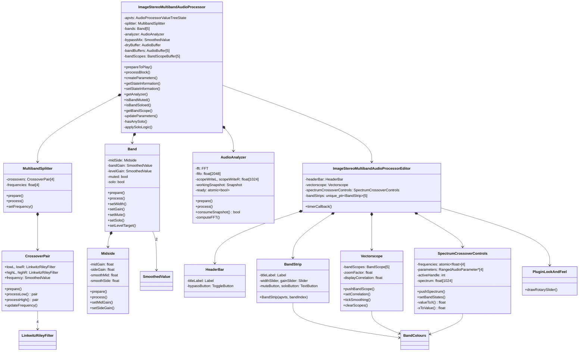

# ImageStereoMultiband — Documentación técnica

> **Autor:** Pedro Cuomo Ghio  
> **Versión:** 1.0.0  
> **Framework:** JUCE 8.0.12 | **Plataforma:** Windows x64 (VS2026)  
> **Formato:** VST3

---

## Índice

1. [Arquitectura general](#1-arquitectura-general)
2. [Estructura del proyecto](#2-estructura-del-proyecto)
3. [Pipeline de audio (ciclo de vida)](#3-pipeline-de-audio-ciclo-de-vida)
   - [3.1 Inicialización](#31-inicialización)
   - [3.2 Preparación](#32-preparación)
   - [3.3 Procesamiento bloque a bloque](#33-procesamiento-bloque-a-bloque)
   - [3.4 Actualización de la GUI](#34-actualización-de-la-gui)
   - [3.5 Persistencia de estado](#35-persistencia-de-estado)
4. [Descripción detallada de componentes](#4-descripción-detallada-de-componentes)
   - [4.1 MultibandSplitter — División en 5 bandas](#41-multibandsplitter--división-en-5-bandas)
   - [4.2 Crossover — Filtros Linkwitz-Riley LR4](#42-crossover--filtros-linkwitz-riley-lr4)
   - [4.3 Midside — Procesamiento Mid/Side](#43-midside--procesamiento-midside)
   - [4.4 Band — Banda individual](#44-band--banda-individual)
   - [4.5 AudioAnalyzer — FFT y osciloscopio](#45-audioanalyzer--fft-y-osciloscopio)
   - [4.6 Bypass suave](#46-bypass-suave)
   - [4.7 Lógica de Solo](#47-lógica-de-solo)
5. [Interfaz gráfica — GUI](#5-interfaz-gráfica--gui)
   - [5.1 Layout general](#51-layout-general)
   - [5.2 HeaderBar](#52-headerbar)
   - [5.3 BandStrip — Tutorial de uso](#53-bandstrip--tutorial-de-uso)
   - [5.4 SpectrumCrossoverControls](#54-spectrumcrossovercontrols)
   - [5.5 Vectorscope](#55-vectorscope)
   - [5.6 PluginLookAndFeel](#56-pluginlookandfeel)
   - [5.7 BandColours](#57-bandcolours)
6. [Diagrama de clases UML](#6-diagrama-de-clases-uml)
7. [Sistema de parámetros](#7-sistema-de-parámetros)
8. [Hilo de audio vs. hilo de GUI](#8-hilo-de-audio-vs-hilo-de-gui)
9. [Instalador Inno Setup](#9-instalador-inno-setup)
10. [Guía para desarrolladores](#10-guía-para-desarrolladores)
    - [10.1 Añadir una nueva banda](#101-añadir-una-nueva-banda)
    - [10.2 Añadir un nuevo parámetro](#102-añadir-un-nuevo-parámetro)
    - [10.3 Compilar en Release](#103-compilar-en-release)
    - [10.4 Stubs pendientes](#104-stubs-pendientes)

---

## 1. Arquitectura general

ImageStereoMultiband es un plugin VST3 que procesa audio estéreo dividiéndolo en **5 bandas de frecuencia** mediante 4 filtros Linkwitz-Riley de 4to orden (LR4) en cascada. Cada banda procesa su contenido de forma independiente con control de ancho estéreo (Mid/Side) y ganancia, y luego las bandas se suman para producir la salida final.

```
                    ┌──────────────────────────────────────┐
                    │            AudioProcessor            │
                    │      (hilo de audio del DAW)          │
                    └──────────────────────────────────────┘
                                      │
                    ┌─────────────────▼──────────────────┐
                    │         updateParameters()          │
                    │   Lee APVTS y sincroniza todo       │
                    └─────────────────┬──────────────────┘
                                      │
              ┌───────────────────────┬───────────────────────┐
              ▼                       ▼                       ▼
    ┌──────────────────┐   ┌──────────────────┐   ┌──────────────────┐
    │  MultibandSplitter │   │   Band[0..4]     │   │   AudioAnalyzer  │
    │  (LR4 cascada)    │   │  MidSide + Gain  │   │   FFT + Scope    │
    │  input → 5 bands  │──▶│  Mute/Solo logic │──▶│   snapshot→GUI   │
    └──────────────────┘   └──────────────────┘   └──────────────────┘
                                      │
                                      ▼
                              ┌──────────────────┐
                              │   Bypass mix     │
                              │  (crossfade 50ms)│
                              └──────────────────┘
                                      │
                                      ▼
                              ┌──────────────────┐
                              │   Output buffer   │
                              └──────────────────┘
```

La GUI se ejecuta en el **hilo de mensajes de JUCE** y se actualiza mediante un **timer a 30 fps** que consulta atómicamente los snapshots producidos por el analizador.

---

## 2. Estructura del proyecto

```
ImageStereoMultiband/
│
├── ImageStereoMultiband.jucer           ← Proyecto JUCE (PROJUCER)
├── README.md                            ← Guía para usuarios y desarrolladores
├── DOCUMENTATION.md                     ← Esta documentación
├── installer.iss                        ← Script Inno Setup
├── ImageStereoMultiband_Installer.exe   ← Instalador compilado
│
├── Source/                              ← CÓDIGO FUENTE
│   │
│   ├── PluginProcessor.h                → Clase AudioProcessor
│   ├── PluginProcessor.cpp              → Pipeline de audio + parámetros
│   ├── PluginEditor.h                   → Clase AudioProcessorEditor
│   ├── PluginEditor.cpp                 → Layout + timer 30 fps
│   │
│   ├── Parameters/                      → [stubs] Sin implementar
│   │   ├── ParameterIDs.h
│   │   ├── ParameterLayout.h
│   │   └── ParameterLayout.cpp
│   │
│   ├── DSP/                             → Procesamiento digital de audio
│   │   ├── MultibandSplitter/           → División espectral 5 bandas
│   │   │   ├── MultibandSplitter.h
│   │   │   └── MultibandSplitter.cpp
│   │   ├── Crossover/                   → Filtros LR4 (un punto de cruce)
│   │   │   ├── Crossover.h
│   │   │   └── Crossover.cpp
│   │   ├── Band/                        → Banda: MidSide + ganancia
│   │   │   ├── Band.h
│   │   │   └── Band.cpp
│   │   ├── Midside/                     → Codificación Mid/Side
│   │   │   ├── MidSide.h
│   │   │   └── MidSide.cpp
│   │   ├── Analyzer/                    → FFT + osciloscopio
│   │   │   ├── AudioAnalyzer.h
│   │   │   └── AudioAnalyzer.cpp
│   │   ├── Gain/                        → [stub]
│   │   │   ├── Gain.h
│   │   │   └── Gain.cpp
│   │   └── DryWet/                      → [stub]
│   │       ├── DryWet.h
│   │       └── DryWet.cpp
│   │
│   └── GUI/                             → Interfaz gráfica
│       ├── LookAndFeel/                 → Tema visual personalizado
│       │   ├── PluginLookAndFeel.h
│       │   └── PluginLookAndFeel.cpp
│       ├── Components/
│       │   ├── HeaderBar/               → Título + bypass
│       │   │   ├── HeaderBar.h
│       │   │   └── HeaderBar.cpp
│       │   ├── BandStrip/              → Controles por banda
│       │   │   ├── BandStrip.h
│       │   │   └── BandStrip.cpp
│       │   ├── SpectrumCrossoverControls/ → Espectro + cruces
│       │   │   ├── SpectrumCrossoverControls.h
│       │   │   └── SpectrumCrossoverControls.cpp
│       │   └── Vectorscope/            → Mid/Side scope
│       │       ├── Vectorscope.h
│       │       └── Vectorscope.cpp
│       └── BandColours.h               → Paleta de 5 colores
│
├── Builds/
│   └── VisualStudio2026/                → Solución VS2026
│       ├── ImageStereoMultiband.sln
│       ├── ImageStereoMultiband_StandalonePlugin.vcxproj
│       ├── ImageStereoMultiband_VST3.vcxproj
│       ├── ImageStereoMultiband_SharedCode.vcxproj
│       ├── x64/Debug/Standalone Plugin/ → .exe debug
│       └── x64/Debug/VST3/              → .vst3 debug
│
└── JuceLibraryCode/                     → Generado por JUCE
```

---

## 3. Pipeline de audio (ciclo de vida)

### 3.1 Inicialización

```cpp
ImageStereoMultibandAudioProcessor()
  ├── AudioProcessor(buses: stereo in/out)
  ├── apvts(*this, &undoManager, "Parameters", createParameters())
  └── undoManager
```

`createParameters()` genera **25 parámetros**:

- 5 bandas × 4 parámetros: Width, Gain, Mute, Solo
- 4 frecuencias de crossover
- 1 bypass

### 3.2 Preparación

El DAW llama a `prepareToPlay(sampleRate, samplesPerBlock)`:

```
prepareToPlay(44100, 512)
  │
  ├── spec = { 44100, 512, 2 }
  ├── splitter.prepare(spec)
  │     └── 4 crossovers × 4 filtros LR4 = 16 filtros preparados
  ├── bands[i].prepare(spec)
  │     └── MidSide.prepare() + SmoothedValue::reset(44100, 0.02)
  ├── bandBuffers[i].setSize(2, 512)
  ├── analyzer.prepare(44100, 512) → reset(), fftHop = 512
  ├── bypassMix.reset(44100, 0.05) → rampa de 50 ms
  └── dryBuffer.setSize(2, 512)
```

### 3.3 Procesamiento bloque a bloque

```
processBlock(buffer, midiMessages)
  │
  ├── updateParameters()
  │     ├── Leer APVTS: Width, Gain, Mute, Solo x 5 bandas
  │     ├── Leer crossover1..4, aplicar límites con gap ≥ 100 Hz
  │     ├── splitter.setFrequency(i, f)
  │     └── setBypassed(estado)
  │
  ├── dryBuffer.makeCopyOf(buffer)        ← respaldo para bypass
  │
  ├── splitter.process(buffer, bandBuffers)
  │     └── Entrada → 5 buffers: band[0..4]
  │
  ├── for (auto& band : bands)
  │     band.process(bandBuffers[i])
  │       ├── midSide.process() → width
  │       └── ganancia = bandGain × levelGain (sample a sample)
  │
  ├── applySoloLogic()
  │     └── setLevelTarget(1.0 o 0.0) en cada banda
  │
  ├── buffer.clear()
  │     buffer.addFrom(bandBuffers[i])  ← suma todas las bandas
  │
  ├── analyzer.process(buffer)           ← FFT sobre el resultado
  │
  └── Bypass crossfade (sample a sample)
        out = wet × mix + dry × (1 - mix)
```

### 3.4 Actualización de la GUI

El editor tiene un **timer a 30 Hz** (~33 ms). Cada tick:

```
timerCallback()
  │
  ├── analyzer.consumeSnapshot(snap)
  │     ├── Éxito: hay nuevo FFT
  │     │   ├── vectorscope.pushBandScope(0..4) → datos por banda
  │     │   ├── Calcular correlación Σ(L×R)/√(ΣL²×ΣR²)
  │     │   ├── spectrumCrossoverControls.pushSpectrum()
  │     │   └── repaint()
  │     └── Fracaso: no hay datos nuevos
  │         └── signalHoldCounter++ (no se borran los scopes para evitar parpadeo)
  │
  ├── vectorscope.tickSmoothing()
  │     └── Suavizado IIR: displayCorrelation += (target - display) × 0.12
  │
  └── updateBandVisibility()
        └── Recalcula visibilidad de band strips según botones +/−
        └── Propaga anySolo a SpectrumCrossoverControls para opacidad de fills
```

### 3.5 Persistencia de estado

```
getStateInformation()
  └── apvts.copyState() → XML → MemoryBlock

setStateInformation()
  └── MemoryBlock → XML → apvts.replaceState()
```

El DAW llama estos métodos al guardar/cargar proyectos, asegurando que todos los parámetros (cruces, gains, solos, bypass) se preserven.

---

## 4. Descripción detallada de componentes

### 4.1 MultibandSplitter — División en 5 bandas

Divide la señal estéreo en 5 bandas usando **4 crossovers Linkwitz-Riley de 4to orden** en configuración en cascada:

```


Entrada estéreo
      │
      ▼
┌──────────────┐
│ Crossover[0] │ 120 Hz
│  LR4 lowpass │───→ Band[0]
│  LR4 highpass│───→ ─┐
└──────────────┘      │
                      ▼
              ┌──────────────┐
              │ Crossover[1] │ 500 Hz
              │  LR4 lowpass │───→ Band[1]
              │  LR4 highpass│───→ ─┐
              └──────────────┘      │
                                    ▼
                            ┌──────────────┐
                            │ Crossover[2] │ 2 kHz
                            │  LR4 lowpass │───→ Band[2]
                            │  LR4 highpass│───→ ─┐
                            └──────────────┘      │
                                                  ▼
                                          ┌──────────────┐
                                          │ Crossover[3] │ 8 kHz
                                          │  LR4 lowpass │───→ Band[3]
                                          │  LR4 highpass│───→ Band[4]
                                          └──────────────┘
```

**CrossoverPair** (estructura anidada en `MultibandSplitter.h`):
- 4 filtros `LinkwitzRileyFilter<float>`: lowL, lowR, highL, highR
- `SmoothedValue<float> frequency` con 50 ms de rampa
- `processLow(l, r)` y `processHigh(l, r)` devuelven `pair<float,float>` procesado sample a sample

**Frecuencias por defecto:** 120, 500, 2000, 8000 Hz.

El procesamiento es **sample a sample** para permitir automatización suave de frecuencias. Cada crossover llama a `updateFrequency()` al inicio de cada sample para actualizar la frecuencia de corte con suavizado.

### 4.2 Crossover — Filtros Linkwitz-Riley LR4

**Linkwitz-Riley de 4to orden** = dos Butterworth de 2do orden en cascada. Pendiente de **24 dB/octava**. La suma del lowpass y highpass produce una respuesta plana en magnitud.

```cpp
struct CrossoverPair {
    LinkwitzRileyFilter<float> lowL, lowR;   // lowpass
    LinkwitzRileyFilter<float> highL, highR; // highpass
    SmoothedValue<float> frequency;          // 50 ms rampa

    void updateFrequency() {
        auto f = frequency.getNextValue();
        lowL.setCutoffFrequency(f);
        lowR.setCutoffFrequency(f);
        highL.setCutoffFrequency(f);
        highR.setCutoffFrequency(f);
    }
};
```

La clase `Crossover` individual (`Crossover.h/.cpp`) es independiente pero actualmente **no se usa directamente** — el `MultibandSplitter` usa `CrossoverPair` que tiene la misma estructura internamente.

### 4.3 Midside — Procesamiento Mid/Side

Convierte la señal estéreo (L,R) a componentes Mid (mono) y Side (estéreo), aplica ganancias independientes, y reconvierte a L,R.

**Ecuaciones:**

```
Mid  = (L + R) / √2
Side = (L - R) / √2

L' = (Mid × gainMid + Side × gainSide) / √2
R' = (Mid × gainMid - Side × gainSide) / √2
```

El factor `√2` asegura conservación de potencia.

**Suavizado IIR de primer orden:**

```cpp
smoothMid  += 0.002 × (midGain  - smoothMid)
smoothSide += 0.002 × (sideGain - smoothSide)
```

Donde `0.002` es la constante de suavizado. Con `sampleRate = 44100`, la constante de tiempo es aproximadamente `τ ≈ 1 / (0.002 × 44100) ≈ 11 ms`.

**Control de Width:** Se expone `setSideGain()` mediante `Band::setWidth()` con el parámetro UI 0–100:
- `sideGain = 0.0` (width=0) → Mono (solo Mid)
- `sideGain = 1.0` (width=50) → Ancho estéreo original
- `sideGain = 2.0` (width=100) → Estéreo ensanchado (el doble de componente Side)

La conversión en `Band::setWidth()` es `midSide.setSideGain(width * 0.02f)`.

`midGain` siempre es `1.0` — no se expone como parámetro en la versión actual.

### 4.4 Band — Banda individual

Cada banda encapsula:

```
Band
├── Midside midSide        → Procesamiento de ancho estéreo
├── SmoothedValue bandGain → Ganancia general (20 ms)
└── SmoothedValue levelGain → Ganancia de mute/solo (20 ms)
```

**Método `process()`:**

```cpp
void Band::process(juce::AudioBuffer<float>& buffer) {
    midSide.process(buffer);          // Aplica width

    for (int sample = 0; sample < buffer.getNumSamples(); ++sample) {
        auto totalGain = bandGain.getNextValue() * levelGain.getNextValue();
        left[sample]  *= totalGain;
        right[sample] *= totalGain;
    }
}
```

**Control desde el procesador:**
- `setWidth(float)` → `midSide.setSideGain(width * 0.02f)` (conversión de 0–100 UI a 0.0–2.0 interno)
- `setGain(float dB)` → `bandGain.setTargetValue(Decibels::decibelsToGain(dB))`
- `setMute(bool)` / `setSolo(bool)` → flags usados por `applySoloLogic()`
- `setLevelTarget(float)` → usado por `applySoloLogic()` para silenciar/activar

### 4.5 AudioAnalyzer — FFT y osciloscopio

Analizador espectral en tiempo real con los siguientes parámetros:

| Parámetro | Valor |
|-----------|-------|
| Orden FFT | 11 |
| Tamaño FFT | 2048 samples |
| Hop size | 512 samples (75% overlap) |
| Ventana | Hann |
| Bins espectrales | 1024 |
| Piso dB | -120 dB |
| Scope size | 1024 samples L/R |
| Sincronización | `std::atomic<bool> ready` |

**Pipeline:**

```
FIFO circular (2048)
  │ write: (L+R)/2 en fifo[fifoIndex++ % 2048]
  │
  └── Cada 512 samples:
        ├── Aplicar ventana Hann
        │     w[n] = 0.5 × (1 - cos(2πn/(N-1)))
        │     fftData[n] = fifo[n] × w[n]
        │
        ├── FFT forward (2048 puntos)
        │
        ├── Magnitud → dB para cada bin:
        │     Bin 0 (DC):     |fftData[0]| / N
        │     Bins 1..1022:   √(real² + imag²) / N
        │     Bin 1023 (Nyq): |fftData[1]| / N
        │     → Decibels::gainToDecibels(mag, -120dB)
        │
        ├── Copiar scope L/R desde ring buffer
        │     scope[0..1023] desde oldestIdx
        │
        └── ready.store(true)
```

**Consumo desde la GUI:**

```cpp
bool consumeSnapshot(Snapshot& output) {
    if (!ready.exchange(false))
        return false;      // No hay datos nuevos
    // Copia segura a output
    memcpy(output.spectrum, workingSnapshot.spectrum, ...);
    memcpy(output.scopeLeft, workingSnapshot.scopeLeft, ...);
    return true;
}
```

### 4.6 Bypass suave

El bypass no corta abruptamente sino que realiza un **crossfade lineal** de 50 ms:

```
bypass activado:   mix: 1.0 → 0.0 (wet se desvanece, dry aparece)
bypass desactivado: mix: 0.0 → 1.0 (dry se desvanece, wet aparece)
```

```cpp
// En processBlock, sample a sample:
for (int sample = 0; sample < buffer.getNumSamples(); ++sample) {
    auto mix = bypassMix.getNextValue();  // SmoothedValue, 50 ms
    for (int ch = 0; ch < numChannels; ++ch) {
        auto wet = buffer.getSample(ch, sample);
        auto dry = dryBuffer.getSample(ch, sample);
        buffer.setSample(ch, sample, wet * mix + dry * (1.0f - mix));
    }
}
```

La `dryBuffer` se captura inmediatamente después de `updateParameters()` y antes de cualquier procesamiento.

### 4.7 Lógica de Solo

La lógica de solo/mute se implementa mediante `setLevelTarget()` con suavizado de 20 ms:

```cpp
void ImageStereoMultibandAudioProcessor::applySoloLogic() {
    const bool anySolo = hasAnySolo();
    for (auto& band : bands) {
        float target = 1.0f;
        if (anySolo)
            target = band.isSolo() ? 1.0f : 0.0f;
        else
            target = band.isMuted() ? 0.0f : 1.0f;
        band.setLevelTarget(target);
    }
}
```

| Situación | Band.Solo | Band.Muted | levelTarget |
|-----------|-----------|------------|-------------|
| Sin solos activos | false | false | 1.0 |
| Sin solos activos | false | true | 0.0 |
| Al menos un solo | true | — | 1.0 |
| Al menos un solo | false | — | 0.0 |

---

## 5. Interfaz gráfica — GUI

### 5.1 Layout general

La ventana del plugin mide **980 × 720 px** con esta disposición:

```
┌──────────────────────────────────────────────────────────────────┐
│  ImageStereoMultiband                        [Bypass]            │  50px
├──────────────────────────────────────────────────────────────────┤
│                                                                  │
│  ┌────────────────────────────────────────────────────────────┐  │
│  │  Frequency — Espectro FFT + handles de crossover           │  │
│  │  (arrastrables) + band fills coloreados                    │  │  200px
│  │                                                            │  │
│  └────────────────────────────────────────────────────────────┘  │
│                                                                  │
├────────┬────────┬────────┬────────┬────────┬───────────────────┤ │
│Band 1  │Band 2  │Band 3  │Band 4  │Band 5  │  Vectorscope      │ │
│        │        │        │        │        │  Mid/Side +       │ │
│ Width  │ Width  │ Width  │ Width  │ Width  │  correlación      │ │
│ ───○── │ ───○── │ ───○── │ ───○── │ ───○── │                   │ │
│        │        │        │        │        │  x6.5  [W][C]     │ │
│ Gain   │ Gain   │ Gain   │ Gain   │ Gain   │                   │ │
│  │     │  │     │  │     │  │     │  │     │  ╭──╮             │ │
│  ○     │  ○     │  ○     │  ○     │  ○     │  ╰──╯ ●           │ │
│  │     │  │     │  │     │  │     │  │     │                   │ │
│ [M][S] │ [M][S] │ [M][S] │ [M][S] │ [M][S] │   correlación     │ │
│        │        │        │        │        │   ││││││││││││    │ │
│ [−][+] │ [−][+] │ [−][+] │ [−][+] │ [−][+] │      0.85          │ │
└────────┴────────┴────────┴────────┴────────┴───────────────────┘ │
└──────────────────────────────────────────────────────────────────┘
```

### 5.2 HeaderBar

Archivos: `Source/GUI/Components/HeaderBar.h/.cpp`

Componente superior que contiene:
- **Título:** `Label` con texto "ImageStereoMultiband", fuente blanca negrita 22px, alineado a la izquierda
- **Bypass:** `ToggleButton` conectado al parámetro `"bypass"` mediante `ButtonAttachment`

Estilo visual: fondo `#15171a` con línea divisoria inferior `#343941`.

### 5.3 BandStrip — Tutorial de uso

Archivos: `Source/GUI/Components/BandStrip.h/.cpp`

Cada banda tiene un panel con estos controles, en orden vertical:

```
┌──────────────────┐
│    Band N        │  ← Título
│                  │
│  ──── ○ ────     │  ← Width (slider horizontal, 0–100)
│    Width         │      Valor en hover encima del slider
│                  │
│       │          │
│       ○          │  ← Gain (slider vertical)
│       │          │     Rango: -24 a +24 dB, editable (doble click)
│                  │
│   [ M ] [ S ]    │  ← Botones Mute (M) y Solo (S)
└──────────────────┘
                     ← [−] [+] Botones add/remove banda
```

**Cómo usar:**

1. **Width:** Desliza horizontalmente para ajustar el ancho estéreo de la banda. Rango 0–100: `0` = mid (mono), `50` = ancho original, `100` = side máximo. El valor actual se muestra al pasar el ratón sobre el slider. Doble click para editar el valor numérico.

2. **Gain:** Desliza verticalmente para subir o bajar el volumen de la banda. El valor en dB se muestra debajo del slider y es editable con doble click.

3. **M (Mute):** Click para silenciar la banda. El botón se ilumina con el color de la banda. Las bandas muteadas se atenúan visualmente al 5% de opacidad.

4. **S (Solo):** Click para aislar la banda. Si activas Solo en cualquier banda, las demás se silencian automáticamente. Puedes activar múltiples solos simultáneamente. Las bandas sin solo (cuando hay otro solo activo) se atenúan al 5% de opacidad.

5. **Add/Remove:** Los botones **−** (remove) y **+** (add) en la parte inferior del panel de bandas permiten ocultar/mostrar bandas. La banda más externa se elimina al hacer click en **−**; se añade una nueva banda al hacer click en **+**.

**Colores por banda:**

| Banda | Color |
|-------|-------|
| 1 | Rojo/Rosa |
| 2 | Azul |
| 3 | Verde |
| 4 | Amarillo |
| 5 | Púrpura |

### 5.4 SpectrumCrossoverControls

Archivos: `Source/GUI/Components/SpectrumCrossoverControls.h/.cpp`

Componente compuesto que integra tres funcionalidades:

#### a) Visualización del espectro FFT

Dibuja la curva espectral en escala **logarítmica** de 20 Hz a 20 kHz. Los niveles se muestran de -96 dB a 0 dB. La curva se renderiza como un path de JUCE con trazo curvo.

**Transformación de coordenadas:**

```cpp
// Frecuencia → posición X (logarítmica)
float valueToX(float frequency) {
    auto proportion = (log10(f) - log10(20)) / (log10(20000) - log10(20));
    return graphX + graphWidth * proportion;
}

// Posición X → frecuencia
float xToValue(float x) {
    auto proportion = (x - graphX) / graphWidth;
    return pow(10, log10(20) + proportion * (log10(20000) - log10(20)));
}
```

#### b) Handles de crossover

Cuatro líneas verticales arrastrables que controlan las frecuencias de cruce. Al hacer drag:

1. `mouseDown()` → detecta el handle más cercano (`findNearestHandle`), inicia gesture
2. `mouseDrag()` → actualiza frecuencia mediante `setCrossoverFrequency(i, xToValue(x))`
3. `mouseUp()` → finaliza gesture

**Restricciones:** `getConstrainedFrequency()` asegura un **gap mínimo de 100 Hz** entre cruces adyacentes.

#### c) Band fills

Áreas coloreadas entre los cruces que se sombrean según el color de cada banda. La opacidad refleja el estado:

| Estado | Opacidad del fill |
|--------|-------------------|
| Normal | 20% |
| Solos activos, banda con solo | 40% |
| Solos activos, banda sin solo | 5% |
| Muted | 5% |

#### Marcas y etiquetas

- **Líneas de rejilla horizontales:** -60, -40, -20 dB (-80 eliminado para evitar saturación visual; se añadió gap derecho)
- **Marcas de frecuencia verticales:** 30, 60, 100, 300, 1k, 5k, 15k Hz
- **Etiquetas de cruce:** formato "120", "2.0k", "10.0k" según magnitud. Posicionadas escalonadas verticalmente (+0, +8, +16, +24px) para evitar solapamiento. Doble click sobre el valor para editarlo con teclado
- **Etiqueta "Hz"** en la esquina inferior derecha del gráfico
- **Margen inferior:** 48px (aumentado de 36px para dar espacio a etiquetas escalonadas)

### 5.5 Vectorscope

Archivos: `Source/GUI/Components/Vectorscope.h/.cpp`

Visualizador Mid/Side que muestra la imagen estéreo en tiempo real. Es el componente más complejo de la GUI.

#### Principio de funcionamiento

Cada sample estéreo se convierte a coordenadas Mid/Side:

```
mid  = (L + R) / 2      → eje Y (pantalla invertida: arriba es positivo)
side = (L - R) / 2      → eje X
```

#### Elementos visuales

- **Crosshair:** Líneas vertical y horizontal en el centro
- **Círculos de referencia:** Anillos concéntricos a 50% y 100% del tamaño máximo
- **Línea de referencia mono:** Línea vertical en el centro (side = 0)
- **Puntos:** Cada sample se dibuja como un círculo de 1.8 px. La opacidad aumenta de 8% a 85% a lo largo del buffer (los samples más recientes son más brillantes)
- **Zoom:** 0.5× a 8.0×, controlado por botones +/- o rueda del ratón
- **Modo color:** Botón W/C alterna entre blanco (todos los puntos en cian `#58c7d9`) y colores por banda

#### Medidor de correlación

```
correlación = Σ(L×R) / √(ΣL² × ΣR²)

  +1.0 → Perfectamente mono (L = R)
   0.0 → No correlacionado
  -1.0 → Inversión de fase (L = -R)
```

El medidor es una barra horizontal con colores:
- **Verde** (> 0.7): Bien correlacionado
- **Amarillo** (0.3 – 0.7): Parcialmente correlacionado
- **Naranja** (-0.3 – 0.3): No correlacionado
- **Rojo** (< -0.3): Fuera de fase

El valor numérico se muestra centrado y se suaviza con `tickSmoothing()` usando un filtro IIR (coeficiente 0.12).

#### Botones e indicadores

| Control | Acción |
|---------|--------|
| **+** | Aumenta zoom (máx 8.0×) |
| **-** | Disminuye zoom (mín 0.5×) |
| **W/C** | Alterna entre blanco y colores por banda |
| **W** | Indicador de modo blanco (desplazado 6px a la izquierda respecto a versión anterior) |

#### Anti-parpadeo

El vectorscopio ya no se limpia en cada tick del timer cuando no hay datos nuevos. En su lugar, usa un `signalHoldCounter` que retiene la imagen durante 5 frames antes de desvanecer, eliminando el parpadeo en silencios.

### 5.6 PluginLookAndFeel

Archivos: `Source/GUI/LookAndFeel/PluginLookAndFeel.h/.cpp`

Tema visual personalizado que hereda de `LookAndFeel_V4`:

**Colores base:**

| Propiedad | Color |
|-----------|-------|
| Fondo de ventana | `#15171a` |
| Thumb de slider | `#ffb84d` |
| Relleno de slider rotatorio | `#58c7d9` |
| Contorno de slider rotatorio | `#343941` |
| Botón normal | `#252a31` |
| Botón activado | `#58c7d9` |

**`drawRotarySlider()`:** Renderizado a medida con:
1. **Arco de fondo:** Trazo del contorno circular completo
2. **Arco de valor:** Trazo desde inicio hasta posición actual
3. **Indicador:** Círculo (8×8 px) en la posición actual sobre el arco

### 5.7 BandColours

Archivos: `Source/GUI/BandColours.h`

Paleta de colores definida como `constexpr` en namespace:

```cpp
namespace BandColours {
    inline constexpr int numBands = 5;

    inline juce::Colour getBandColour(int index) {
        static const std::array<juce::Colour, 5> colours {
            juce::Colour(0xffee6677),  // Rojo/Rosa
            juce::Colour(0xff4477aa),  // Azul
            juce::Colour(0xff228833),  // Verde
            juce::Colour(0xffccbb44),  // Amarillo
            juce::Colour(0xffaa3377)   // Púrpura
        };
        return colours[jlimit(0, 4, index)];
    }

    inline juce::Colour getBandFillColour(int index) {
        return getBandColour(index).withAlpha(0.20f);
    }
}
```

---

## 6. Diagrama de clases UML



---

## 7. Sistema de parámetros

Todos los parámetros se definen en `PluginProcessor::createParameters()` y se gestionan mediante `AudioProcessorValueTreeState`.

| Parámetro | ID | Tipo | Rango | Default |
|-----------|----|------|-------|---------|
| Width banda N | `band{N}Width` | Float (enteros) | 0 – 100 | 50 |
| Gain banda N | `band{N}Gain` | Float | -24 – 24 dB | 0.0 |
| Mute banda N | `band{N}Mute` | Bool | off/on | false |
| Solo banda N | `band{N}Solo` | Bool | off/on | false |
| Crossover 1 | `crossover1` | Float | 20 – 20000 Hz | 120 |
| Crossover 2 | `crossover2` | Float | 20 – 20000 Hz | 500 |
| Crossover 3 | `crossover3` | Float | 20 – 20000 Hz | 2000 |
| Crossover 4 | `crossover4` | Float | 20 – 20000 Hz | 8000 |
| Bypass | `bypass` | Bool | off/on | false |

Total: **25 parámetros** (5 bandas × 4 + 4 cruces + 1 bypass).

### Conexión con la GUI

La conexión entre parámetros y controles visuales se realiza mediante `Attachments`:

```cpp
// En BandStrip constructor:
widthAttachment = make_unique<SliderAttachment>(apvts, "band1Width", widthSlider);
gainAttachment  = make_unique<SliderAttachment>(apvts, "band1Gain", gainSlider);
muteAttachment  = make_unique<ButtonAttachment>(apvts, "band1Mute", muteButton);
soloAttachment  = make_unique<ButtonAttachment>(apvts, "band1Solo", soloButton);
```

### Restricciones en tiempo real

`updateParameters()` aplica límites a las frecuencias de crossover para garantizar un gap mínimo de 100 Hz entre bandas:

```cpp
f1 = jlimit(20.0f, 19600.0f, f1);
f2 = jlimit(f1 + 100, 19700.0f, f2);
f3 = jlimit(f2 + 100, 19800.0f, f3);
f4 = jlimit(f3 + 100, 19900.0f, f4);
```

---

## 8. Hilo de audio vs. hilo de GUI

La comunicación entre el hilo de audio (tiempo real) y el hilo de la GUI se realiza mediante **datos compartidos atómicos**:

### AudioAnalyzer

```cpp
// Hilo de audio (processBlock):
void computeFFT() {
    // ... procesamiento ...
    ready.store(true);   // Señal: hay datos nuevos
}

// Hilo de GUI (timer 30 Hz):
bool consumeSnapshot(Snapshot& output) {
    if (!ready.exchange(false))  // Toma el flag y lo resetea
        return false;             // No hay datos nuevos
    // Copia segura de workingSnapshot a output
    return true;
}
```

### SpectrumCrossoverControls

Las frecuencias de crossover se comparten mediante `std::atomic<float>[4]`:

```cpp
// Actualizado desde hilo de audio o desde cambio de parámetro:
frequencies[i].store(constrainedFrequency);

// Leído desde hilo de pintado:
auto f = frequencies[i].load();
```

### Vectorscope

Los datos de los scopes por banda se escriben desde `processBlock` y se leen desde `timerCallback`. No hay sincronización explícita porque el timer usa `consumeSnapshot` atómico y los buffers de scope se sobrescriben cada bloque — la pérdida ocasional de un frame es aceptable en visualización.

---

## 9. Instalador Inno Setup

El archivo `installer.iss` genera un instalador que copia el plugin VST3 a:

```
C:\Program Files\Common Files\VST3\ImageStereoMultiband.vst3\
```

Esta es la ubicación estándar donde los DAWs buscan plugins VST3 de 64 bits en Windows.

**Requisitos del instalador:**
- Privilegios de administrador (necesarios para escribir en `Program Files`)
- Arquitectura x64 (compatible con sistemas de 64 bits)

**Para regenerar el instalador:**

```bash
# 1. Compilar el proyecto en Release (x64) desde VS2026
# 2. Actualizar rutas en installer.iss si es necesario
# 3. Ejecutar:
& "C:\Program Files (x86)\Inno Setup 6\ISCC.exe" installer.iss
```

---

## 10. Guía para desarrolladores

### 10.1 Añadir una nueva banda

Si quisieras expandir el plugin a **6 bandas** (5 cruces):

1. **`PluginProcessor.h`:** Cambiar `numBands = 6`, `bandBuffers[6]`, `bandScopes[6]`
2. **`MultibandSplitter.h`:** Cambiar `frequencies[5]`, `crossovers[5]`, outputs `array<AudioBuffer, 6>`
3. **`MultibandSplitter.cpp`:** Añadir un crossover más en la cascada, actualizar outputs
4. **`PluginProcessor.cpp`:** Cambiar loops `for (int i = 0; i < 5; ++i)` a `i < 6`
5. **`BandColours.h`:** Añadir un sexto color a la paleta
6. **`PluginEditor.cpp`:** Actualizar `bandStrips` de 5 a 6, recalcular layout
7. **`createParameters()`:** Añadir Width, Gain, Mute, Solo para banda 6 + crossover 5

### 10.2 Añadir un nuevo parámetro

Ejemplo: añadir un control **Mid Gain** a cada banda:

1. **`PluginProcessor::createParameters()`:** Añadir `AudioParameterFloat("band{N}Mid", ...)`
2. **`Midside.h`:** Asegurar que `setMidGain()` existe
3. **`Band.h`:** Añadir `setMidGain(float)`
4. **`PluginProcessor::updateParameters()`:** Leer nuevo parámetro y llamar `bands[i].setMidGain()`
5. **`BandStrip.h/.cpp`:** Añadir slider + attachment
6. **`installer.iss`:** Actualizar versión si es necesario

### 10.3 Compilar en Release

```bash
# Desde la línea de comandos de VS2026 (Developer Command Prompt):
msbuild Builds/VisualStudio2026/ImageStereoMultiband.sln /p:Configuration=Release /p:Platform=x64
```

O desde el IDE: Configuración → Release, Plataforma → x64, Compilar.

Los binarios Release se generan en:
- `Builds/VisualStudio2026/x64/Release/VST3/ImageStereoMultiband.vst3/`
- `Builds/VisualStudio2026/x64/Release/Standalone Plugin/ImageStereoMultiband.exe`

### 10.4 Stubs pendientes

Estos archivos están vacíos y podrían implementarse en el futuro:

| Archivo | Posible propósito |
|---------|-------------------|
| `Parameters/ParameterIDs.h` | Centralizar IDs de parámetros como constantes |
| `Parameters/ParameterLayout.h/.cpp` | Separar la creación del layout de parámetros del `PluginProcessor` |
| `DSP/Gain.h/.cpp` | Módulo de ganancia reutilizable (actualmente la ganancia está en `Band`) |
| `DSP/DryWet.h/.cpp` | Control de mezcla wet/dry independiente (actualmente es parte del bypass) |

---

## 11. Casos de uso en producción musical

### 11.1 Masterización — Ajuste de imagen estéreo por banda

En masterización, el control del ancho estéreo por rango frecuencial es fundamental para lograr una copia final competitiva y compatible con monoaural.

**Problema:** Una mezcla suena estrecha en las altas frecuencias pero el bajo está demasiado ancho, causando problemas de fase al sumar a mono.

**Solución con ImageStereoMultiband:**
1. Cargar el plugin en el canal master (último slot de la cadena de mastering)
2. Ajustar los crossovers: banda 1 (sub-bajos) hasta ~120 Hz, banda 2 (bajos) hasta ~500 Hz
3. Reducir Width en banda 1 y 2 a **0.0** (mono forzado) — esto centraliza la energía de graves
4. Aumentar Width en banda 4 o 5 (agudos) a **1.2–1.5** para ensanchar la imagen estéreo
5. Usar el **vectoscopio** como guía: la correlación debe mantenerse > 0.5 en todo momento

**Resultado:** Un máster con graves sólidos y centrados, agudos amplios pero coherentes, y nula cancelación de fase al sumar a mono.

### 11.2 Mezcla — Control de anchura en instrumentos específicos

**Problema:** Una pista de sintetizador pad suena muy ancha y enmascara la voz principal en el centro.

**Solución:**
1. Insertar el plugin en el canal del sintetizador
2. Identificar el rango frecuencial de la voz (típicamente 300 Hz – 3 kHz)
3. Ajustar el crossover 2 a ~300 Hz y el crossover 3 a ~3 kHz
4. Reducir Width en la banda 2 o 3 (donde coincide con la voz) a **0.5–0.7**
5. Mantener Width alto en las bandas extremas para preservar la amplitud del pad

**Tip:** Usar los botones **S (Solo)** para aislar cada banda y escuchar exactamente qué rango estás modificando.

### 11.3 Diseño sonoro — Efectos extremos de anchura

**Problema:** Se necesita un efecto creativo de imagen estéreo extrema para un breakdown o transición.

**Solución:**
1. Cargar el plugin en el bus de efectos
2. Aumentar Width en todas las bandas a **1.5–2.0** (máximo ensanchamiento)
3. Experimentar con distintas configuraciones de crossover para determinar qué rangos suenan más interesantes al ensancharse
4. Usar **Mute** en bandas específicas para crear "huecos espectrales" que jueguen con la percepción espacial
5. Automatizar los crossovers a lo largo de la canción para crear movimiento en la imagen estéreo

**Advertencia:** El ensanchamiento extremo (>1.5) puede causar fatiga auditiva y problemas de fase. Usar con moderación y verificar la correlación en el vectoscopio.

### 11.4 Restauración — Corrección de problemas de fase

**Problema:** Una grabación tiene una batería con micrófonos fuera de fase, resultando en un sonido hueco y sin pegada.

**Solución:**
1. Insertar el plugin en el canal de la batería
2. Observar el **vectoscopio**: si la correlación es negativa (< -0.3) en ciertas bandas, hay cancelación de fase
3. Usar los botones **S (Solo)** para identificar qué banda tiene la correlación más baja
4. Reducir Width a **0.0** (mono) en la(s) banda(s) problemática(s) para forzar coerencia de fase
5. Alternativamente, ajustar los crossowers para aislar específicamente la frecuencia donde ocurre la cancelación

**Resultado:** La batería recupera pegada y definición sin perder necesariamente la imagen estéreo en las bandas no problemáticas.

---

## 12. Explicación profunda del código — Clases y métodos

Esta sección recorre cada clase del proyecto, documentando todos sus métodos, parámetros, comportamiento y rol dentro del sistema. Es la referencia definitiva para desarrolladores que necesitan entender, modificar o extender el plugin.

### 12.1 `ImageStereoMultibandAudioProcessor` — `PluginProcessor.h`

Esta es la clase central del plugin. Hereda de `juce::AudioProcessor` y es el punto de entrada que el DAW utiliza para todo el ciclo de vida del plugin.

#### Métodos del ciclo de vida JUCE

| Método | Llamado por | Propósito |
|--------|-------------|-----------|
| `ImageStereoMultibandAudioProcessor()` | DAW al instanciar el plugin | Inicializa buses estéreo y el `AudioProcessorValueTreeState` (APVTS) con 25 parámetros |
| `~ImageStereoMultibandAudioProcessor()` | DAW al destruir el plugin | Libera recursos |
| `prepareToPlay(sampleRate, samplesPerBlock)` | DAW al iniciar reproducción | Prepara todos los submódulos con la tasa de muestreo y tamaño de bloque del proyecto |
| `releaseResources()` | DAW al detener reproducción | Actualmente vacío — los recursos se liberan en el destructor |
| `processBlock(buffer, midiBuffer)` | DAW en cada bloque de audio | Pipeline completo de procesamiento (ver sección 12.2) |

#### Métodos de configuración de canales

```cpp
bool isBusesLayoutSupported(const BusesLayout& layouts) const;
```
**Ubicación:** `PluginProcessor.cpp:208-237`
**Propósito:** Verifica que el layout de canales sea válido. Acepta exclusivamente configuraciones mono o estéreo, y exige que entrada y salida tengan la misma configuración.

**Parámetros:**
- `layouts`: Layout de buses propuesto por el DAW

**Retorno:** `true` si el layout es mono o estéreo con entrada/salida simétrica

#### Métodos de creación y acceso a parámetros

```cpp
static ParameterLayout createParameters();
```
**Ubicación:** `PluginProcessor.cpp:40-101`
**Propósito:** Genera los 25 parámetros del plugin. Itera 5 bandas creando Width (float 0–100 con step 1, default 50), Gain (float -24–24 dB), Mute (bool), Solo (bool). Luego crea 4 crossovers (float 20–20000 Hz) con valores default (120, 500, 2000, 8000). Finalmente crea el bypass (bool).

**Retorno:** `ParameterLayout` (vector de `RangedAudioParameter`) — se pasa al constructor del `APVTS`

```cpp
AudioProcessorValueTreeState& getAPVTS();
```
**Ubicación:** `PluginProcessor.cpp:465-468`
**Propósito:** Retorna una referencia al `APVTS` interno, permitiendo que el editor y los componentes GUI accedan a los parámetros.

**Retorno:** Referencia a `apvts`

#### Métodos de estado (presets)

```cpp
void getStateInformation(MemoryBlock& destData);
```
**Ubicación:** `PluginProcessor.cpp:430-439`
**Propósito:** Serializa todo el estado del plugin (todos los parámetros) a un `MemoryBlock`. El DAW llama esto al guardar el proyecto. El flujo es: `apvts.copyState()` → `ValueTree::createXml()` → `copyXmlToBinary()`.

```cpp
void setStateInformation(const void* data, int sizeInBytes);
```
**Ubicación:** `PluginProcessor.cpp:441-456`
**Propósito:** Restaura el estado del plugin desde un `MemoryBlock`. El DAW llama esto al cargar el proyecto. El flujo inverso: `getXmlFromBinary()` → `ValueTree::fromXml()` → `apvts.replaceState()`.

#### Métodos de actualización y lógica interna

```cpp
void updateParameters();
```
**Ubicación:** `PluginProcessor.cpp:322-377`
**Propósito:** Sincroniza todos los submódulos con los valores actuales del `APVTS`. Se llama al inicio de cada `processBlock()`.

**Flujo:**
1. Itera las 5 bandas: lee Width, Gain, Mute y Solo del APVTS y los aplica a `bands[i]`
2. Lee los 4 crossovers del APVTS y aplica límites de gap mínimo (100 Hz entre adyacentes)
3. Aplica los límites mediante `juce::jlimit()` con dependencias en cadena:
   - `f2 = jlimit(f1 + minBandWidth, 19700.0f, f2)`
   - `f3 = jlimit(f2 + minBandWidth, 19800.0f, f3)`
   - `f4 = jlimit(f3 + minBandWidth, 19900.0f, f4)`
4. Llama a `splitter.setFrequency(i, f)` para actualizar las frecuencias de corte
5. Lee el estado de bypass y llama a `setBypassed()`

```cpp
bool hasAnySolo() const;
```
**Ubicación:** `PluginProcessor.cpp:381-390`
**Propósito:** Retorna `true` si al menos una banda tiene el flag de solo activado.

```cpp
void applySoloLogic();
```
**Ubicación:** `PluginProcessor.cpp:392-411`
**Propósito:** Implementa la lógica de solo/mute. Si hay algún solo activo, todas las bandas sin solo se silencian (`levelTarget = 0.0`). Si no hay solos, las bandas muteadas se silencian y las no muteadas se escuchan (`levelTarget = 1.0`). El cambio se aplica mediante `setLevelTarget()` con suavizado de 20 ms.

```cpp
void setBypassed(bool shouldBypass);
```
**Ubicación:** `PluginProcessor.cpp:470-479`
**Propósito:** Activa o desactiva el bypass con transición suave. Si `bypassed` cambia, actualiza `bypassMix.setTargetValue()` — `0.0` para bypass activado (solo dry), `1.0` para bypass desactivado (solo wet).

**Nota:** El crossfade real ocurre en `processBlock()`, no aquí. Este método solo establece el destino del `SmoothedValue`.

#### Métodos de acceso público

```cpp
AudioAnalyzer& getAnalyzer();
const std::array<float, 4>& getCrossovers() const;
double getCurrentSampleRate() const;
bool isBandMuted(int index) const;
bool isBandSoloed(int index) const;
const BandScopeBuffer& getBandScope(int index) const;
```

#### Estructura interna `BandScopeBuffer`

```cpp
struct BandScopeBuffer {
    static constexpr int size = 512;
    std::array<float, size> left{};
    std::array<float, size> right{};
    int count = 0;
private:
    int pos = 0;
    friend class ImageStereoMultibandAudioProcessor;
};
```
**Propósito:** Buffer circular de 512 samples por canal (L/R) para cada banda. Se llena en `processBlock()` sample a sample. El `pos` se incrementa circularmente (`pos = (pos + 1) % size`), y `count` se incrementa hasta `size`. Es `friend` del procesador, permitiendo acceso privado a `pos` desde `PluginProcessor`.

#### Miembros privados

```cpp
static constexpr int numBands = 5;
juce::UndoManager undoManager;
juce::AudioProcessorValueTreeState apvts;
MultibandSplitter splitter;
juce::SmoothedValue<float> bypassMix;         // 50 ms de rampa
juce::AudioBuffer<float> dryBuffer;            // Copia del input para bypass
bool bypassed = false;
std::array<Band, numBands> bands;
std::array<juce::AudioBuffer<float>, numBands> bandBuffers;  // Un buffer por banda
std::array<float, 4> currentCrossovers;        // Frecuencias actuales: 120, 500, 2000, 8000
AudioAnalyzer analyzer;
std::array<BandScopeBuffer, numBands> bandScopes;
double currentSampleRate = 44100.0;
```

---

### 12.2 `ImageStereoMultibandAudioProcessor` — `PluginProcessor.cpp` — El `processBlock` en detalle

**Ubicación:** `PluginProcessor.cpp:244-318`

Este es el método más importante del plugin. El DAW lo llama con cada bloque de audio (típicamente 64 a 1024 samples, 512 es común en 44.1 kHz).

```cpp
void ImageStereoMultibandAudioProcessor::processBlock(
    juce::AudioBuffer<float>& buffer,
    juce::MidiBuffer&)
```

**Parámetros:**
- `buffer`: Audio buffer de entrada/salida. Contiene el audio entrante; el método lo reemplaza con el audio procesado
- `MidiBuffer&`: No se usa, se ignora explícitamente (el plugin no procesa MIDI)

**Pipeline completo (en orden de ejecución):**

```
Paso 1: juce::ScopedNoDenormals noDenormals;
```
Previene denormales (floating-point underflow) que pueden causar picos de CPU en procesadores x86. Se crea al inicio del bloque y se destruye al salir; su constructor y destructor configuran el estado de la FPU.

```
Paso 2: updateParameters();
```
Sincroniza todos los parámetros desde APVTS a los submódulos. Ver sección 12.1.

```
Paso 3: dryBuffer.makeCopyOf(buffer);
```
Guarda una copia idéntica del buffer de entrada en `dryBuffer`. Esta copia se usará en el bypass crossfade en el paso 10. Es **fundamental** que esta copia se haga antes de cualquier modificación al buffer original.

**Detalle de implementación:** `makeCopyOf()` redimensiona el buffer destino si es necesario y copia todos los canales y samples. Esto implica una operación `memcpy` por canal.

```
Paso 4: splitter.process(buffer, bandBuffers);
```
Divide el buffer de entrada en 5 buffers (uno por banda) mediante la cascada de filtros LR4. Ver sección 12.3.

```
Paso 5: for (int i = 0; i < numBands; ++i) bands[i].process(bandBuffers[i]);
```
Cada banda aplica su procesamiento individual: Mid/Side (control de ancho estéreo) y ganancia. Ver secciones 12.5 y 12.6.

```
Paso 6: applySoloLogic();
```
Aplica mute/solo mediante `setLevelTarget()`. Los cambios son suavizados (20 ms de rampa) y se aplican en el siguiente `process()` de cada banda.

```
Paso 7: Captura de scopes por banda
```
Para cada banda, recorre sample a sample su buffer procesado y llena el `BandScopeBuffer` correspondiente:

```cpp
for (int s = 0; s < numSamples; ++s)
{
    buf.left[buf.pos] = l[s];
    buf.right[buf.pos] = r[s];
    buf.pos = (buf.pos + 1) % BandScopeBuffer::size;
    if (buf.count < BandScopeBuffer::size)
        ++buf.count;
}
```

**Nota de diseño:** `pos` es privado en `BandScopeBuffer` y `PluginProcessor` es `friend`, lo que permite acceso directo. Esta decisión mantiene la encapsulación (solo el procesador puede escribir) mientras permite escritura eficiente sin getters.

```
Paso 8: buffer.clear();
         for (int band = 0; band < numBands; ++band)
             buffer.addFrom(ch, 0, bandBuffers[band], ch, 0, buffer.getNumSamples());
```
Limpia el buffer de salida y suma todas las bandas procesadas. `addFrom()` suma sample a sample el contenido de cada buffer de banda al buffer de salida. Como cada banda tiene su propio rango espectral (gracias al splitter), la suma reconstruye la señal completa.

```
Paso 9: analyzer.process(buffer);
```
Alimenta el buffer post-procesamiento al analizador FFT. Esto ocurre **después** de aplicar Width y Gain (para que el análisis refleje el procesamiento) pero **antes** del bypass (el bypass crossfade es posterior).

```
Paso 10: Bypass crossfade sample a sample
```

```cpp
for (int sample = 0; sample < buffer.getNumSamples(); ++sample)
{
    auto mix = bypassMix.getNextValue();
    for (int ch = 0; ch < buffer.getNumChannels(); ++ch)
    {
        auto wet = buffer.getSample(ch, sample);
        auto dry = dryBuffer.getSample(ch, sample);
        buffer.setSample(ch, sample, wet * mix + dry * (1.0f - mix));
    }
}
```

**Detalle técnico:** `bypassMix` es un `juce::SmoothedValue<float>` configurado con 50 ms de rampa en `prepareToPlay()`. `getNextValue()` retorna el valor actual y avanza hacia el target (0.0 o 1.0). Cuando `bypassMix` está en 1.0, la salida es 100% wet (procesada). Cuando está en 0.0, es 100% dry (original). Durante la transición, el crossfade lineal evita clicks.

---

### 12.3 `MultibandSplitter` — La cascada de crossovers

**Archivo:** `Source/DSP/MultibandSplitter/MultibandSplitter.h` (79 líneas)
**Archivo:** `Source/DSP/MultibandSplitter/MultibandSplitter.cpp` (71 líneas)

#### Propósito
Divide una señal estéreo en 5 bandas de frecuencia usando 4 filtros Linkwitz-Riley de 4to orden en configuración en cascada. Cada crossover produce una salida lowpass (banda actual) y highpass (alimenta el siguiente crossover).

#### Métodos

```cpp
void prepare(const juce::dsp::ProcessSpec& spec);
```
**Ubicación:** `MultibandSplitter.cpp:3-10`
**Parámetros:**
- `spec.sampleRate`: Tasa de muestreo
- `spec.maximumBlockSize`: Tamaño máximo de bloque
- `spec.numChannels`: Número de canales

**Comportamiento:** Itera los 4 crossovers llamando a `crossovers[i].prepare(spec)` y establece la frecuencia inicial de cada uno desde `frequencies[i]`.

```cpp
void setFrequency(int index, float frequency);
```
**Ubicación:** `MultibandSplitter.cpp:12-16`
**Parámetros:**
- `index`: Índice del crossover (0–3)
- `frequency`: Frecuencia de corte en Hz

**Comportamiento:** Actualiza `frequencies[index]` (para persistencia) y llama a `crossovers[index].setFrequency(frequency)` que inicia la rampa de `SmoothedValue`.

```cpp
void process(const juce::AudioBuffer<float>& input,
             std::array<juce::AudioBuffer<float>, 5>& outputs);
```
**Ubicación:** `MultibandSplitter.cpp:18-70`
**Parámetros:**
- `input`: Buffer de entrada estéreo
- `outputs`: Arreglo de 5 buffers de salida (uno por banda)

**Comportamiento detallado:**

1. **Redimensionamiento de outputs:** Cada buffer de salida se redimensiona para coincidir con el input (mismos canales, mismos samples):

```cpp
for (auto& band : outputs)
    band.setSize(input.getNumChannels(), input.getNumSamples(),
                 false, false, true);
```

Los flags: `false` (no mantener contenido existente), `false` (no limpiar con ceros — se sobrescribirá todo), `true` (evitar reasignación de memoria si el tamaño no cambió).

2. **Procesamiento sample a sample:** Para cada sample, primero actualiza las frecuencias de todos los crossovers (`crossover.updateFrequency()`), luego aplica la cascada:

```
Entrada: l, r
Crossover[0]: processLow(l, r)  → l0, r0  (lowpass, va a banda 0)
              processHigh(l, r) → lH0, rH0 (highpass, alimenta crossover 1)

Crossover[1]: processLow(lH0, rH0)  → l1, r1  (lowpass, banda 1)
              processHigh(lH0, rH0) → lH1, rH1 (highpass → crossover 2)

Crossover[2]: processLow(lH1, rH1)  → l2, r2  (lowpass, banda 2)
              processHigh(lH1, rH1) → lH2, rH2 (highpass → crossover 3)

Crossover[3]: processLow(lH2, rH2)  → l3, r3  (lowpass, banda 3)
              processHigh(lH2, rH2) → l4, r4  (highpass, banda 4)
```

**Por qué sample a sample y no por bloques:**
- Las frecuencias de crossover se pueden automatizar desde el DAW
- Si se aplicara un cambio de frecuencia abrupto en medio de un bloque, habría un salto audible (zipper noise)
- `SmoothedValue` interpola la frecuencia muestra a muestra, pero necesita actualizarse en cada sample para que el suavizado funcione
- Procesar por bloques requeriría actualizar la frecuencia una vez por bloque, lo que produce escalones audibles en automatización rápida

---

### 12.4 `CrossoverPair` — Filtros LR4 por canal (estructura anidada)

**Ubicación:** `MultibandSplitter.h:19-74`

Esta estructura es **privada** dentro de `MultibandSplitter`. No se expone externamente.

#### Miembros

```cpp
juce::dsp::LinkwitzRileyFilter<float> lowL, lowR;   // Lowpass por canal
juce::dsp::LinkwitzRileyFilter<float> highL, highR;  // Highpass por canal
juce::SmoothedValue<float> frequency;                // Frecuencia de corte con rampa
```

**Por qué 4 filtros (2 low, 2 high) en lugar de 2 procesando ambos canales a la vez:**
- `juce::dsp::LinkwitzRileyFilter` es un filtro monoaural (procesa un solo canal)
- Para procesar estéreo necesitamos filtros independientes por canal
- `processSample(channelIndex, sample)` toma el índice del canal explícitamente

#### Métodos

```cpp
void prepare(const juce::dsp::ProcessSpec& spec);
```
Configura los 4 filtros con el spec recibido. Establece sus tipos: `lowpass` para lowL/lowR, `highpass` para highL/highR. Inicializa `frequency` con rampa de 50 ms y valor default 1000 Hz.

```cpp
void setFrequency(float f);
```
**Parámetros:** `f`: Frecuencia de corte objetivo

Inicia la rampa: `frequency.setTargetValue(f)`. El cambio real ocurre gradualmente a lo largo de 50 ms.

```cpp
void updateFrequency();
```
Obtiene el valor suavizado actual (`frequency.getNextValue()`) y lo aplica a los 4 filtros:

```cpp
lowL.setCutoffFrequency(f);
lowR.setCutoffFrequency(f);
highL.setCutoffFrequency(f);
highR.setCutoffFrequency(f);
```

```cpp
std::pair<float, float> processLow(float l, float r);
std::pair<float, float> processHigh(float l, float r);
```
**Parámetros:** Muestra izquierda y derecha del canal de entrada
**Retorno:** Par `{left, right}` filtrado

---

### 12.5 `Band` — Procesamiento individual por banda

**Archivo:** `Source/DSP/Band/Band.h` (39 líneas)
**Archivo:** `Source/DSP/Band/Band.cpp` (83 líneas)

#### Propósito
Encapsula todo el procesamiento de una banda individual: control de ancho estéreo (delegado a `Midside`) y ganancia.

#### Miembros privados

```cpp
Midside midSide;                           // Procesador Mid/Side
juce::SmoothedValue<float> bandGain;        // Ganancia del usuario, rampa 20 ms
juce::SmoothedValue<float> levelGain;       // Ganancia de mute/solo, rampa 20 ms
bool muted = false;
bool solo = false;
```

**Separación de ganancias:** `bandGain` y `levelGain` son independientes y se multiplican en `process()`. Esto permite que:
- `bandGain` cambie suavemente cuando el usuario mueve el slider
- `levelGain` cambie suavemente cuando se activa/desactiva mute o solo
- Ambos coexistan sin interferencia y sin clicks

#### Métodos

```cpp
void Band::prepare(juce::dsp::ProcessSpec spec);
```
**Ubicación:** `Band.cpp:16-25`
- Prepara `midSide` con el spec
- Resetea `bandGain` con rampa de 20 ms, target = 1.0
- Resetea `levelGain` con rampa de 20 ms, target = 1.0

**Detalle:** `SmoothedValue::reset(sampleRate, rampInSeconds)` configura la velocidad de transición. Con `0.02` (20 ms) a 44100 Hz, la rampa dura ~882 samples.

```cpp
void Band::process(juce::AudioBuffer<float>& buffer);
```
**Ubicación:** `Band.cpp:27-47`

1. Llama a `midSide.process(buffer)` — aplica el ancho estéreo (ver 12.6)
2. Itera sample a sample:

```cpp
for (int sample = 0; sample < buffer.getNumSamples(); ++sample)
{
    auto gain = bandGain.getNextValue();      // Ganancia del slider
    auto level = levelGain.getNextValue();    // Ganancia de mute/solo
    auto totalGain = gain * level;            // Combinación
    left[sample] *= totalGain;
    right[sample] *= totalGain;
}
```

**Nota de diseño:** `bandGain` y `levelGain` se evalúan **en cada sample** mediante `getNextValue()`. Esto significa que durante la rampa, cada sample recibe un valor ligeramente diferente, produciendo una transición suave. Sin embargo, si el usuario no cambia parámetros, `getNextValue()` retorna el valor estable inmediatamente después de que la rampa termina.

```cpp
void Band::setWidth(float width);
```
**Ubicación:** `Band.cpp:49-52`
Delega a `midSide.setSideGain(width)`.

**Rango de width:**
- `width = 0.0` → Mono (sideGain = 0, solo se escucha el componente Mid)
- `width = 1.0` → Ancho estéreo original (sideGain = 1)
- `width = 2.0` → Ensanchamiento máximo (sideGain = 2, el doble de Side)

```cpp
void Band::setGain(float gainDb);
```
**Ubicación:** `Band.cpp:54-58`
Convierte dB a ganancia lineal y establece el target en `bandGain`:

```cpp
bandGain.setTargetValue(juce::Decibels::decibelsToGain(gainDb));
```

**Detalle:** `decibelsToGain(0.0)` = 1.0, `decibelsToGain(-24.0)` ≈ 0.063, `decibelsToGain(24.0)` ≈ 15.85.

```cpp
void Band::setMute(bool shouldMute);
void Band::setSolo(bool shouldSolo);
```
Establecen los flags booleanos. Estos flags son **leídos por `applySoloLogic()`** en `PluginProcessor`, que a su vez llama a `setLevelTarget()`.

```cpp
void Band::setLevelTarget(float gain);
```
**Ubicación:** `Band.cpp:80-82`
Establece el target de `levelGain`. Es llamado por `applySoloLogic()` para silenciar o activar la banda según la lógica de mute/solo.

---

### 12.6 `Midside` — Codificación/decodificación Mid/Side

**Archivo:** `Source/DSP/Midside/MidSide.h` (32 líneas)
**Archivo:** `Source/DSP/Midside/MidSide.cpp` (51 líneas)

#### Propósito
Implementa el procesamiento Mid/Side (M/S) estéreo. Convierte L/R a M/S, aplica ganancias independientes a cada componente, y reconvierte a L/R. Permite controlar el ancho estéreo variando la ganancia del componente Side.

#### Ecuaciones de codificación y decodificación

```
Codificación (L,R → M,S):
    Mid  = (L + R) / √2
    Side = (L - R) / √2

Decodificación (M,S → L',R'):
    L' = (Mid × gainMid + Side × gainSide) / √2
    R' = (Mid × gainMid - Side × gainSide) / √2
```

**Factor √2:** La división por √2 tanto en codificación como en decodificación garantiza **conservación de potencia** (energy preservation). Sin este factor, una señal idéntica en L y R (mono) procesada con gains unitarios tendría el doble de amplitud después de la reconstrucción. Con √2, la potencia RMS se mantiene constante.

**Demostración:** Para una señal mono donde L = R = x:
- Mid = (x + x) / √2 = 2x/√2 = x√2
- Side = (x - x) / √2 = 0
- L' = (x√2 × 1 + 0 × 1) / √2 = x ✓
- R' = (x√2 × 1 - 0 × 1) / √2 = x ✓

#### Miembros privados

```cpp
double sampleRate{ 44100.0 };
float midGain  = 1.0f;       // Ganancia del componente Mid (siempre 1.0 en v1.0)
float sideGain = 1.0f;       // Ganancia del componente Side (controla el width)
float smoothMid = 0.0f;      // Valor suavizado de midGain (RAM)
float smoothSide = 0.0f;     // Valor suavizado de sideGain (RAM)
```

**Nota:** `midGain` es 1.0 fijo en esta versión. El diseño permite exponerlo como parámetro en el futuro simplemente añadiendo el parámetro en `createParameters()` y llamando a `setMidGain()`.

#### El suavizado IIR de primer orden

En `process()`, la ganancia no se aplica directamente sino a través de un filtro IIR de primer orden (también llamado one-pole lowpass o leaky integrator):

```cpp
smoothMid = smoothMid - (0.002f * (smoothMid - midGain));
smoothSide = smoothSide - (0.002f * (smoothSide - sideGain));
```

**Análisis matemático:**
- Es equivalente a: `smoothMid += 0.002 × (midGain - smoothMid)`
- El coeficiente 0.002 controla la velocidad de convergencia
- La constante de tiempo τ ≈ 1 / (0.002 × sampleRate)
- A 44100 Hz: τ ≈ 1 / (0.002 × 44100) ≈ 11.3 ms

**Por qué suavizado IIR y no SmoothedValue:**
- `SmoothedValue` de JUCE es un interpolador lineal por tramos (piecewise linear ramp)
- Este IIR es un filtro analógico emulado: responde exponencialmente, como un circuito RC
- La elección entre uno y otro es principalmente estética en cuanto a la curva de transición; ambos eliminan clicks

**Por qué en el hilo de audio:** El suavizado ocurre dentro del loop de samples en `process()`, lo que significa que está en el hilo de audio (tiempo real). Esto es necesario para evitar zipper noise. El overhead es mínimo: dos multiplicaciones y dos sumas por sample.

#### Métodos

```cpp
void Midside::prepare(juce::dsp::ProcessSpec spec);
```
**Ubicación:** `MidSide.cpp:16-18`
Solo almacena `sampleRate` — no hay inicialización adicional porque `smoothMid` y `smoothSide` se actualizarán naturalmente hacia los targets en las primeras llamadas a `process()`.

```cpp
void Midside::process(juce::AudioBuffer<float>& buffer);
```
**Ubicación:** `MidSide.cpp:20-41`

Para cada sample:
1. Lee L y R del buffer
2. Actualiza smoothMid y smoothSide con el IIR
3. Codifica: mid = (L + R) / √2, side = (L - R) / √2
4. Aplica ganancias: mid *= smoothMid, side *= smoothSide
5. Decodifica: newL = (mid + side) / √2, newR = (mid - side) / √2
6. Escribe newL, newR al buffer (in-place)

**Procesamiento in-place:** El buffer se modifica directamente. Las lecturas y escrituras ocurren sobre el mismo buffer, muestra a muestra. Esto es seguro porque cada sample se lee antes de escribirse.

```cpp
void setMidGain(float gain);
void setSideGain(float gain);
```
Establecen `midGain` y `sideGain` respectivamente. No hay suavizado aquí — el suavizado ocurre en `process()` a través del IIR. Estos setters solo actualizan el target; la transición suave ocurre naturalmente en el próximo bloque de audio.

---

### 12.7 `AudioAnalyzer` — FFT y osciloscopio en tiempo real

**Archivo:** `Source/DSP/Analyzer/AudioAnalyzer.h` (41 líneas)
**Archivo:** `Source/DSP/Analyzer/AudioAnalyzer.cpp` (107 líneas)

#### Propósito
Analiza el espectro de frecuencia (FFT) y captura la forma de onda (osciloscopio) de la señal de audio en tiempo real. Los resultados se pasan a la GUI a través de snapshots atómicos.

#### Constantes

```cpp
static constexpr int fftOrder = 11;       // 2^11 = 2048
static constexpr int fftSize  = 1 << fftOrder;  // 2048
static constexpr int numBins  = fftSize / 2;    // 1024
static constexpr int scopeSize = 1024;
```

**Elección de FFT size = 2048:**
- Resolución frecuencial a 44100 Hz: 44100 / 2048 ≈ 21.5 Hz por bin
- Permite ver desde ~21.5 Hz hasta 22050 Hz (Nyquist)
- Suficiente resolución en frecuencias bajas (sub-bajos ~40-60 Hz tienen 1-2 bins)
- Tamaño moderado: el cómputo no es costoso, la FFT es O(n log n)

#### Estructura `Snapshot`

```cpp
struct Snapshot {
    float spectrum[numBins]{};        // 1024 bins en dB
    float scopeLeft[scopeSize]{};     // 1024 samples del canal izquierdo
    float scopeRight[scopeSize]{};    // 1024 samples del canal derecho
    int scopeCount = 0;               // Samples válidos en scope
};
```

`Snapshot` es una estructura de datos plana (plain data) diseñada para copia eficiente. Se llena en el hilo de audio (`computeFFT()`) y se lee desde el hilo de GUI (`consumeSnapshot()`).

#### Miembros privados

```cpp
juce::dsp::FFT fft{fftOrder};               // Objeto FFT de JUCE
std::array<float, fftSize> fifo{};           // FIFO circular de entrada (2048)
int fifoIndex = 0;                            // Posición de escritura en FIFO
std::array<float, 2 * fftSize> fftData{};    // Buffer de FFT (real + imaginario)
std::array<float, scopeSize> scopeWriteL{};   // Scope circular izquierdo
std::array<float, scopeSize> scopeWriteR{};   // Scope circular derecho
int scopeWritePos = 0;                        // Posición de escritura en scope
int samplesSinceFFT = 0;                      // Samples acumulados desde última FFT
int fftHop = 0;                               // Hop size (fftSize / 4 = 512)
Snapshot workingSnapshot;                     // Snapshot en construcción
std::atomic<bool> ready{false};               // Flag de datos listos para GUI
```

#### Métodos

```cpp
void AudioAnalyzer::prepare(double sampleRate, int blockSize);
```
**Ubicación:** `AudioAnalyzer.cpp:3-8`
Llama a `reset()` y establece `fftHop = fftSize / 4 = 512`. Ignora `blockSize` porque el analizador es independiente del tamaño de bloque del DAW.

**Por qué hop = 512:** Con FFT size = 2048, hop = 512 significa 75% de overlap (cada FFT comparte 1536 samples con la anterior). Esto:
- Suaviza la visualización espectral (menos fluctuación frame a frame)
- Permite detectar transitorios con mejor resolución temporal
- Aumenta la carga computacional (4 FFTs por cada ventana completa en lugar de 1)

```cpp
void AudioAnalyzer::reset();
```
**Ubicación:** `AudioAnalyzer.cpp:10-23`
Reinicializa todos los buffers a cero, reinicia índices, establece el espectro a -120 dB (silencio), `scopeCount = 0`, y `ready = false`.

```cpp
void AudioAnalyzer::process(const juce::AudioBuffer<float>& buffer);
```
**Ubicación:** `AudioAnalyzer.cpp:25-49`
Llama muestra a muestra sobre el buffer de audio:

1. Calcula la señal mono sumando: `fifo[fifoIndex] = (left + right) * 0.5f`
2. Avanza `fifoIndex` circularmente
3. Cada `fftHop` samples: llama a `computeFFT()`
4. Escribe los samples originales en los scopes circulares

```cpp
void AudioAnalyzer::computeFFT();
```
**Ubicación:** `AudioAnalyzer.cpp:52-90`
**Privado** — solo se llama desde `process()`.

Pasos:

1. **Ventana Hann:**

```cpp
for (int i = 0; i < fftSize; ++i)
{
    auto hann = 0.5f * (1.0f - std::cos(2.0f * pi * i / (fftSize - 1)));
    fftData[i] = fifo[i] * hann;
}
```

**Por qué Hann:** La ventana Hann tiene buena atenuación de lóbulos laterales (~32 dB) y es la opción estándar para análisis espectral de audio. La fórmula produce una forma de campana que hace que los extremos de la ventana tiendan a cero, reduciendo el leakage espectral (artefactos causados por la discontinuidad en los bordes de la ventana).

2. **Relleno de ceros:** `std::fill(fftData.begin() + fftSize, fftData.end(), 0.0f)`. La FFT de JUCE espera un buffer de tamaño 2×N. Los últimos N elementos son para la parte imaginaria.

3. **FFT forward:** `fft.performRealOnlyForwardTransform(fftData.data())`. Produce el espectro en el mismo buffer, intercalado: [DC, bin1_real, bin1_imag, bin2_real, bin2_imag, ..., Nyquist].

4. **Cálculo de magnitud a dB:**

```
Bin 0 (DC):       mag = |fftData[0]| / N
Bins 1 a N/2 - 1: mag = √(real² + imag²) / N
Bin N/2 (Nyquist): mag = |fftData[1]| / N
spectrum[i] = Decibels::gainToDecibels(mag, -120.0f)
```

**Piso de -120 dB:** Valores por debajo de -120 dB se truncan a -120 dB. Esto evita que el logaritmo de cero produzca -infinito.

5. **Scope:**
```cpp
auto oldestIdx = (scopeWritePos + 1) % scopeSize;
for (int i = 0; i < scopeSize; ++i)
{
    auto idx = (oldestIdx + i) % scopeSize;
    workingSnapshot.scopeLeft[i] = scopeWriteL[idx];
    workingSnapshot.scopeRight[i] = scopeWriteR[idx];
}
```

Lee `scopeSize` (1024) samples desde la posición más antigua del buffer circular. Esto asegura que el snapshot contenga la historia más reciente completa.

6. **Señalización:**
```cpp
ready.store(true);
```
Establece el flag atómico para que la GUI sepa que hay datos nuevos.

```cpp
bool AudioAnalyzer::consumeSnapshot(Snapshot& output);
```
**Ubicación:** `AudioAnalyzer.cpp:92-107`
**Llamado desde:** `PluginEditor::timerCallback()` (hilo de GUI)

```cpp
if (!ready.exchange(false))
    return false;  // No hay datos nuevos, no actualizar
```

`ready.exchange(false)` es una operación atómica que lee y escribe en una instrucción. Retorna el valor anterior y establece `false`. Esto es **lock-free** y seguro para usar entre hilos.

Si había datos nuevos, copia el espectro y los scopes desde `workingSnapshot` al `output`. La copia es segura porque `ready` ya se puso en `false` — el hilo de audio no modificará `workingSnapshot` hasta la próxima FFT.

---

### 12.8 `ImageStereoMultibandAudioProcessorEditor` — Timer y actualización visual

**Archivo:** `Source/PluginEditor.h` (45 líneas)
**Archivo:** `Source/PluginEditor.cpp` (116 líneas)

#### Propósito
Gestiona la interfaz gráfica del plugin. Se actualiza a 30 fps mediante un temporizador JUCE.

#### Miembros

```cpp
ImageStereoMultibandAudioProcessor& audioProcessor;
PluginLookAndFeel lookAndFeel;
HeaderBar headerBar;
Vectorscope vectorscope;
SpectrumCrossoverControls spectrumCrossoverControls;
std::array<std::unique_ptr<BandStrip>, 5> bandStrips;
```

#### Constructor

```cpp
ImageStereoMultibandAudioProcessorEditor::ImageStereoMultibandAudioProcessorEditor(
    ImageStereoMultibandAudioProcessor& p)
```
**Ubicación:** `PluginEditor.cpp:13-33`

Inicializa todos los componentes, los añade al hierarchy, configura el tamaño de ventana (980 × 720) e inicia el timer a 30 Hz.

**Detalle:** `startTimerHz(30)` crea un timer interno de JUCE que dispara `timerCallback()` aproximadamente cada 33 ms. Este timer corre en el hilo de mensajes de JUCE (GUI thread).

```cpp
void timerCallback();
```
**Ubicación:** `PluginEditor.cpp:73-116`

**Flujo:**

1. **Consume snapshot del analizador:**

```cpp
AudioAnalyzer::Snapshot snap;
if (audioProcessor.getAnalyzer().consumeSnapshot(snap))
{
```

Si `consumeSnapshot()` retorna `true`, hay datos espectrales y de scope nuevos.

2. **Push de band scopes al vectorscope:**

```cpp
for (int i = 0; i < 5; ++i)
{
    auto& bs = audioProcessor.getBandScope(i);
    vectorscope.pushBandScope(i, bs.left.data(), bs.right.data(), bs.count);
}
```

Cada banda tiene su propio buffer de scope (512 samples L/R) que se llenó en `processBlock()`. Estos se pasan al vectorscope, que internamente los convierte a coordenadas Mid/Side.

3. **Cálculo de correlación:**

```cpp
double sumL = 0.0, sumR = 0.0, sumLR = 0.0;
for (int i = 0; i < snap.scopeCount; ++i)
{
    auto l = static_cast<double>(snap.scopeLeft[i]);
    auto r = static_cast<double>(snap.scopeRight[i]);
    sumL += l * l; sumR += r * r; sumLR += l * r;
}
vectorscope.setHasSignal((sumL + sumR) > 1e-10);
auto denom = std::sqrt(sumL * sumR);
vectorscope.setCorrelation(denom > 1e-12
    ? static_cast<float>(sumLR / denom) : 0.0f);
```

**Fórmula de correlación:**

```
correlación = Σ(L × R) / √(ΣL² × ΣR²)
```

- **+1.0:** Perfectamente mono (L = R)
- **0.0:** No correlacionado
- **-1.0:** Inversión de fase (L = -R)

Las comprobaciones `1e-10` y `1e-12` evitan división por cero cuando la señal es silencio.

4. **Push del espectro:**

```cpp
auto maxFreq = static_cast<float>(audioProcessor.getCurrentSampleRate()) * 0.5f;
spectrumCrossoverControls.pushSpectrum(snap.spectrum, AudioAnalyzer::numBins, maxFreq);
```

`maxFreq` = sampleRate / 2 (frecuencia de Nyquist). Para 44100 Hz → 22050 Hz.

5. **Estados de mute/solo al spectrum:**

```cpp
bool muted[5], soloed[5];
for (int i = 0; i < 5; ++i) {
    muted[i] = audioProcessor.isBandMuted(i);
    soloed[i] = audioProcessor.isBandSoloed(i);
}
spectrumCrossoverControls.setBandStates(muted, soloed, 5);
```

Esto permite que el espectro muestre los band fills con opacidad reducida en bandas muteadas o no solistas.

6. **Si no hay snapshot:**
```cpp
else {
    vectorscope.setCorrelation(0.0f);
    vectorscope.clearScopes();
}
```

7. **Siempre:**
```cpp
vectorscope.tickSmoothing();
```
Actualiza el suavizado del display de correlación (IIR, coeficiente 0.12).

#### Métodos de layout

```cpp
void resized();
```
**Ubicación:** `PluginEditor.cpp:47-71`

Disposición vertical:
- HeaderBar: 50 px arriba
- SpectrumCrossoverControls: 200 px
- Espaciado: 6 px
- Fila inferior: BandStrips × 5 (izquierda) + Vectorscope cuadrado (derecha, 1/3 del ancho)

---

### 12.9 `Vectorscope` — Visualización Mid/Side

**Archivo:** `Source/GUI/Components/Vectorscope.h` (47 líneas)
**Archivo:** `Source/GUI/Components/Vectorscope.cpp` (298 líneas)

#### Propósito
Visualizador de imagen estéreo en espacio Mid/Side. Cada punto representa un sample: la coordenada X es el componente Side (ancho estéreo) y la coordenada Y es el componente Mid (mono).

#### Estructura interna `BandScope`

```cpp
struct BandScope {
    std::array<float, maxSamples> mid{};   // 1024 valores Mid
    std::array<float, maxSamples> side{};  // 1024 valores Side
    int count = 0;
};
```

#### Métodos

```cpp
void pushBandScope(int bandIndex, const float* left, const float* right, int count);
```
**Ubicación:** `Vectorscope.cpp:61-84`

Convierte L/R a Mid/Side para una banda específica:

```cpp
for (int i = 0; i < bs.count; ++i)
{
    auto l = left[i];
    auto r = right[i];
    bs.mid[i] = (l + r) * 0.5f;    // Componente mono
    bs.side[i] = (l - r) * 0.5f;   // Componente estéreo
}
```

**Nota:** El factor aquí es 0.5 (en lugar de 1/√2 como en `Midside`). Esto es porque aquí solo es visualización, no procesamiento. La escala no necesita conservación de potencia.

```cpp
void paint(juce::Graphics& g);
```
**Ubicación:** `Vectorscope.cpp:107-276`

**Renderizado:**
1. Fondo oscuro con borde redondeado
2. Crosshair (líneas vertical/horizontal en el centro)
3. Círculos de referencia (50% y 100% del tamaño máximo) — en espacio M/S, un círculo perfecto indica correlación = 0 (señal estéreo balanceada)
4. Línea de referencia mono (vertical en X = 0, side = 0)
5. **Dots por banda:** Cada banda se dibuja con su color. El alpha progresa de 8% (samples más viejos) a 85% (samples más recientes), creando un efecto de persistencia.
6. Medidor de correlación: barra horizontal coloreada (verde/amarillo/naranja/rojo)
7. Botones: +/-, W/C

**Transformación de coordenadas:**
```cpp
auto x = cx + bs.side[i] * size * zoomFactor;
auto y = cy - bs.mid[i] * size * zoomFactor;
```
- `cx`, `cy`: Centro del área de dibujo
- `size`: 45% del mínimo entre ancho y alto del área
- `zoomFactor`: 0.5× a 8.0×
- Y invertido (resta) porque en pantalla Y crece hacia abajo pero Mid positivo debería ir hacia arriba

```cpp
void tickSmoothing();
```
**Ubicación:** `Vectorscope.cpp:96-105`

Suavizado IIR del valor de correlación mostrado:

```cpp
auto diff = targetCorrelation - displayCorrelation;
displayCorrelation += diff * 0.12f;
```

Coeficiente 0.12 produce una convergencia más rápida que el suavizado del audio (~8 ticks para 95% del target). A 30 fps, esto son ~250 ms.

```cpp
void mouseWheelMove(const juce::MouseEvent& event, const juce::MouseWheelDetails& wheel);
```
Permite zoom con la rueda del ratón: incrementos de 0.5× por paso.

---

### 12.10 `SpectrumCrossoverControls` — Espectro y handles de crossover

**Archivo:** `Source/GUI/Components/SpectrumCrossoverControls.h` (59 líneas)
**Archivo:** `Source/GUI/Components/SpectrumCrossoverControls.cpp` (390 líneas)

#### Propósito
Componente compuesto que muestra: (a) el espectro FFT en tiempo real, (b) los band fills coloreados entre crossovers, (c) los handles arrastrables de crossover, (d) las marcas de frecuencia y dB.

#### Jerarquía de herencia

```cpp
class SpectrumCrossoverControls : public juce::Component,
                                  private juce::AudioProcessorValueTreeState::Listener,
                                  private juce::AsyncUpdater
```

- `Component`: Componente visual de JUCE
- `Listener`: Escucha cambios en parámetros del APVTS (para actualizar frecuencias cuando cambian)
- `AsyncUpdater`: Permite encolar actualizaciones asíncronas desde el listener (el listener se dispara desde cualquier hilo, pero `handleAsyncUpdate()` corre en el hilo de GUI)

#### Miembros clave

```cpp
std::array<juce::String, 4> parameterIDs;              // IDs de los parámetros de crossover
std::array<juce::RangedAudioParameter*, 4> parameters; // Punteros a los parámetros reales
std::array<std::atomic<float>, 4> frequencies;          // Frecuencias compartidas atómicamente
int activeHandle = -1;                                  // Handle actualmente arrastrado (-1 = ninguno)
```

**Uso de `atomic<float>`:** Las frecuencias se escriben desde el hilo de audio (via `updateParameters()` → `splitter.setFrequency()`) y desde el hilo de GUI (via `mouseDrag()` → `setCrossoverFrequency()`). El `atomic` garantiza que las lecturas en `paint()` vean valores consistentes sin condiciones de carrera.

#### Métodos

```cpp
void pushSpectrum(const float* data, int numBinsIn, float maxFrequencyHz);
```
**Ubicación:** `SpectrumCrossoverControls.cpp:31-37`
**Llamado desde:** `timerCallback()` en el editor.

Copia los datos del espectro FFT (1024 bins en dB) al array interno `spectrum`. Se llama a 30 fps.

```cpp
void setBandStates(const bool* muted, const bool* soloed, int numBandsIn);
```
**Ubicación:** `SpectrumCrossoverControls.cpp:39-47`
**Llamado desde:** `timerCallback()`.

Actualiza los estados de mute/solo para que el paint renderice los band fills con opacidad correcta.

```cpp
void paint(juce::Graphics& g);
```
**Ubicación:** `SpectrumCrossoverControls.cpp:49-253`

**Renderizado en orden:**

1. **Fondo y borde** del componente
2. **Área del gráfico** (reduced clip region)
3. **Band fills:** Áreas coloreadas entre frecuencias de crossover. Opacidad:
   - Normal: 20%
   - Con solos activos + banda solista: 40%
   - Con solos activos + banda no solista: 5%
   - Muted: 5%
4. **Grid horizontal:** -80, -60, -40, -20 dB
5. **Grid vertical:** 30, 60, 100, 300, 1k, 5k, 15k Hz
6. **Curva espectral:** Path de JUCE con stroke curvo, color `#58c7d9` al 85%
7. **Crossover lines:** Líneas verticales con handle cuadrado en la parte superior. El handle activo es blanco, los demás grises
8. **Etiquetas:** Marcas de frecuencia, etiquetas de crossover ("120", "2.0k", etc.), "Hz"

**Transformación logarítmica:**

```cpp
float valueToX(float frequency) const {
    auto proportion = (log10(f) - log10(20)) / (log10(20000) - log10(20));
    return graphX + graphWidth * proportion;
}
```

Escala logarítmica de 20 Hz a 20 kHz. Esto refleja la percepción humana de la frecuencia (escala logarítmica). Los cruces en frecuencias bajas tienen más espacio visual que en altas.

```cpp
void mouseDown(const juce::MouseEvent& event);
void mouseDrag(const juce::MouseEvent& event);
void mouseUp(const juce::MouseEvent& event);
```
**Ubicación:** `SpectrumCrossoverControls.cpp:261-286`

**mouseDown:** Detecta el handle más cercano (dentro de 28 px) con `findNearestHandle()`. Si encuentra uno, llama a `beginChangeGesture()` en el parámetro para que el DAW sepa que comienza una automatización. Luego llama a `mouseDrag()` para aplicar inmediatamente.

**mouseDrag:** Convierte la posición X del mouse a frecuencia (`xToValue()`), aplica constraints y llama a `setCrossoverFrequency()`.

**mouseUp:** Llama a `endChangeGesture()`, limpia `activeHandle`, repinta.

```cpp
void setCrossoverFrequency(int index, float frequency);
```
**Ubicación:** `SpectrumCrossoverControls.cpp:349-360`
Aplica constraints (`getConstrainedFrequency()`), actualiza el `atomic<float>`, y notifica al DAW mediante `setValueNotifyingHost()`. Esto actualiza el APVTS, que a su vez dispara `parameterChanged()`, y en el próximo bloque `updateParameters()` aplicará el cambio al splitter.

```cpp
float getConstrainedFrequency(int index, float frequency) const;
```
**Ubicación:** `SpectrumCrossoverControls.cpp:335-347`
Asegura un gap mínimo de 100 Hz entre cruces adyacentes:

```
lower = (index > 0) ? frequencies[index-1] + 100 : 20
upper = (index < 3) ? frequencies[index+1] - 100 : 20000
return jlimit(lower, upper, frequency)
```

---

### 12.11 `BandStrip` — Controles por banda

**Archivo:** `Source/GUI/Components/BandStrip.h` (37 líneas)
**Archivo:** `Source/GUI/Components/BandStrip.cpp` (88 líneas)

#### Propósito
Panel individual por banda con: título, slider de Width, slider de Gain, botones Mute y Solo.

#### Constructor

```cpp
BandStrip(juce::AudioProcessorValueTreeState& apvts, int bandIndex);
```
**Ubicación:** `BandStrip.cpp:3-48`

- Crea labels (Band N, Width, Gain)
- Configura sliders con estilo LinearHorizontal (Width) y LinearVertical (Gain)
- Configura colores con `accentColour` de `BandColours::getBandColour(bandIndex)`
- Crea botones M y S con `setClickingTogglesState(true)`
- Crea `Attachments` para conectar sliders y botones al APVTS

**Attachments:**

```cpp
widthAttachment = make_unique<SliderAttachment>(apvts, "band1Width", widthSlider);
gainAttachment  = make_unique<SliderAttachment>(apvts, "band1Gain", gainSlider);
muteAttachment  = make_unique<ButtonAttachment>(apvts, "band1Mute", muteButton);
soloAttachment  = make_unique<ButtonAttachment>(apvts, "band1Solo", soloButton);
```

Los `Attachments` son objetos RAII que sincronizan bidireccionalmente el parámetro con el control visual. Viven mientras exista el `BandStrip`.

#### Layout (resized)

```
┌──────────────────┐
│    Band N        │  24px
│                  │
│  Width Label     │  18px
│  ──── ○ ────     │  40px (Width slider)
│                  │
│  Gain Label      │  18px
│       │          │  (gain slider ocupa el resto)
│       ○          │
│       │          │
│ [ M ] [ S ]      │  28px (botones)
└──────────────────┘
```

#### Método `configureSlider`

```cpp
static void configureSlider(juce::Slider& slider)
{
    slider.setSliderStyle(juce::Slider::LinearVertical);  // Default, pero Width lo cambia a Horizontal
    slider.setTextBoxStyle(juce::Slider::TextBoxBelow, false, 60, 18);
}
```

El text box debajo del slider muestra el valor numérico actual.

---

### 12.12 `HeaderBar` — Barra superior

**Archivo:** `Source/GUI/Components/HeaderBar.h` (21 líneas)
**Archivo:** `Source/GUI/Components/HeaderBar.cpp` (30 líneas)

#### Propósito
Barra superior que muestra el título del plugin y el botón de bypass.

#### Constructor

```cpp
HeaderBar(juce::AudioProcessorValueTreeState& apvts);
```
**Ubicación:** `HeaderBar.cpp:3-13`

Crea un label "ImageStereoMultiband" con fuente blanca bold 22px y un toggle button "Bypass" conectado al parámetro `"bypass"` mediante `ButtonAttachment`.

#### Paint
- Fondo: `#15171a`
- Línea divisoria inferior: `#343941`

#### Layout
- Bypass button: 96px a la derecha
- Título: ocupa el resto

---

### 12.13 `PluginLookAndFeel` — Tema personalizado

**Archivo:** `Source/GUI/LookAndFeel/PluginLookAndFeel.h` (19 líneas)
**Archivo:** `Source/GUI/LookAndFeel/PluginLookAndFeel.cpp` (66 líneas)

#### Propósito
Personaliza la apariencia visual del plugin, especialmente los sliders rotatorios.

#### Colores base

| Propiedad | Color | Uso |
|-----------|-------|-----|
| backgroundColourId | `#15171a` | Fondo de ventana |
| thumbColourId | `#ffb84d` | Thumb de slider rotatorio |
| rotarySliderFillColourId | `#58c7d9` | Arco de valor del slider |
| rotarySliderOutlineColourId | `#343941` | Arco de fondo del slider |
| buttonColourId | `#252a31` | Botón normal |
| buttonOnColourId | `#58c7d9` | Botón activado |

#### `drawRotarySlider`

Renderizado personalizado del slider rotatorio:

1. **Arco de fondo:** Círculo incompleto usando `addCentredArc()` con el color outline
2. **Arco de valor:** Desde el inicio hasta la posición actual del slider
3. **Indicador:** Círculo de 8×8 px en la posición actual sobre el arco, con el color thumb

```cpp
auto angle = rotaryStartAngle + sliderPos * (rotaryEndAngle - rotaryStartAngle);
// ...
g.fillEllipse(cx + cos(angle - halfPi) * radius - 4,
              cy + sin(angle - halfPi) * radius - 4,
              8, 8);
```

**Nota:** El `halfPi` en el coseno/seno corrige el offset: JUCE usa el "lado derecho" del círculo como ángulo 0, pero el indicador visual se espera que apunte desde el centro hacia el arco. `angle - halfPi` alinea el indicador tangencialmente al arco.

---

### 12.14 `BandColours` — Paleta de colores

**Archivo:** `Source/GUI/BandColours.h` (27 líneas)

#### Propósito
Define la paleta de 5 colores para las bandas. Se usa desde `BandStrip`, `Vectorscope` y `SpectrumCrossoverControls`.

```cpp
namespace BandColours {
    inline constexpr int numBands = 5;

    inline juce::Colour getBandColour(int bandIndex) {
        static const std::array<juce::Colour, 5> colours {
            juce::Colour(0xffee6677),  // 0: Rojo/Rosa
            juce::Colour(0xff4477aa),  // 1: Azul
            juce::Colour(0xff228833),  // 2: Verde
            juce::Colour(0xffccbb44),  // 3: Amarillo
            juce::Colour(0xffaa3377)   // 4: Púrpura
        };
        return colours[static_cast<size_t>(juce::jlimit(0, 4, bandIndex))];
    }

    inline juce::Colour getBandFillColour(int bandIndex) {
        return getBandColour(bandIndex).withAlpha(0.20f);
    }
}
```

**Uso de `inline`:** Las funciones `inline` en un namespace permiten definirlas en el header sin violar la ODR (One Definition Rule) cuando el header se incluye desde múltiples translation units. Alternativa moderna a `static` o `constexpr`.

---

## 13. Diagrama de dependencias entre clases

```
PluginProcessor (crea y posee)
│
├── MultibandSplitter (composición)
│   └── CrossoverPair[4] (anidada privada)
│       └── LinkwitzRileyFilter<float> × 4 por CrossoverPair
│
├── Band[5] (composición)
│   └── Midside (composición)
│
├── AudioAnalyzer (composición)
│   └── juce::dsp::FFT
│
├── dryBuffer (AudioBuffer, composición)
├── bandBuffers[5] (AudioBuffer[], composición)
├── bandScopes[5] (BandScopeBuffer[], composición)
├── bypassMix (SmoothedValue, composición)
└── apvts (AudioProcessorValueTreeState, composición)
     └── RangedAudioParameter × 25

PluginEditor (recibe referencia al Processor)
│
├── PluginLookAndFeel (composición, set como LookAndFeel)
├── HeaderBar (composición)
│   └── ButtonAttachment → apvts
├── Vectorscope (composición)
│   └── BandScope[5] (anidada privada)
├── SpectrumCrossoverControls (composición)
│   └── atomic<float>[4]
└── BandStrip[5] (composición, unique_ptr)
    ├── SliderAttachment × 2 → apvts
    └── ButtonAttachment × 2 → apvts
```

### Relaciones clave

| Relación | Tipo | Explicación |
|----------|------|-------------|
| `Processor → MultibandSplitter` | Composición | El splitter nace y muere con el processor |
| `Processor → Band[5]` | Composición | Las 5 bandas son miembros directos (std::array) |
| `Processor → analyzer` | Composición | El analizador es miembro directo |
| `Editor → Processor` | Agregación | El editor recibe una referencia al processor |
| `Editor → BandStrip[5]` | Composición | unique_ptr, ownership exclusivo del editor |
| `Band → Midside` | Composición | Midside es miembro directo de Band |
| `GUI → BandColours` | Namespace | Uso de funciones inline sin instanciación |
| `GUI → APVTS` | Referencia | Vía attachments que conectan controles con parámetros |

### Flujo de datos entre hilos

```
Hilo de audio (processBlock)              Hilo de GUI (timerCallback)
│                                         │
├── Analyzer::process()                   ├── Analyzer::consumeSnapshot()
│   └── computeFFT()                      │   ├── spectrum → SpectrumCrossoverControls
│       └── ready.store(true)  ───────►   │   ├── scope → Vectorscope
│                                         │   └── correlation → Vectorscope
├── BandScopeBuffer escritura             │
│   (sin sincronización, pérdida OK) ──►  ├── Vectorscope::pushBandScope()
│                                         │
├── updateParameters()                    │
│   └── splitter.setFrequency()           │
│       └── CrossoverPair::setFrequency() │
│           └── SmoothedValue             │
│                                         │
└── apvts (lectura) ◄──────────────────   └── SliderAttachment (escritura en apvts)
        (vía getRawParameterValue)                 ↑ User drags slider
```

---

## 14. Limitaciones conocidas y hoja de ruta

### Limitaciones técnicas

| Limitación | Descripción | Impacto |
|------------|-------------|---------|
| **Solo estéreo** | El plugin solo acepta/configura buses estéreo. No procesa mono a estéreo ni surround | No usable en pistas mono sin que el DAW haga upmix |
| **midGain fijo a 1.0** | El componente `Midside` permite `setMidGain()` pero no está expuesto como parámetro en la UI | No se puede atenuar el centro independientemente del ancho |
| **Solo LR4 (Butterworth cascade)** | Linkwitz-Riley de 4to orden es el único tipo de filtro implementado | Pendiente de 24 dB/octava, no configurable |
| **Sin latency compensation** | El plugin reporta 0 samples de latencia. Los filtros LR4 tienen latencia de fase que no se compensa | Puede causar desfase leve en routing paralelo |
| **Vectorscope sin sincronización** | Los datos de `BandScopeBuffer` se leen desde el timer sin lock | Ocasionalmente se muestran datos incompletos de un bloque a medio escribir |
| **FFT fijo a 2048** | El tamaño de FFT no es configurable | A 48 kHz la resolución es ~23 Hz/bin; puede ser insuficiente para análisis de sub-graves |
| **Crossover.h independiente no usado** | La clase `Crossover` existe como archivo separado pero el `MultibandSplitter` usa `CrossoverPair` interno | Código muerto que puede confundir; está listo para refactorizarse |
| **Stubs sin implementar** | `Gain.h/.cpp`, `DryWet.h/.cpp`, `Parameters/ParameterIDs.h`, `Parameters/ParameterLayout.h/.cpp` están vacíos | Funcionalidad faltante que el código base espera |

### Hoja de ruta sugerida

| Prioridad | Feature | Descripción |
|-----------|---------|-------------|
| **Alta** | Parámetro Mid Gain por banda | Exponer el `midGain` ya existente en `Midside` como slider en `BandStrip` |
| **Alta** | Soporte mono | Permitir que el plugin acepte buses mono sin forzar al DAW a upmixing |
| **Media** | Refactorizar `Crossover` | Unificar `Crossover.h/.cpp` con `CrossoverPair` interno en `MultibandSplitter` |
| **Media** | `ParameterIDs.h` | Centralizar strings de IDs de parámetros para evitar errores tipográficos |
| **Media** | `ParameterLayout.h/.cpp` | Separar `createParameters()` en su propio archivo |
| **Baja** | FFT configurable | Permitir seleccionar tamaño de FFT (1024, 2048, 4096) desde la GUI |
| **Baja** | `DryWet` | Implementar control independiente de mezcla wet/dry |
| **Baja** | `Gain` | Refactorizar ganancia de `Band` a un módulo reutilizable |
| **Futuro** | Presets | Sistema de presets interno (más allá de los program del DAW) |

---

## Referencias

- [JUCE Framework](https://juce.com/)
- [Linkwitz-Riley filter design](https://en.wikipedia.org/wiki/Linkwitz%E2%80%93Riley_filter)
- [Mid/Side stereo processing](https://en.wikipedia.org/wiki/M/S_stereo)
- [Inno Setup](https://www.innosetup.com/)
- [FFT Hann window](https://en.wikipedia.org/wiki/Hann_function)
- [SmoothedValue JUCE documentation](https://docs.juce.com/master/classSmoothedValue.html)
- [AudioProcessorValueTreeState JUCE docs](https://docs.juce.com/master/classAudioProcessorValueTreeState.html)
