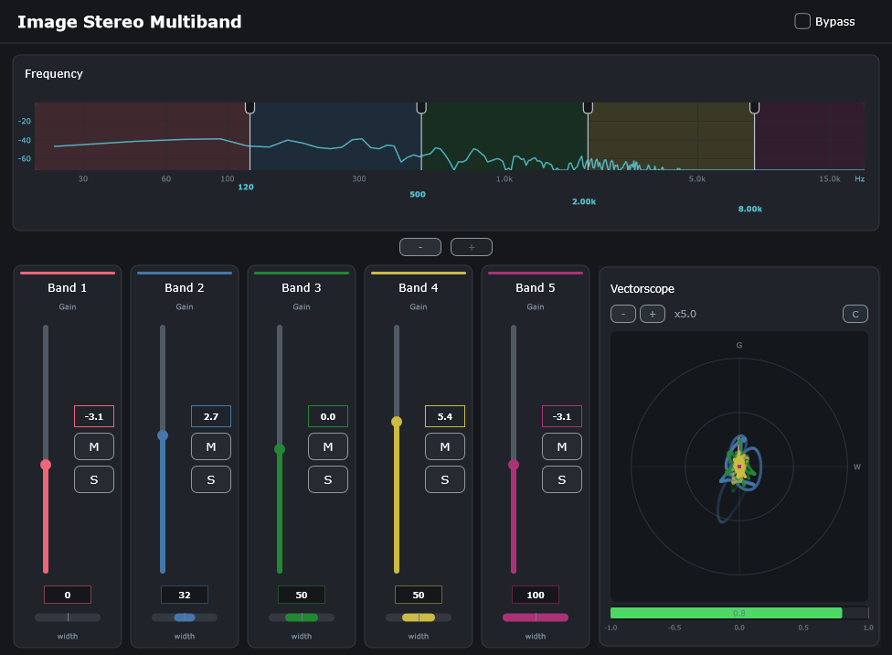

# ImageStereoMultiband

**Multiband stereo processing VST3 plugin** — Splits the audio signal into 5 frequency bands with independent stereo width, gain, mute, and solo control.

Developed by **Pedro Cuomo Ghio** — Version **1.0.0**

---

## Features

- **5 frequency bands** with configurable crossover points (120, 500, 2000, 8000 Hz default)
- **Per-band stereo width** control (Mid/Side processing)
- **Independent gain** per band (-24 dB to +24 dB)
- **Mute/Solo** per band with intelligent solo logic
- **Real-time FFT spectrum** analyzer
- **Mid/Side vectorscope** with phase correlation meter
- **Smooth bypass** with 50 ms wet/dry crossfade (clean signal when bypassed)
- **State persistence** — the DAW saves and restores all settings

---

## Installation

### Users

1. Download `ImageStereoMultiband_Installer.exe`
2. Run as administrator
3. The installer places the plugin at:
   ```
   C:\Program Files\Common Files\VST3\ImageStereoMultiband.vst3\
   ```
4. Scan the VST3 folder from your DAW (Cubase, Reaper, FL Studio, Studio One, etc.)

### Developers — Building from Source

#### Requirements

- **Visual Studio 2026** (or compatible with VC++ v143 toolset)
- **JUCE 8.0.12** — located at `../../juce-8.0.12-windows/JUCE/` relative to the project
- **Inno Setup 6** (optional, for building the installer)

#### Steps

```bash
# 1. Open the solution
Builds/VisualStudio2026/ImageStereoMultiband.sln

# 2. Select Release configuration, x64 platform
# 3. Build → generates:
#    - VST3: x64/Release/VST3/ImageStereoMultiband.vst3/
#    - Standalone: x64/Release/Standalone Plugin/ImageStereoMultiband.exe

# 4. (Optional) Build installer
& "C:\Program Files (x86)\Inno Setup 6\ISCC.exe" installer.iss
```

---

## Usage Guide

### Per-band Control Panel

Each band has four controls:

| Control | Type | Description |
|---------|------|-------------|
| **Width** | Horizontal slider | Stereo width (0 = mid/mono, 50 = original, 100 = max side). Shows value on hover; double-click to edit |
| **Gain** | Vertical slider | Gain from -24 dB to +24 dB. Double-click to edit |
| **M** | Button | Mutes the band |
| **S** | Button | Solos the band |

### Spectrum & Crossovers

The top panel shows the **FFT spectrum** in real time. The vertical lines with square handles are the **crossover frequencies** between bands. Drag them with the mouse or double-click the numeric label to edit — adjacent crossovers maintain a minimum 100 Hz gap.

### Vectorscope

Visualizes the stereo image in **Mid/Side** space:

- **Y axis** = Mid (mono), **X axis** = Side (stereo)
- Mono signal → vertical dots
- Balanced stereo → circle
- Out-of-phase signal → dots outside the reference circle

Controls: **+/-** for zoom, **W/C** to toggle between white and per-band colors. Muted or non-soloed bands (when another solo is active) are dimmed to 5% opacity. **−** (remove) and **+** (add) buttons let you add/remove bands in real time.

The bottom meter shows **phase correlation** (-1 to +1):
- Green > 0.7 — Well correlated
- Yellow 0.3–0.7 — Partially correlated
- Orange -0.3–0.3 — Uncorrelated / wide
- Red < -0.3 — Out of phase (may cancel when summed to mono)

---

## Project Structure

```
Source/
├── PluginProcessor.h/.cpp     → Audio processing (DAW entry point)
├── PluginEditor.h/.cpp        → Graphical interface (timer + layout)
├── Parameters/                → [stubs] Parameter IDs and layout
├── DSP/
│   ├── MultibandSplitter/     → Splits into 5 bands (cascaded LR4 filters)
│   ├── Band/                  → Single band processing (MidSide + Gain)
│   ├── Midside/               → Mid/Side encoding/decoding
│   ├── Crossover/             → 4th-order Linkwitz-Riley filter pair
│   ├── Analyzer/              → FFT 2048 + real-time oscilloscope
│   ├── Gain/                  → [stub] Not implemented
│   └── DryWet/                → [stub] Not implemented
└── GUI/
    ├── LookAndFeel/           → Dark theme + custom rotary slider
    ├── Components/
    │   ├── HeaderBar/         → Title + bypass button
    │   ├── BandStrip/         → Per-band controls
    │   ├── SpectrumCrossoverControls/ → Spectrum + crossover handles
    │   └── Vectorscope/       → Mid/Side visualizer + correlation
    └── BandColours.h          → Color palette (5 bands)
```

---

## Screenshot



---

## License

Distributed under the MIT License. See [LICENSE](LICENSE) for details.
